# Game screens

Digital games are currently very popular, and you can use them in exhibitions too. Games **are not only for child visitors**: they also engage adults and **draw visitors into the story**. Some of the six games in INDIHU Exhibition have a clear solution and focus more on facts; others are more creative and open-ended.

!!! warning "Warning"
    [Research](https://www.lib.cas.cz/casopis_informace/analyza-vystav-indihu-exhibition/) examining all 189 exhibitions created at that time found that 80% contained no games. This is a pity: visitors and users expect interaction and game elements online.

**The benefits of games include:**

- You can check whether visitors remember key information.
- A game can highlight the most important information.
- Content becomes more dynamic and can renew visitors' interest.
- You draw visitors into the story.
- You encourage visitors to think about the topic.
- A passive visitor becomes an active visitor.
- You give visitors an opportunity for creative expression.
- You simply offer entertainment.

!!! warning "Warning"
    Carefully formulate the task or question visitors must answer in the "Question" or "Game task" field for every game. It should be simple, short and, above all, clear. Test the task with someone you know to make sure the instruction is understandable.

## Content common to all games

As shown in the editing screenshots for Find it in the image, name the screen's topic in the "Title" field (1) for every game. This title appears on the timeline and in chapters, and is used for exhibition navigation. In the "Game task" field, briefly state what visitors must do (2). For each game, set the time for which the result of correct solutions is displayed. Visitors finish a game by clicking the tick (5), confirming that they have finished playing. To play again, they click the curved-arrow icon (6); the content is reset and they can start again.

## Find it in the image

Visitors must find a specific place in an image. In the Images tab, upload the image to "Task"; this is the image displayed to the visitor, in which they look for the relevant motif. If a visitor must find a particular place, also upload a "Result" image that appears after they make their guess. Set the result display time in seconds (3) in the "Title, task" tab. Create this result image in another programme and mark the place, for example with a circle or cross (see the second image). If the game has no correct answer, select "The game has no correct solution". Visitors search using a pin that they notionally place in the image (4). After selecting a place, they click the tick icon (5) to confirm their choice.

**Example tasks:**

- Find the place on the map where ... took place.
- Try to guess which child in the photograph became a famous writer as an adult.
- Find the symbol representing innocence in the painting.
- Choose the stained-glass window you like most.

!!! info "Tip"
    This game makes visitors examine content closely, deepening their perception and concentration.

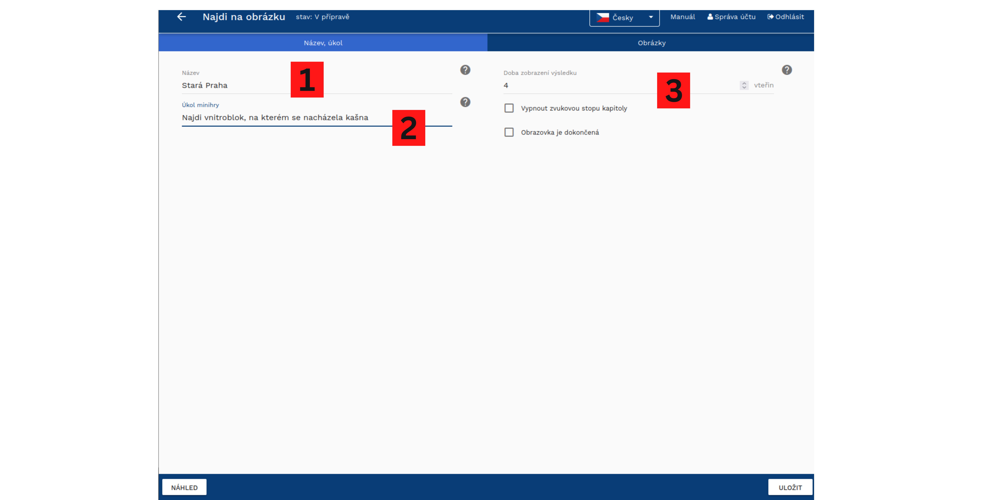

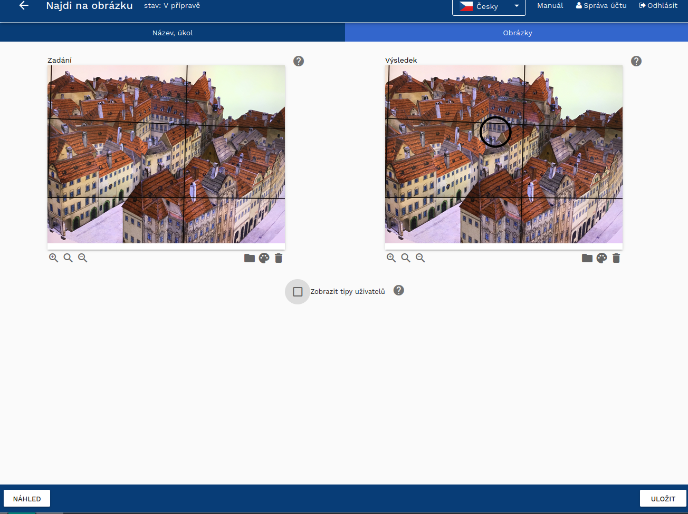

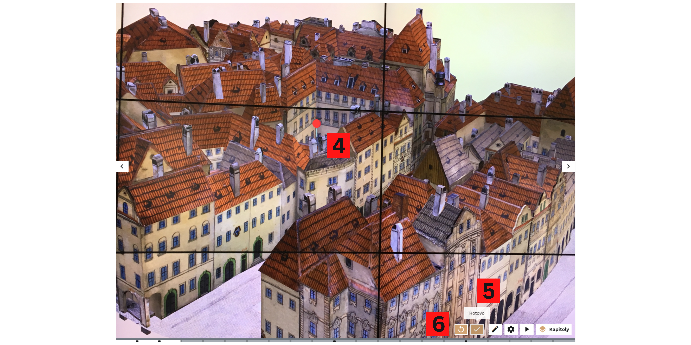

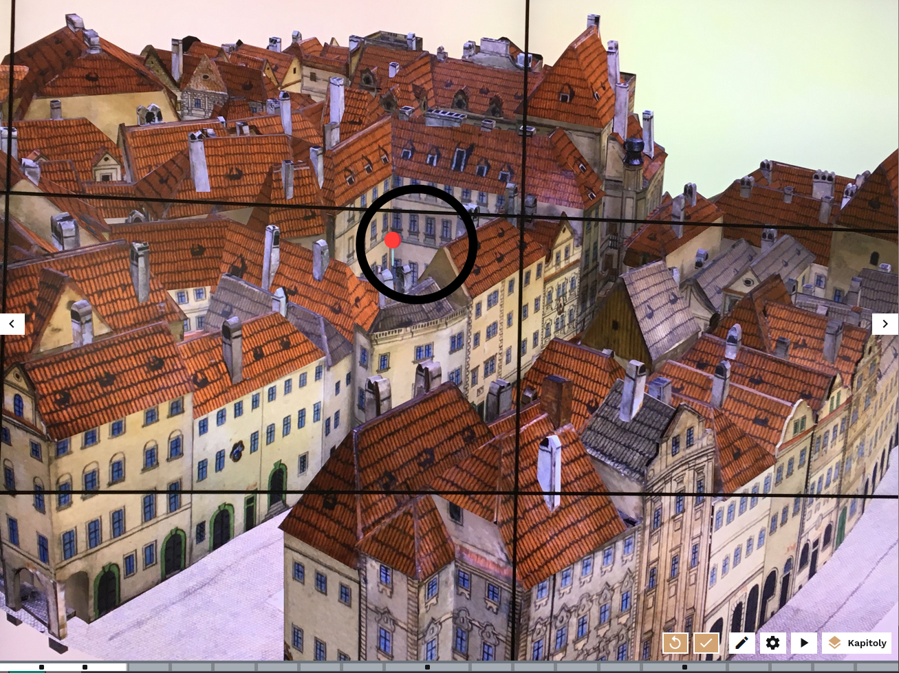

!!! info "Tip"
    If the game has no correct answer and visitors are to form their own opinion, you can share your own opinion in the "Result" image. This deepens the relationship between visitors, creators and the exhibition.

## Draw in

Visitors must complete a partly shown object or colour areas. They have a pencil whose colour (1) and thickness (2) they can change, and an eraser (3) to remove part of the image if necessary. Different pencil thicknesses allow visitors to colour the image and fill areas. If you want to show the complete image, upload it as the Result. If the game has no correct answer, select "The game has no correct solution".

**Example tasks:**

- Complete a symmetrical object (vase, ornament, candlestick).
- Colour a black-and-white image.
- Colour an image using only cool, warm or particular colours.
- Show visitors only part of a graph and ask them to estimate how development continued after an event.
- Colouring pages.

!!! info "Tip"
    This game makes visitors truly think about the topic and compare the exhibition's information with what they previously thought. If it focuses on completing shapes, decoration and similar elements, it can support creative expression.

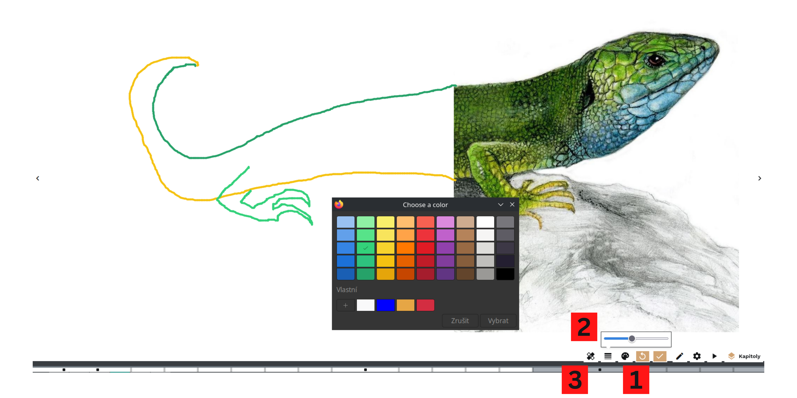

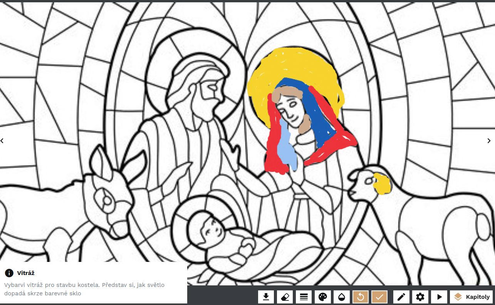

## Scratch card

In this game, visitors uncover an image displayed underneath the first image. Upload a top and bottom image in the editor, then choose the tools visitors use to uncover it: an eraser, brush, broom, hammer and more. Visitors erase the first image with the mouse to reveal a new image and information. You can use a scratch card as an interactive equivalent of [Before and after](obrazovky.md#before-and-after). The tools chosen in the editor can influence the game's context.

**Example tasks:**

- Visitors excavate a palaeontological find hidden in rock using a hammer.
- They clean dust from a room using a brush.
- They wash a dirty window with a cloth to reveal what is behind it.
- They carve a statue from a piece of wood using a chisel.

!!! info "Tip"
    Scratching is very simple and intuitive. However, do not assume visitors will carefully uncover the whole image, so place the object and punchline near the image centre rather than its edges.

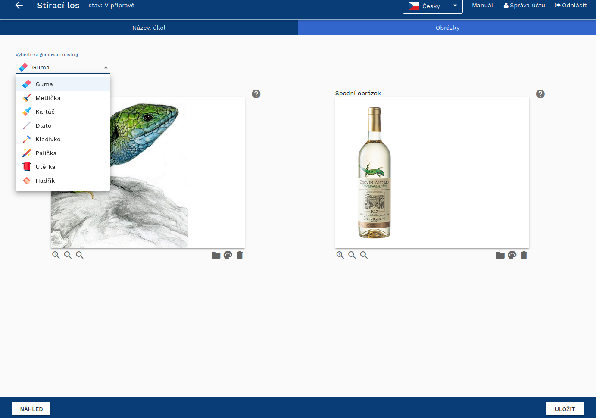

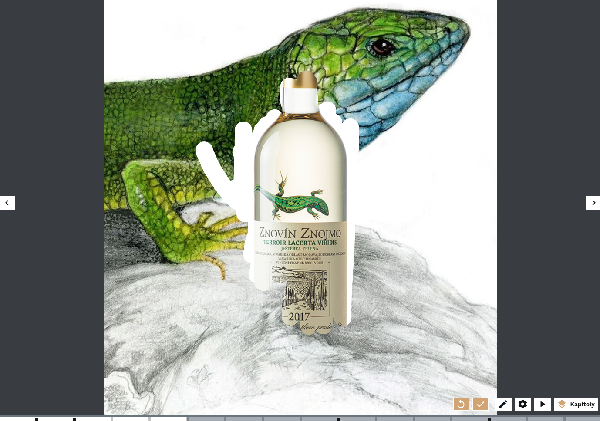

## Guess the size

This game helps visitors realise how small or large some things are. They use an arrow to enlarge or reduce an image and compare its size with a reference object. Choose a familiar object with a fixed, widely known size, such as a matchbox, pen, human figure or car. The game tests sensory experience.

**Example tasks:**

- Surprise visitors by showing how small some objects are. For example, Venus of Dolni Vestonice figurines are much smaller than people think; visitors can then be amazed by the skill of people in the past who made them.
- Show how buildings can appear grand when viewed from below.
- Show how skylines changed with the addition of new landmarks, such as the Eiffel Tower in Paris.

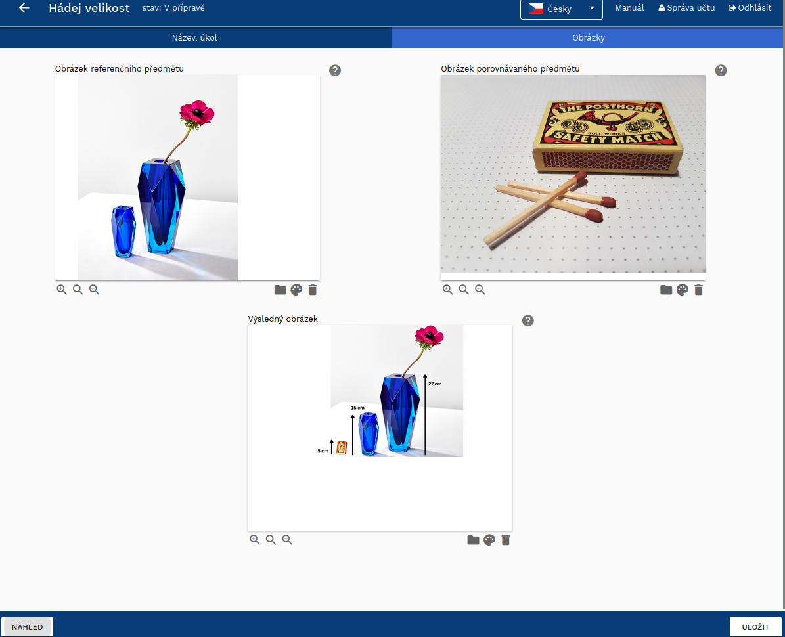

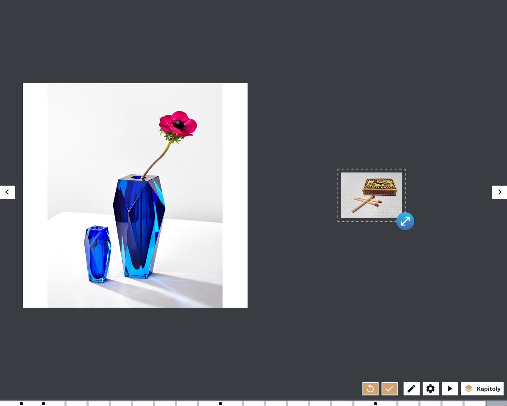

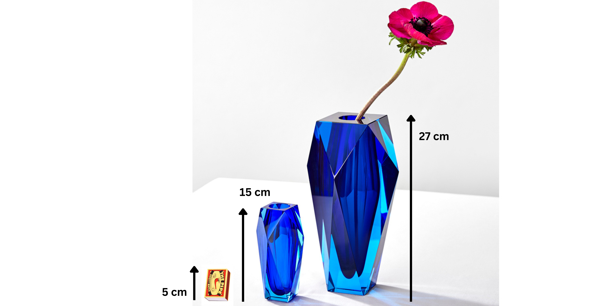

## Move to the right place

"Move to the right place" uses drag and drop: visitors move an object in an image and find where it belongs. The game may or may not have a correct solution. For example, visitors might choose the window from which a princess likes to look; the choice is entirely theirs. If you create a game without a correct answer, select "The game has no correct solution".

**Example tasks:**

- Place an important building or other landmark on the skyline.
- Decorate a place with a flag.
- Place an ornament or motif in a painting to improve it.
- Choose where you would like to view a street from.

!!! info "Tip"
    The game works better visually when the object visitors move has no background. Export it with a transparent background in .png format.

!!! info "Tip"
    Match the size of the movable image to the screen and image. If it is too large, it obscures the image where visitors should place it. Use the "Resize" function while preserving the aspect ratio.

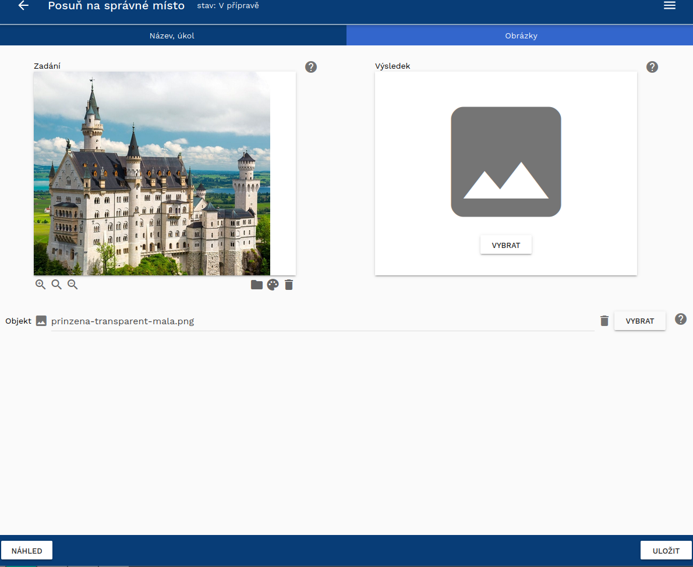

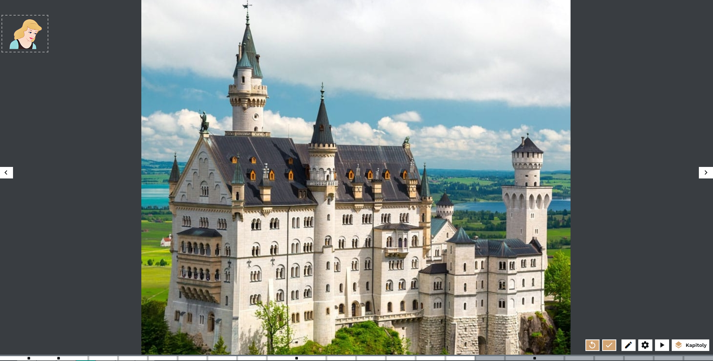

## Quiz

A quiz is a simple game in which visitors select one or more correct answers from a choice. When designing a quiz, set whether it has one or more correct answers and mark them as correct. You always need at least two options, although you can add more. When creating a quiz, three options appear; add a fourth and further options with the "Add new answer" button. As the final image with four options shows, answers are arranged automatically to fill the page well.

We recommend naming individual options, which makes it easier to find your way around answers when moving them and changing their order with arrows. Decide whether quiz answers will be text only, images only, or images with text. Images make a quiz more engaging and visual. Text-only options can also be made visual as images, such as an Instagram post or other infographic.

!!! warning "Warning"
    [Research](https://www.lib.cas.cz/casopis_informace/analyza-vystav-indihu-exhibition/) examining created exhibitions found that when exhibitions include games, they are usually quizzes. A quiz is the easiest to devise, but try to create other games as well.

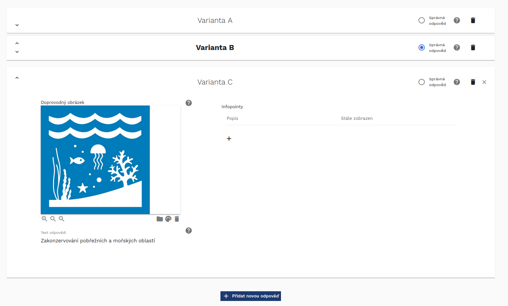

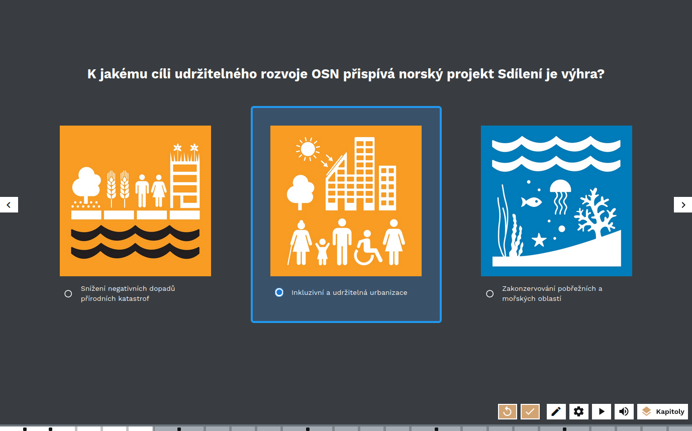

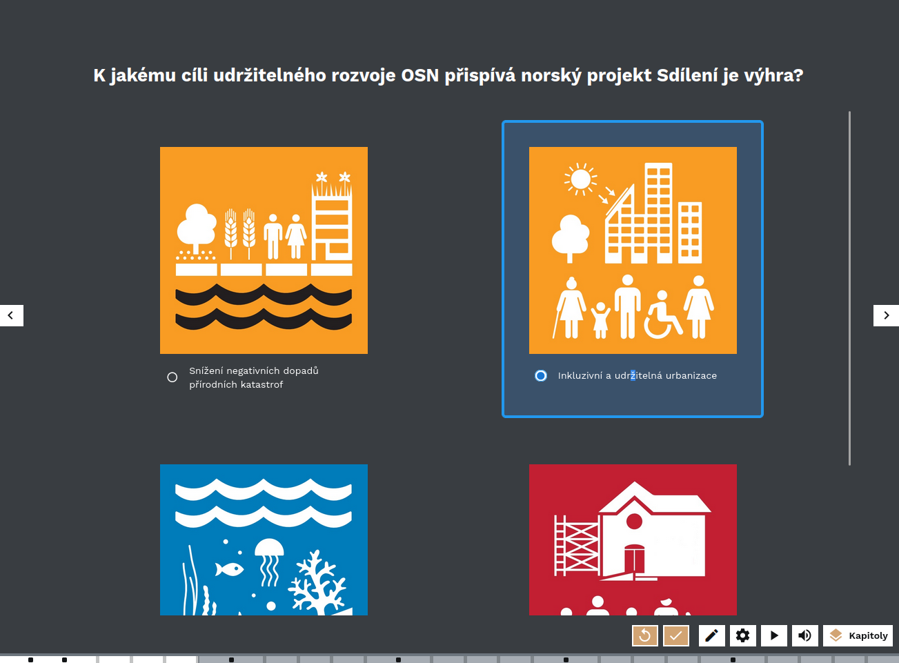

!!! info "Tip"
    A quiz is ideal for checking whether visitors remember important information from an earlier part of the exhibition. Conversely, multiple choices can test opinions on a topic that the exhibition develops later.
