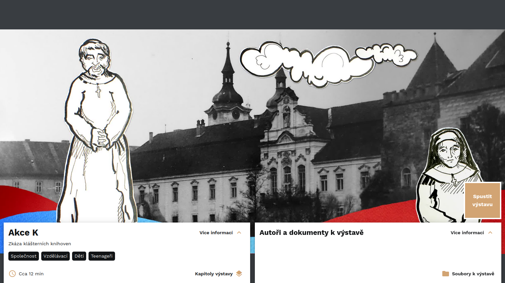
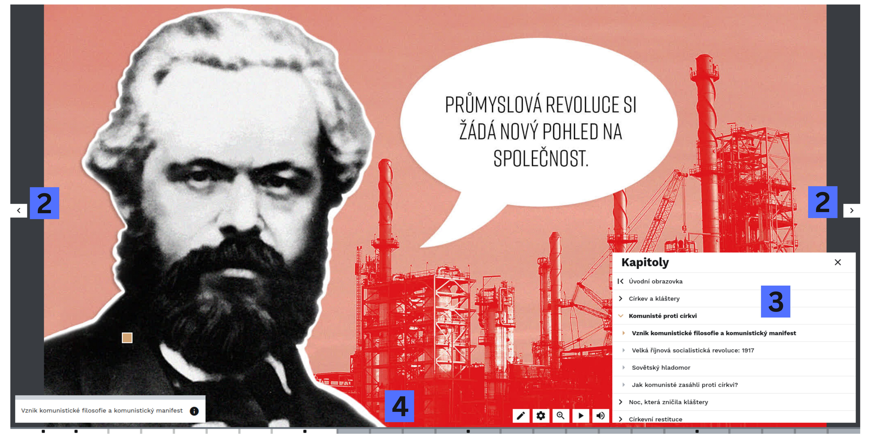

<!-- TODO promotional video -->

# About INDIHU Exhibition

The INDIHU Exhibition virtual exhibition editor is suitable for creating **multimedia-rich presentations with interactive elements**. An online presence is becoming essential, as the public expects you to **offer engaging content online**. It is ideal for presenting your work in an original way that sparks visitors' interest. It is less suitable for conveying large amounts of information. However, longer materials can be attached and visitors can download the files if they wish.

The editor was designed to make the resulting virtual exhibition visual, fresh, imaginative and entertaining. An exhibition should not be longer than 15 minutes. Visual content plays the main role in virtual exhibitions, while controls are as unobtrusive as possible. INDIHU Exhibition has a wide range of uses for cultural heritage institutions, enables exhibitions on **any subject**, and can also be used to present the results of academic research online in an original way.

It can serve as an **educational tool** and a teaching aid in different types of schools. Creators can offer completed exhibitions to schools, which can use them to complement or enliven teaching with engaging educational content. Pupils and students can also create their own exhibitions, gaining an understanding of both a particular subject and digital cultural heritage.

!!! question "Why use INDIHU Exhibition?"
    * It lets you create virtual exhibitions without having to understand web design
    * It provides a broad range of content, from images and videos to text
    * It offers interactive games
    * It allows you to focus on content rather than technical aspects
    * It saves money on developers
    * It meets current user-interface standards: simple controls and a restrained interface that emphasises visually appealing content.

INDIHU Exhibition is open-source (free) software with [source code](https://github.com/LIBCAS/INDIHU). [Registered creators](zaklady.md#creating-an-account) create exhibitions in their web browser at [exhibition.indihu.cz](https://exhibition.indihu.cz/). Anyone can run the software on their own infrastructure and modify it as required. The Library of the Czech Academy of Sciences takes care of technical matters, infrastructure, operations and data.

## What it can do

- Images (animation, various transitions, before and after, photo galleries)
- Infopoints (brief information boxes in images)
- Video
- Text
- Audio (music, audio commentary)
- Embedding external content (e.g. maps, videos, charts, 3D objects)
- [Games](hry.md) (Quiz, Find in Image, Scratch Card, Guess the Size, etc.)
- Attaching files with additional materials (e.g. bibliographies, worksheets for schools)
- [Exhibition branching](obrazovky.md#signpost), where the visitor chooses how to continue
- Multiple creators can collaborate on an exhibition
- Exhibition hosting
- Easy sharing with visitors and co-creators
<!-- - Responsive design (basic exhibition elements are also suitable for mobile devices) -->

## How to get started?

Creating virtual exhibitions has two parts: preparing the content and working in the editor itself. Do not underestimate content preparation. We recommend the following approach to learning the tool:

1. First, [choose a subject](uspesna-vystava.md) and prepare the content so that it is suitable for a virtual exhibition. Get [inspiration](inspirace.md) from other creators.
2. [Basics](zaklady.md): An explanation of the terms used and an illustrated description of the individual steps in creating your first exhibition
3. [Screens](obrazovky.md): A detailed illustrated description of individual screen types
4. [Games](hry.md): A detailed illustrated description of individual interactive games

Use our **worksheets** to help you create a virtual exhibition. Simply print them out. The worksheets will help you target specific types of online visitors and, through questions, refine the content and select multimedia.

[Download worksheets as PDF](../img/INDIHU_pracovni_listy_2026.pdf){:download}

## How visitors see an exhibition

On the landing page, visitors find key information about the virtual exhibition: its approximate duration, individual chapters, information about the creative team and, if the author has provided them, supplementary exhibition documents.

## Intro tour

When a visitor starts the exhibition with the "Start exhibition" button, an **intro tour** automatically opens. It gradually guides the visitor through the exhibition controls, including useful keyboard shortcuts such as moving through the exhibition with the arrow keys or pausing and restarting it with the space bar. The visitor can skip it by clicking the "Skip tour" button.

### Navigating through the exhibition

The exhibition is **timed** by its creator and plays automatically in the visitor's browser, screen by screen and chapter by chapter. However, visitors have several options for navigating the exhibition as they need:

- (1) Pause and restart the exhibition: space bar
- (2) Move to the next screen or back: left/right arrow key on the keyboard or on-screen controls
- (3) Move to another chapter/screen: Clicking the icon labelled "Chapters" opens a panel listing chapters and, when expanded with the arrow, screens, allowing visitors to choose
- (4) Move to another chapter/screen: using the timeline with marked chapter starts (black square) and screens (a dot which reveals the screen title)

### Screen types

INDIHU Exhibition virtual exhibitions have many [types of screen](obrazovky.md), which can generally be categorised into three types: **content, game and interactive.** [Content screens](obrazovky.md#content-screens) are largely static and do not require as much visitor activity. Interactive screens include small interactions while viewing content, while [games](hry.md) fully engage visitors. Games and interactive screens are intended to engage visitors, but completing them is never compulsory. Visitors who are not interested in interacting can skip the games.
