# Inspiration

Virtual exhibitions are a **modern way** to connect the traditional environment of museums and galleries with today's online world. Available tools make it possible to open up the unexpected content behind our institutions' walls to remote visitors, introduce current research findings, and present current and past exhibitions prepared by memory institutions.

A virtual exhibition can be an **accompanying programme to a physical exhibition**, but it can also stand alone as an **independent multimedia project**. Modern technology is a normal part of younger generations' lives, but it is not a barrier for older people either, who are gradually discovering its benefits.

At the outset, exhibition creators must decide whether they will create a virtual exhibition as an **independent project or in connection with the physical part of an exhibition**. The latter option is constrained by the existing interpretation and concept of the physical exhibition, while a virtual exhibition without that connection gives creators room for a wholly new approach.

The next step is to define the **target visitor**, so that we can create the exhibition with their knowledge and educational needs in mind, as well as the specific information we want to convey, because content remains the most important thing. You can create adapted versions of an exhibition for different target groups, including worksheets, which are useful educational aids.

!!! info "What does research say?"
    To keep visitors with a virtual exhibition and encourage them to view it all, we must engage them within 30 seconds. Consider what will form the beginning of your exhibition. Ideally, **activate the visitor** throughout the exhibition through a balanced combination of content, images, video and interactive elements (for example, [games](hry.md)). The main trend is a **move away from text towards visual content**, so use text thoughtfully and consider its length. The same applies to videos, which should not be too long either (about one minute).

Promotion is also important for a virtual exhibition. Alongside traditional media, promote it online through websites and especially social media, not only those of your own institution but also friendly partner organisations.

## Visitor expectations

What does a visitor expect from a virtual exhibition? Above all, an **intense experience**, a feeling of being drawn into the story. This experience has the greatest impact, and visitors can take away interesting information about the topic through their own impressions. INDIHU Exhibition can activate visitors through, for example:

- interactive screens
- games
- alternating varied content
- the option to choose a topic

Visitors expect a **story.** Framing the topic as a story and using a **narrator** - a real or fictional character - can create a personal experience.

Finally, navigating a virtual exhibition must be **simple and intuitive**, and visitors should know how to move through it. The ideal combination is a predetermined route with the option to depart from it individually.

## Exhibitions for inspiration

### To Siberia from Home

The National Museum created the exhibition "To Siberia from Home" when museums were closed during the COVID-19 pandemic. Its concept was to **transfer a physical exhibition into a virtual format** while adapting it to online visitors' needs. It stands out for its surprising subject and **engaging content**: visitors encounter a culture they know little about and follow the **everyday life and customs** of Siberia's inhabitants. The exhibition has a **strong opening**, introducing one of its authors by video, making it **feel personal**. Other quality elements include **varied visual material**, especially excellent photographs from field research taken by a professional photographer. The types of photographs alternate, maintaining visitors' attention. **Photographs of collection objects** are high quality and supplemented by infopoints. The exhibition includes music and quality audio commentary. **It lasts 14 minutes**, which is ideal: exhibitions should not be longer than 15 minutes because online visitors tend to seek shorter content.

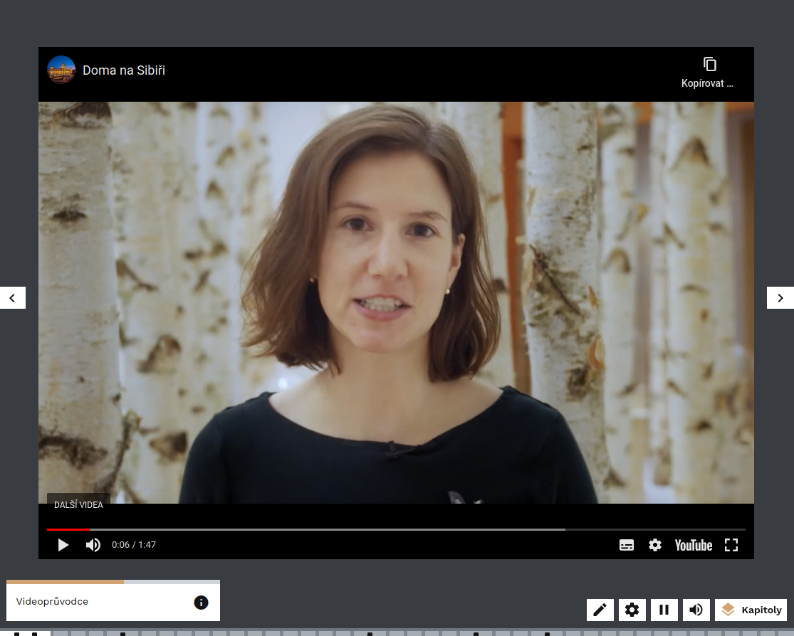

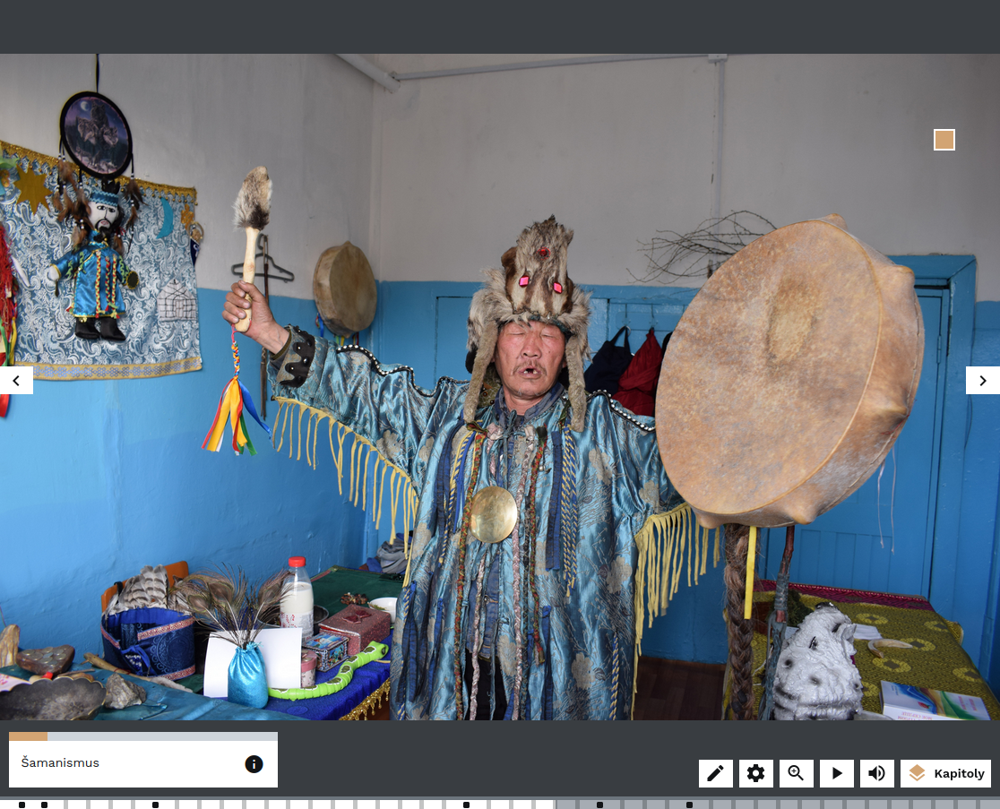

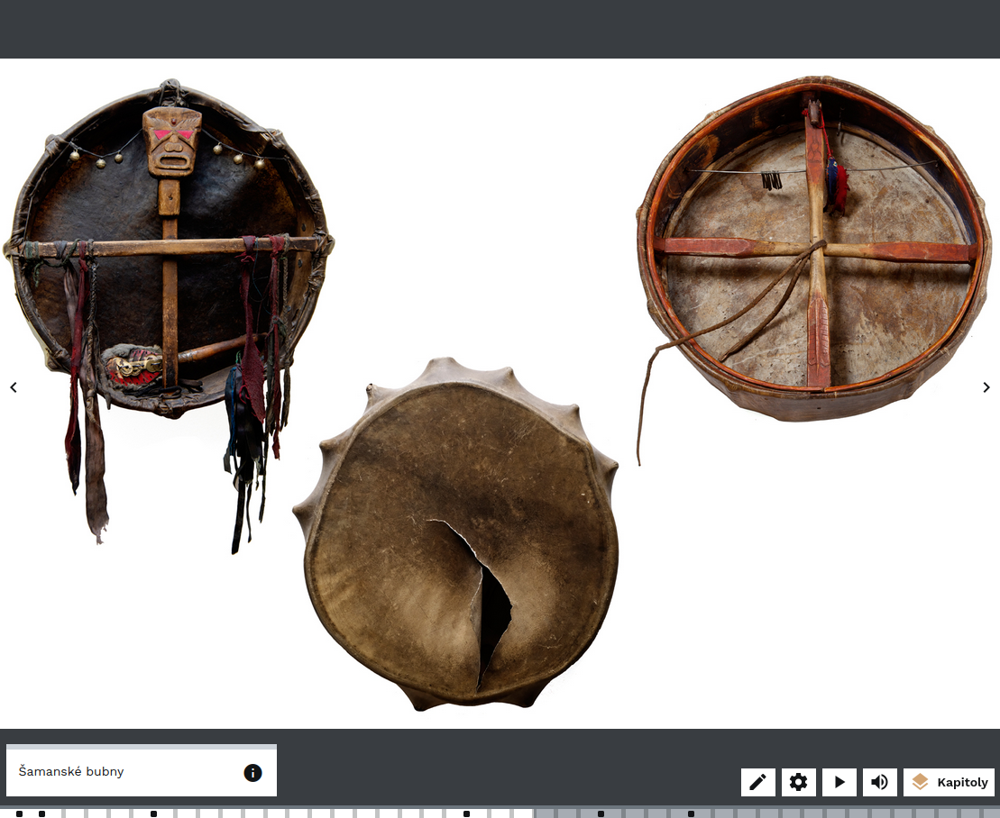

[Exhibition link: To Siberia from Home](https://exhibition.indihu.cz/view/na-sibir-z-domova/)

### Nordic Sustainable Cities

The virtual exhibition "Nordic Sustainable Cities" is an example of an exhibition addressing a **current topic.** It was created by Nordic Innovation, an organisation pursuing sustainable development across Northern European countries. It shows that **many different types of institution can create exhibitions**, not just museums. At 14 minutes, it is **appropriately short**. Alternating female and male voices in the audio commentary gives it **dynamism**, activating visitors and making them less likely to lose attention. The exhibition **alternates** general environmental recommendations, current trends and a range of specific cases from different cities, which maintains attention. It uses **games** to draw visitors in and provide welcome variety. The photographs are high quality, include people, feel personal, and correspond to what the commentators say. The exhibition stands out for its **clear language**: chapter titles are simple, short and understandable. When it addresses something more complex, terms are explained.

[Exhibition link: Nordic Sustainable Cities](https://exhibition.indihu.cz/view/severska-udrzitelna-mesta/)

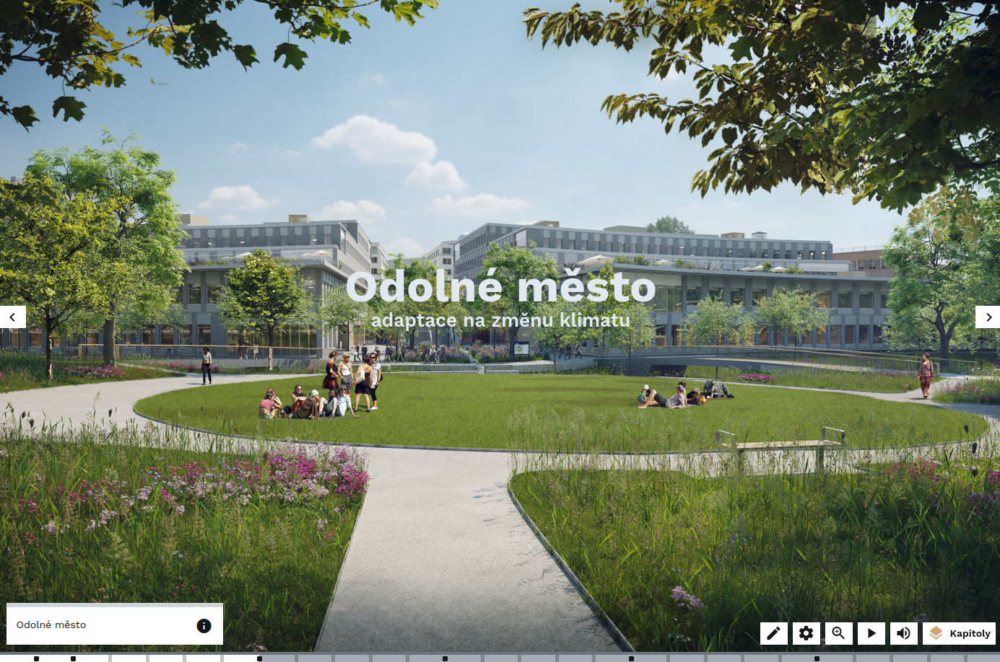

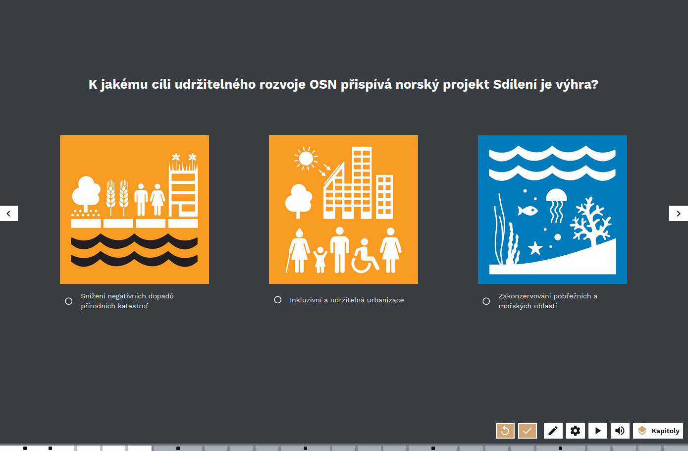

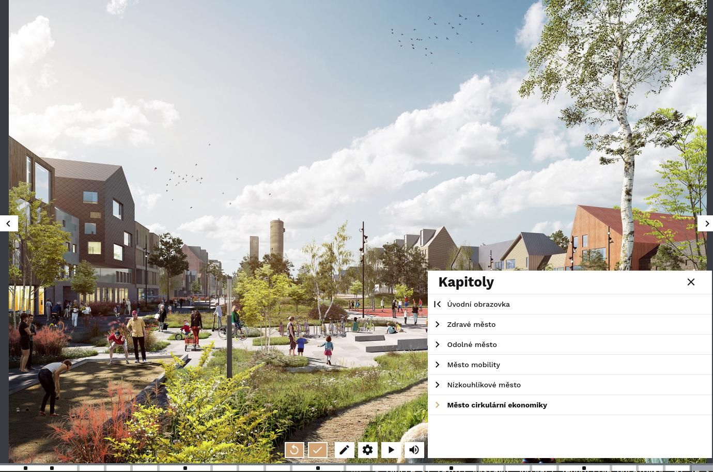

### Project Piombo_Madonna without a Mask

The virtual exhibition "Project Piombo_Madonna without a Mask" introduces visitors **to a single work in greater depth**, leading them detail by detail through one particular painting. It teaches visitors **what to see in paintings** and what to notice. They can then apply this skill to other works they encounter online and in physical exhibitions. The painting itself is the central motif; only at the end do we learn more about the painter. The exhibition concludes by presenting further works at the Museum of Art Olomouc, which created it. It thus has a **broader context** and also functions as an invitation to visit. It successfully connects specific content with an institution and its collections. The exhibition does not contain sound or audio commentary, and visitors are drawn in through **a range of games**. Its texts are, however, rather more complex than they could be for a general audience.

[Exhibition link: Project Piombo_Madonna without a Mask](https://exhibition.indihu.cz/view/ProjektPiombo2021-05-05T115848277Z/1/0)

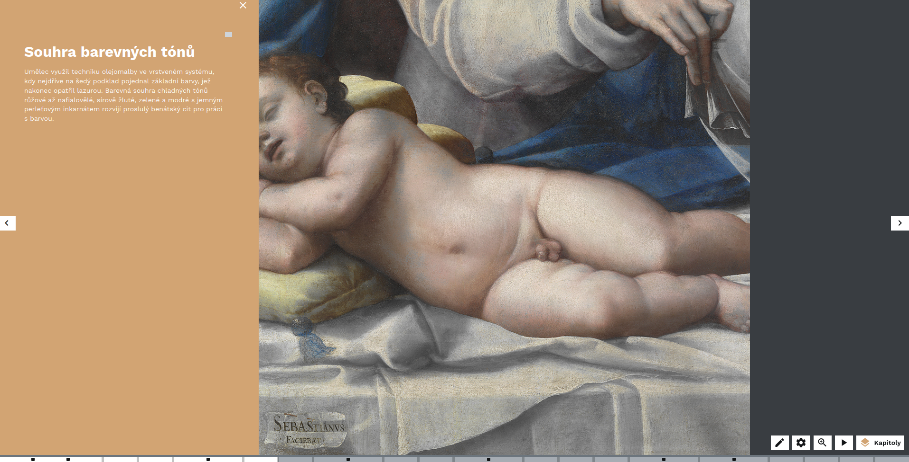

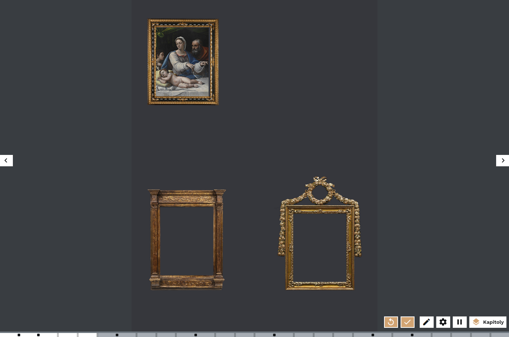

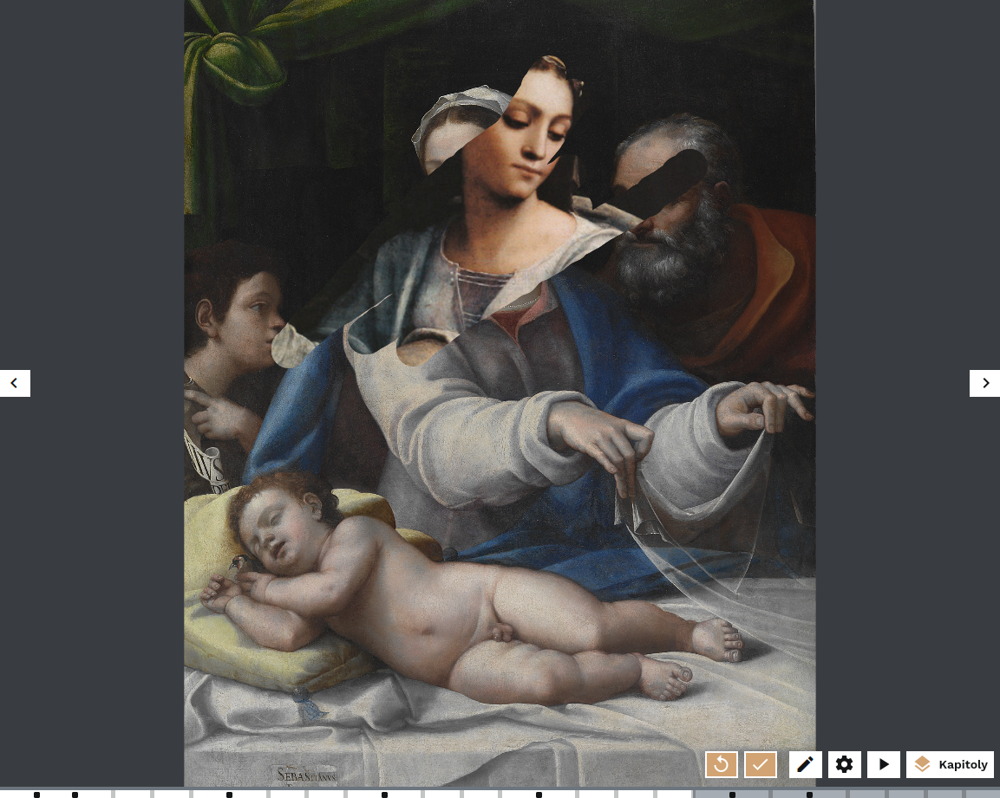

### Action K: The Destruction of Monastic Libraries

The virtual exhibition "Action K: The Destruction of Monastic Libraries" addresses communist repression against the Church in the 1950s. The author team faced several difficulties in preparing it. There was little authentic contemporary material on the topic, and what existed was well known. The other problem was that the general public, which the exhibition targeted, was not sufficiently familiar with the history of monasteries and the Church's importance in medieval and modern society. Repression by the communist regime, by contrast, is a popular topic, and the exhibition opening was timed to the 70th anniversary of the events, attracting media interest. The creators therefore focused on **broader context** and explaining how monasteries came to be wealthy. They created authentic material for the exhibition in the form of animations and drawings, and a **monk guide character**, to make the limited authentic material stand out. Alongside promotion, the exhibition's 14-minute length made it possible to use during remote teaching in the first wave of the COVID-19 pandemic.

The exhibition's creation and conceptualisation are presented in a peer-reviewed case study in JOINME (Journal of Interactive Media): [When Monastic Libraries Meet New Media: A Case Study of Creating a Virtual Exhibition](https://joinme-muni.cz/show-article.php)

[Exhibition link: Action K: The Destruction of Monastic Libraries](https://exhibition.indihu.cz/view/akce-k)

[Video recording of a walkthrough of the Action K exhibition in the first version of INDIHU Exhibition, before the redesign](https://youtu.be/I3EHBzh4onw?si=leUwkGX47dvwux7l)

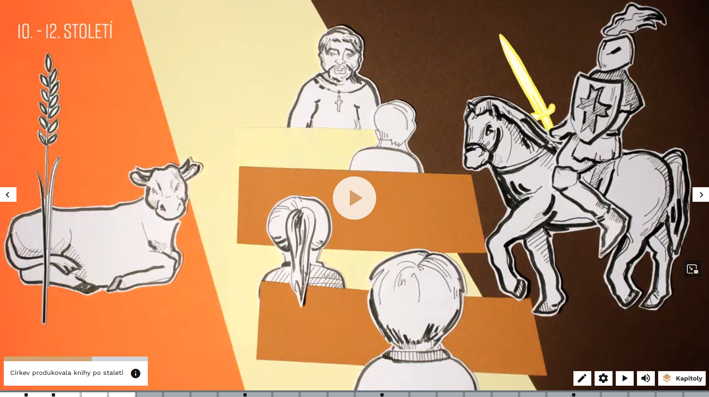

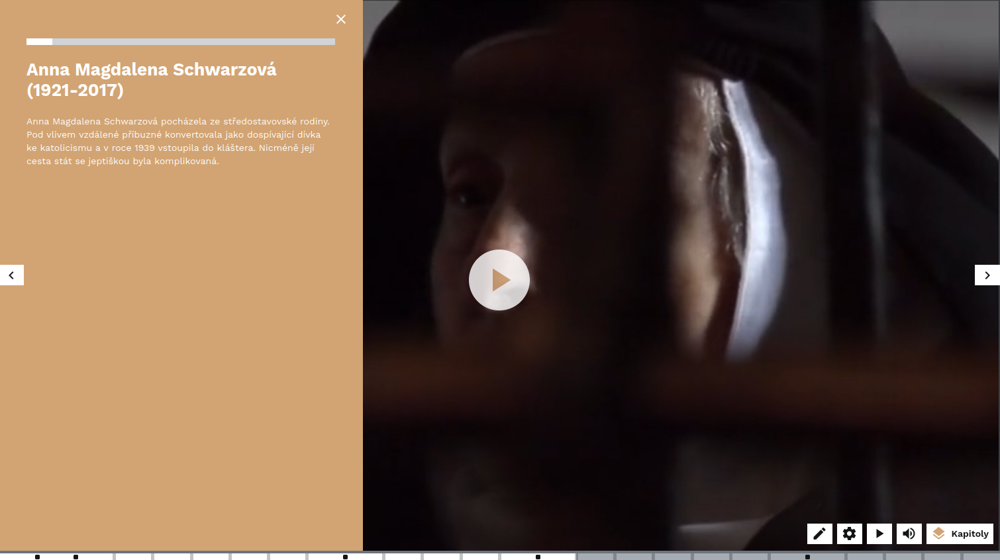

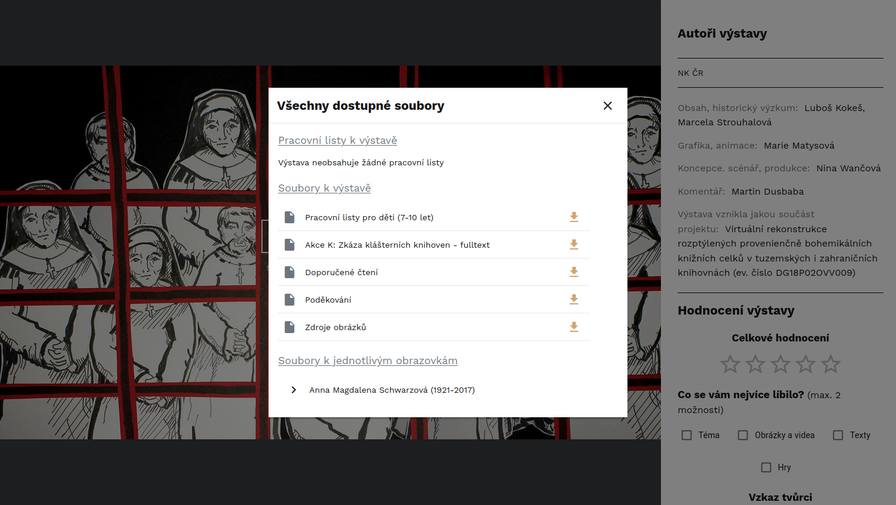
