# Screens

Screens are the basic building blocks of a virtual exhibition. You fill them with content and group them into chapters; an exhibition can also consist of individual screens without chapters. We offer three kinds of screen:

- [Content screens](obrazovky.md#content-screens)
- [Interactive screens](obrazovky.md#interactive-screens)
- [Game screens](hry.md)

## Exhibition introduction

The exhibition landing page contains an animated image, exhibition title, creator information, a chapter list, estimated viewing time and, most importantly, the icon for starting the exhibition. Viewing time is calculated automatically from the duration of all screens, excluding games. This screen is created automatically when you create an exhibition; edit it from the "Exhibition structure" tab by clicking the square or the three-dot menu.

!!! warning "Warning"
    You do not need to complete every field at the start. Some information only emerges while creating the exhibition.

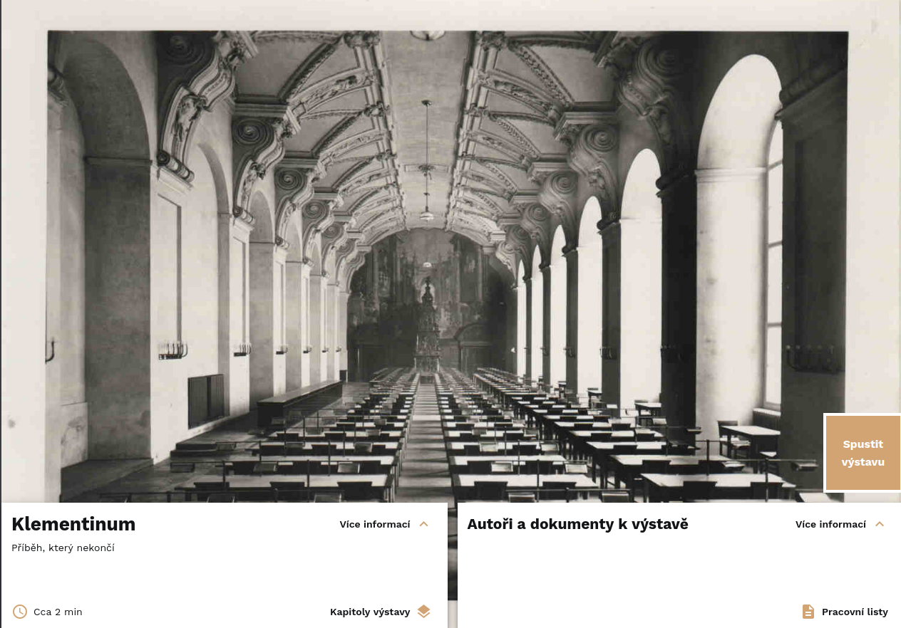

The "Exhibition introduction" screen has three tabs to fill in. In addition to "Title, description, audio", which contains the information used on other screens and the institution that created the exhibition, there are "Credits" and "Exhibition documents/files" tabs. Complete:

- Title: The exhibition title displayed while viewing it. Make it engaging.
- Subtitle: An explanatory addition to the title. Optional.
- Introduction: Text introducing the exhibition. It should be compelling, short and simple. It is shown after clicking "More information" before the exhibition starts. The editor shows the character count and estimates its spoken-audio duration.
- Background image: The cover image for the whole exhibition.
- Image animation: Choose an animation type (top to bottom, bottom to top and others), or leave the image static.
- Audio version of the exhibition: Combines all audio commentaries used in the exhibition. Visitors can download, listen to or share it as a podcast.
- Organisation: The principal institution behind the exhibition. Add other institutions in the credits.
- Link to the organisation's website.

!!! info "Tip"
    You can publish the exhibition's audio version as a podcast, allowing people to access interesting information by listening.

!!! info "Tip"
    Test the exhibition with someone unfamiliar with it who did not help create it. Do they have enough time to view every screen? How long do they spend playing?

**Credits**

In this tab, add people involved in preparing the exhibition. Use the "+" icon to **freely add collaborators** and assign a description of their contribution. Contributors appear in rows. Use the pencil to edit text and the bin to delete it. Clicking "+" opens a dialog: enter what the person did in the first "Role" field, and their name or other short information in "People or text". Confirm another credit entry with Save, or use Cancel to abandon it. Use the up/down arrows to change the order of people in the credits.

## Chapter introduction

Every new chapter starts with a title page, the "Chapter introduction" screen. It contains a title and cover image. Add the image in the "Background image" tab, where you can choose its animation. Try several animation types and select the one that suits you best. We recommend a landscape image. Select it from documents, or upload it with the file manager. In the main "Title, audio" tab, enter the chapter title, optionally a subtitle, and set the text position (centre, top, left), dark or light theme, or emphasis. These settings ensure the text is legible. You can also animate the text so its letters appear gradually.

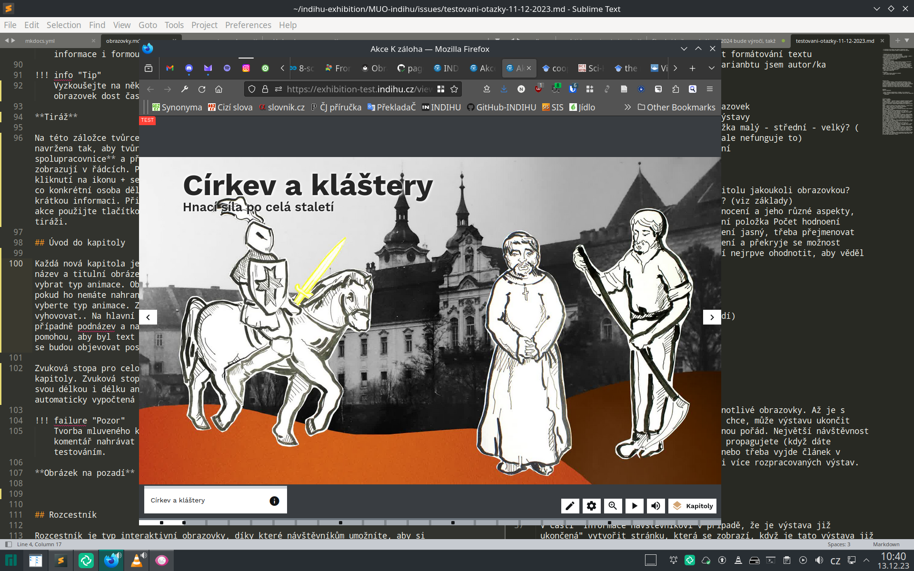

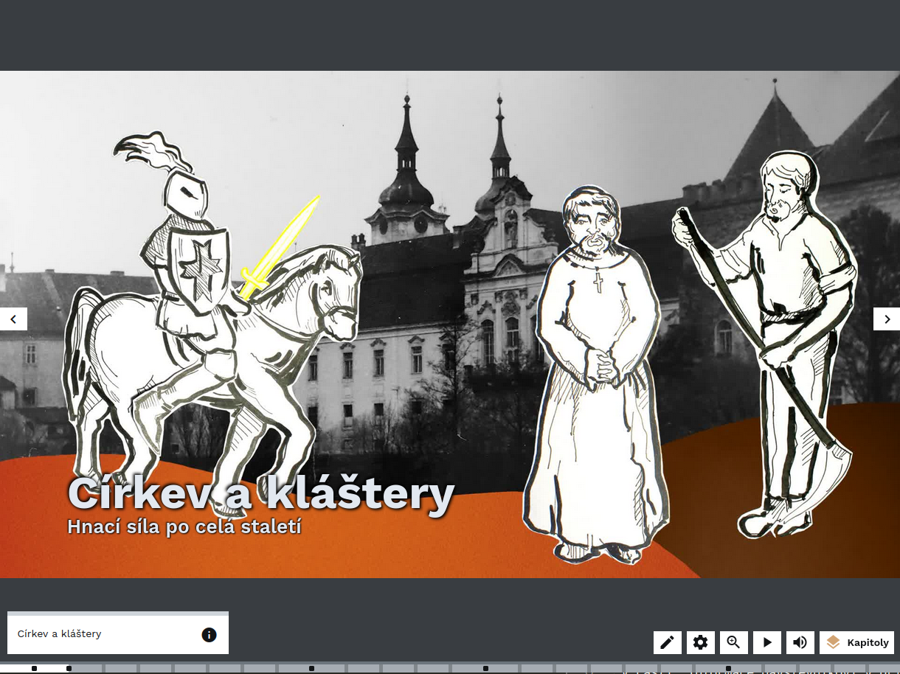

A chapter-wide audio track loops while visitors move through all its pages. Audio for the chapter introduction plays once only; its length determines the image-animation and overall duration of the page. If the automatically calculated duration does not suit you, change it manually in seconds.

!!! failure "Caution"
    Producing spoken commentary is relatively demanding. Record audio commentary last, once you are satisfied with the whole exhibition and it has been tested.

## Content common to all screens

### Title, text, audio

Every screen starts with the **Title, text, audio** tab, where you enter the screen title. Use it to summarise the screen and help visitors navigate the topic. It appears in the editor's screen list and to visitors in the bottom-left corner, where they can open a text field with further topic information. Keep titles attractive and concise.

Complete **Topic text** to provide information about what visitors are viewing or add broader context. Text formatting (1) makes it easier to read. The editor shows the text length, converting its character count into spoken-word duration, to help estimate required reading time. Text appears after clicking the screen title. After finalising it, you can record it as audio for visitors to hear. The audio and text need not contain identical content.

On the right side of the editing page, upload **audio** files and set screen timing manually (2) or according to spoken words (3). If the relevant chapter has background music, turn it off for a particular screen (4) to prevent it clashing with that screen's audio.

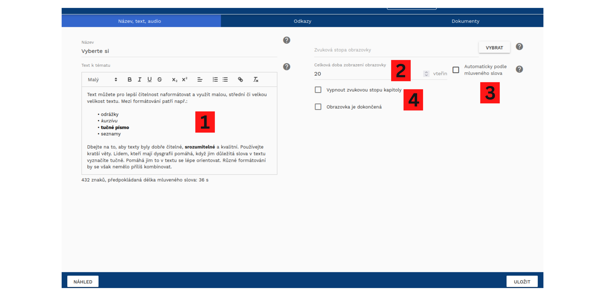

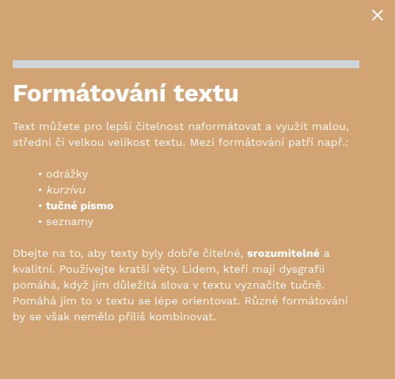

!!! info "Tip"
    Screen titles and icons next to them help you navigate while creating an exhibition. The icons indicate screen type, such as an image, trophy for games or video icon. They give you an overview of content, screen types, their sequence and whether screens are repeating too much.

### Documents

Add documents, ideally .docx or .pdf, to the exhibition and to each screen for visitors to download. **Downloadable files** can add supplementary information such as an article, recommended-reading list or worksheets. Choose documents from the editor's document library or upload them from your computer. Alternatively, insert a website link using its URL; it opens automatically in a new window.

!!! info "Tip"
    Add documents to the exhibition or to individual screens. You do not need to attach them all to the landing page. Placing some inside the exhibition reduces the risk of overwhelming visitors with information at the start.

!!! warning "Warning"
    Supported exhibition file formats are video (.mp4, Full HD 1920x1080, 25 frames per second, H.264), audio (.mp3), images (.jpeg, .png), and text documents (.pdf, .txt, .docx).

Documents are available to visitors:

- in the exhibition introduction
- in the text field of every screen
- on the final screen

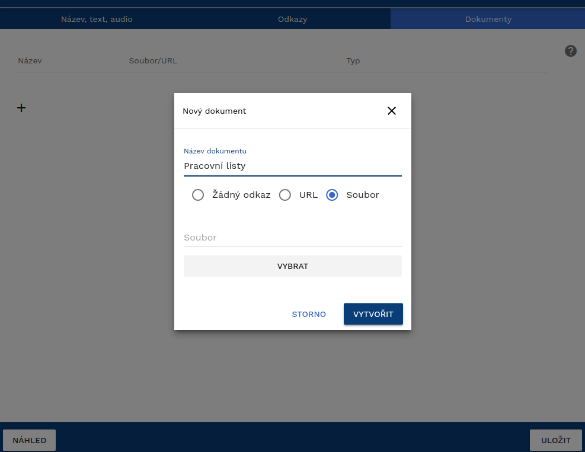

### Infopoints

Infopoints are small squares you can place anywhere on a screen to add extra information to a detail as text, an image or video. They can direct visitors' attention and offer these features:

- Title, which is not displayed when blank (1)
- Type: text, image or video (2)
- Description for a text infopoint (3)
- Always displayed (4); otherwise visitors open its content by clicking, encouraging interaction
- An external web link or link to another screen (5)
- Square, circle, or a custom uploaded image (6)
- Colour change (7)
- Size adjustment (8)

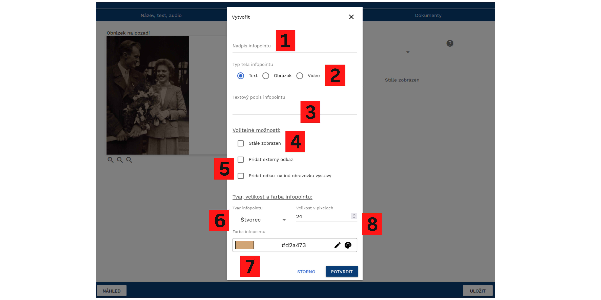

!!! info "Tip"
    We recommend **no more than three infopoints** per image. Testing and research show that more are confusing and overwhelming without improving the visitor experience.

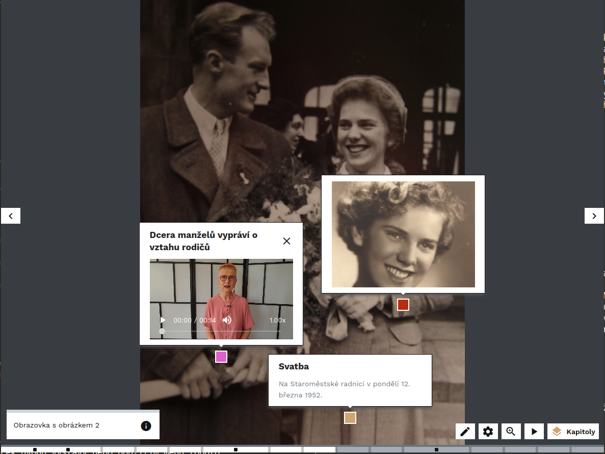

!!! info "Tip"
    To make exhibition work easier to track, mark completed screens as complete. They appear green in the list of all exhibition screens.

!!! warning "Warning"
    Visitors may view exhibitions on small screens, where infopoint content can overlap. Keep infopoints brief and do not set them to "Always displayed". You can also create a separate exhibition for phones.

## Content screens

### Image screen

An image screen is one of the basic screens. Its main content is an image, making it relatively easy to prepare and effective. Open the simple image editor for each image through the palette icon or file manager. We recommend [infopoints](obrazovky.md#infopoints) to add informational value. Add them in the "Image" tab; they appear as blue question marks which you can place anywhere. A new infopoint always appears in the top-left corner.

Infopoints highlight a detail or motif by placing an icon and short text, image or video at a specific place. You can add more than one to an image. In editing, an infopoint always appears as a blue question-mark icon in the top-left corner; drag it with the mouse to any place in the image.

!!! info "Tip"
    If your exhibition has several image screens in sequence, consider using a [photo gallery](obrazovky.md#photo-gallery) or [slideshow](obrazovky.md#slideshow) instead.

Select an image from documents, or upload it with the file manager. Optionally choose an animation type. Add infopoints with the + button; their settings open in a dialog. You can add several infopoints to one image, but we recommend no more than three.

### Timeline

Use the timeline screen to represent chronological sequence by placing events on an axis in order. You can set:

- Axis direction: horizontal, vertical, diagonally up or diagonally down
- Point type: text, image, or text and image; combine these variants
- Axis colour
- Background image and its intensity (opacity)
- Axis start and end: point, line or no ending
- Axis points: click to open or always displayed; colour, shape and evenly distributed or manual layout

First choose the basic axis type, then add its individual points. Use automatic placement to distribute points evenly or place them manually.

!!! warning "Warning"
    Online visitors are likely to use a phone. Consider the number of points: we recommend four to six for mobile devices and no more than eight for larger screens. Check how the screen looks on a phone and whether information overlaps too much.

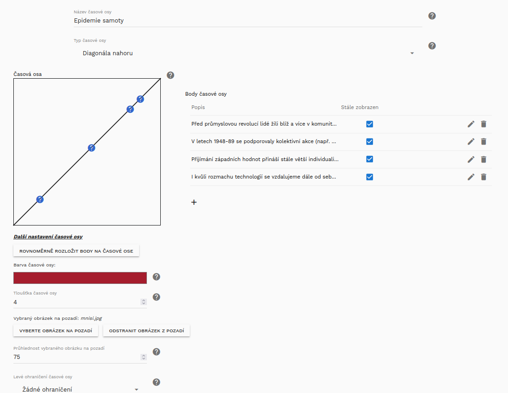

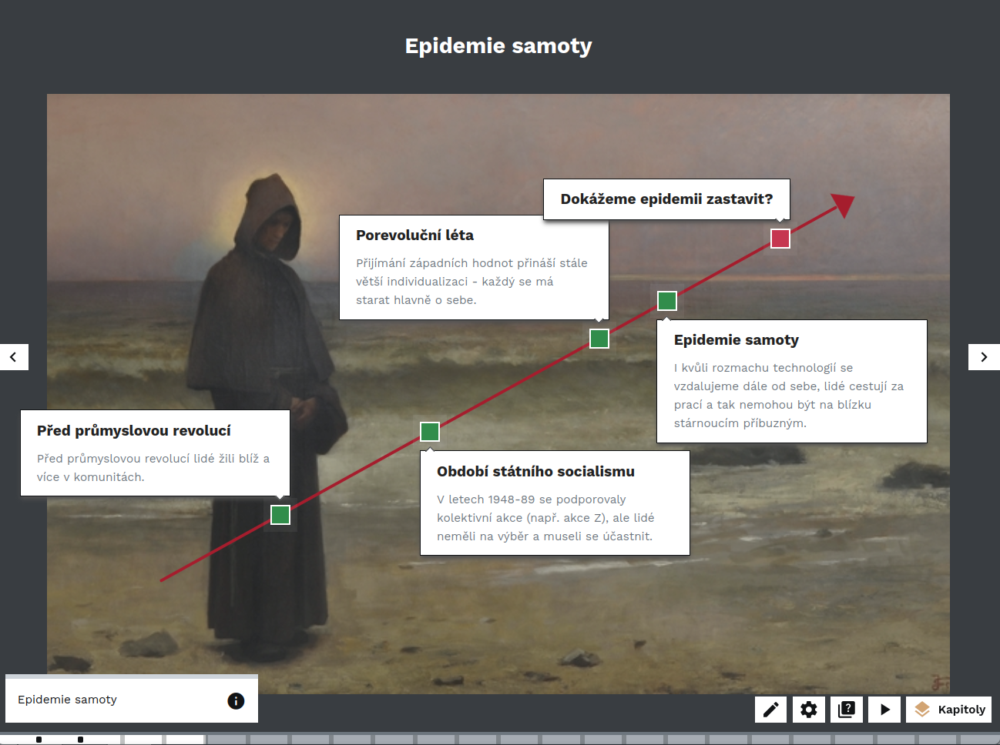
This timeline runs diagonally upwards, has a background image at 75% opacity, and uses manually positioned points.

### Video screen

The main content of this screen is a video, which you upload from your computer just as you upload other content. It fills the page, so landscape videos work best. Prepare video in Full HD (1920x1080), 25 frames per second, rendered in H.264.

If you select Disable chapter audio track, the chapter's background sound will not play on this screen and the video's sound will play instead.

!!! info "Tip"
    You can also use video published online, such as on YouTube or Vimeo. In this case, use an [external-content screen](obrazovky.md#external-content-screen). External services offer sharing through an embed code, which you copy to your page.

### Text screen

A text screen lets you write text on any topic. The main screen content is white text on a dark-grey background, centred on the page with left alignment. Choose small, medium or large text and use various formatting options. For this screen, consider completing text in the "Title, text, audio" tab.

Uses for a text screen:

- A quotation from a notable person
- A brief summary of part of the exhibition
- A reminder of what visitors should remember
- A rhetorical question
- An invitation to the next part of the exhibition

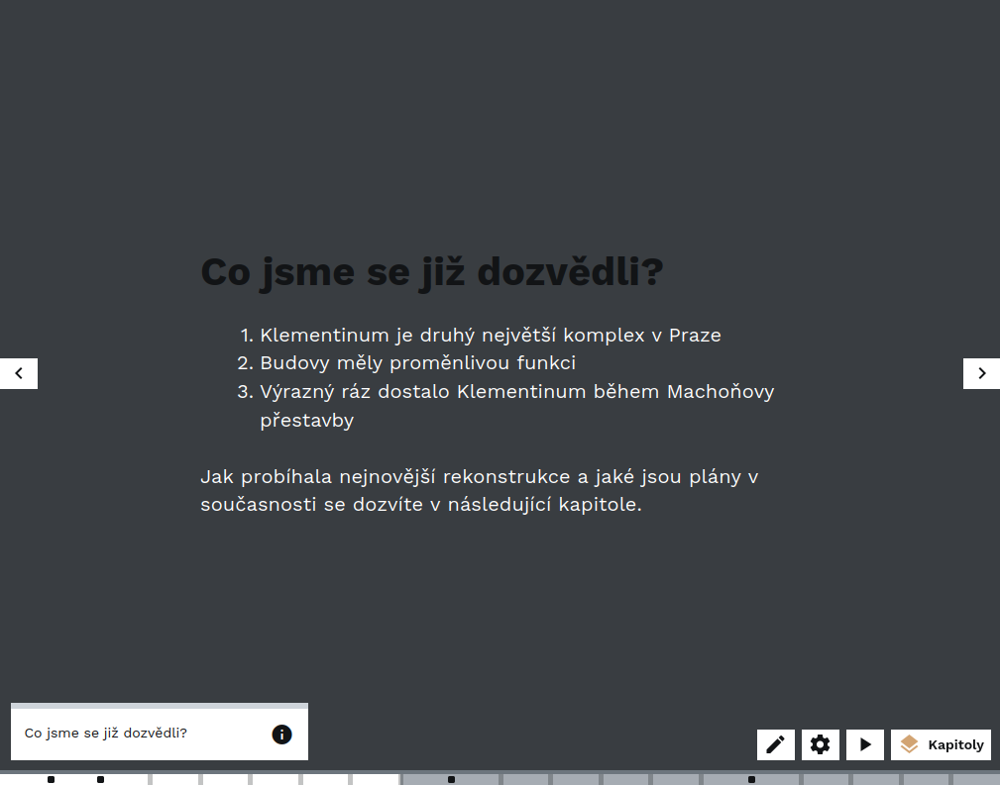

### Parallax

Parallax is a dynamic effect that brings a virtual exhibition to life. An image is split into at least two layers - foreground and background - which are animated at different speeds to create a 3D illusion while remaining an image. Prepare the layers in a graphics program you use, such as Krita or Adobe Photoshop.

!!! info "Tip"
    This screen is demanding both graphically and conceptually, so it is not yet common in exhibitions. Look for inspiration for its use on YouTube.

Create parallax by adding images in layers. Upload them from your computer through the file manager. You need to edit and crop the individual layer images, as shown in the following editing image. Take particular care when selecting the background image.

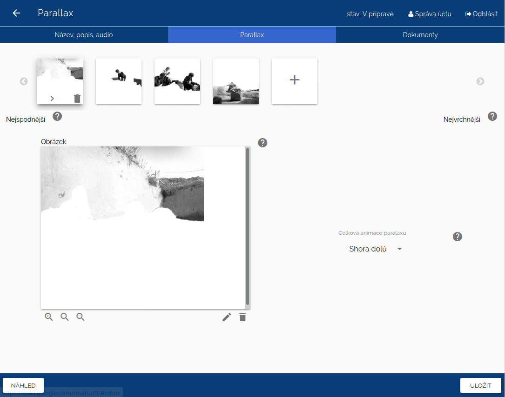

Try which animation looks best. Choose from top to bottom, bottom to top, left to right and right to left.

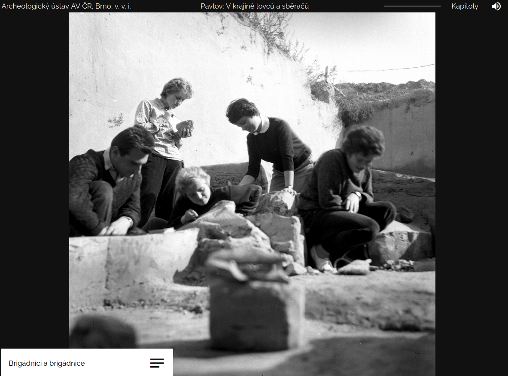

The following video shows an example of parallax:

<iframe width="560" height="615" src="https://www.youtube.com/embed/XoykDUe2ItI" frameborder="0" allow="accelerometer; autoplay; encrypted-media; gyroscope; picture-in-picture" allowfullscreen></iframe>

### Zoom animation

The "Zoom animation" screen is an effective way to emphasise details in a single image. The image zooms to a chosen place, then out again and can zoom to another detail. You can comment on each detail and choose where the comment appears. You can also draw attention to details with infopoints, which visitors may not always open; with a zoom animation screen they will not miss the detailed view because the image zooms as you set it. Between details, the animation always returns to the whole image. Edit images through the palette icon or file manager.

!!! info "Tip"
    A "Zoom animation" screen needs a relatively long duration for its animation to feel pleasant and smooth and for visitors to have enough time to inspect the image.

**Sequence**

Select or upload the relevant image. Mark places to zoom in on with infopoints, which you drag and drop with the mouse. The infopoint always appears in the top-left corner. Arrange points in order to create a sequence. For each point, add a caption and set its duration and zoom level. Choose where the caption appears: bottom right or top left. This screen type needs considerable time and is therefore usually longer.

### Slideshow

A slideshow presents several related images. If you are placing several image screens in sequence, consider a slideshow for a smoother result. It also lets you comment on several photographs in one text or audio commentary, simplifying editing and audio-file work.

Select each image from a folder or upload it through the file manager. Add another image by clicking the square with the "+" icon (1). Edit images through the palette icon or file manager.

**Slideshow features:**

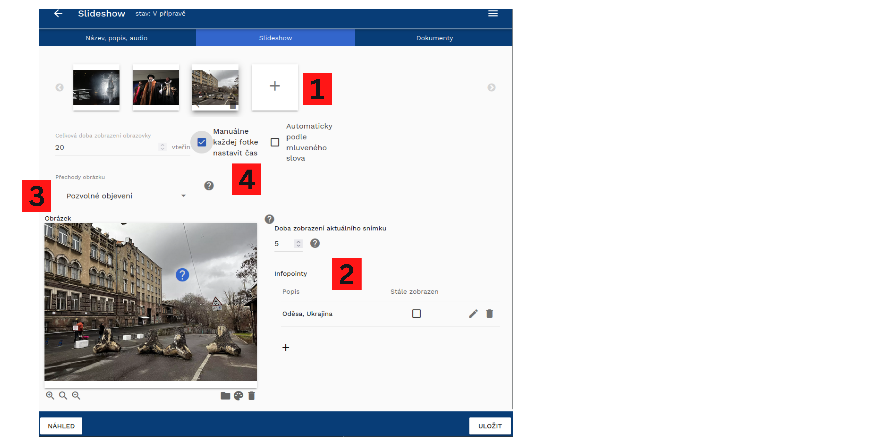

- **Infopoints (2):** Add infopoints to every photograph.
- **Image transition (3):** Choose an animation between images, such as no animation, no animation with blurred background, or gradual appearance. A blurred background fills the screen fullscreen.
- **Timing (4):** Either set a duration for the whole screen and let the editor distribute image times evenly, or set each image duration manually.

!!! info "Tip"
    Consider using an image with a blurred background. The background will be black and the image will stand out.
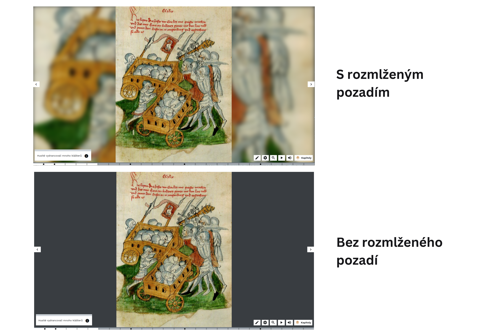

## Interactive screens

### Photo gallery

A photo gallery presents several related images. Unlike a slideshow, it shows an overview of all images and displays only the images visitors select interactively in detail. Visitors can enlarge the detail, close an image with the cross icon or move to the next image with arrows. Depending on image count and screen size, previews adjust automatically to be large enough and spread across the screen. If they do not fit, visitors can scroll down.

Select images as for an image screen or upload them through the file manager, which supports multiple uploads. Add another image with the + square. Change photo order with arrows or delete them with the bin.

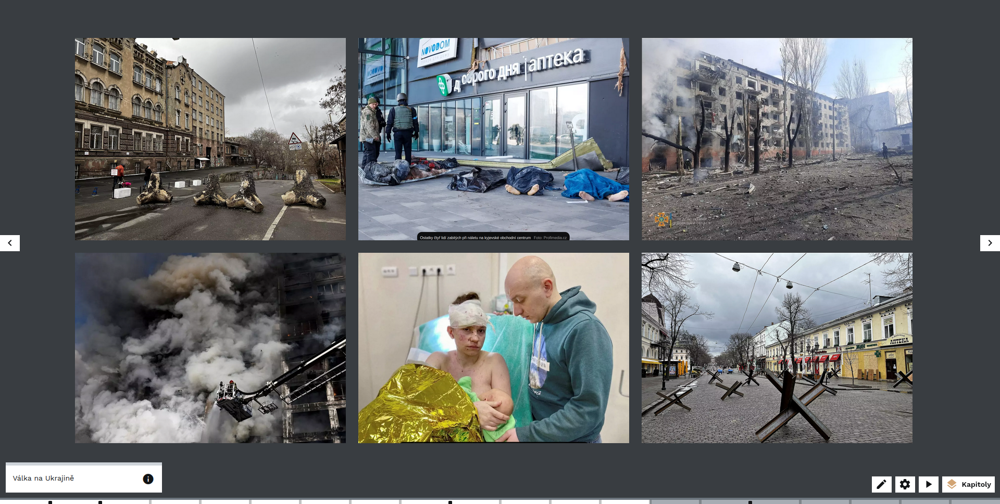

### Before and after

The "Before and after" screen encourages activity: visitors view an image and move a slider from one layer to the other. It consists of two half-visible images. Edit it by choosing two images from exhibition files, or upload a file from your computer. The simple [image editor](zaklady.md#simple-image-editor) is available through each image's file-directory menu. Set:

- Image transition method: slider, transition or fade
- Slider position
- Infopoints
- Screen duration

This screen is ideal for **highlighting changes and differences** that visitors might otherwise miss, for example the same place at different times. It can also create jokes and playful effects: put something in one image that is not in the original, revealing the difference only when the slider moves. Edit images through the palette icon or file manager.

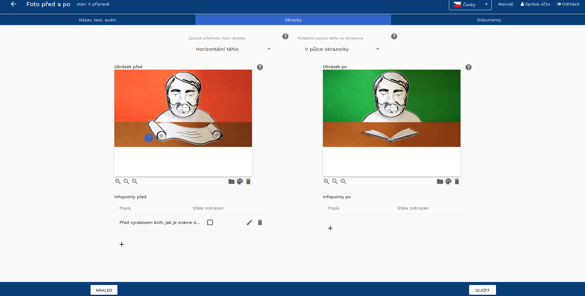

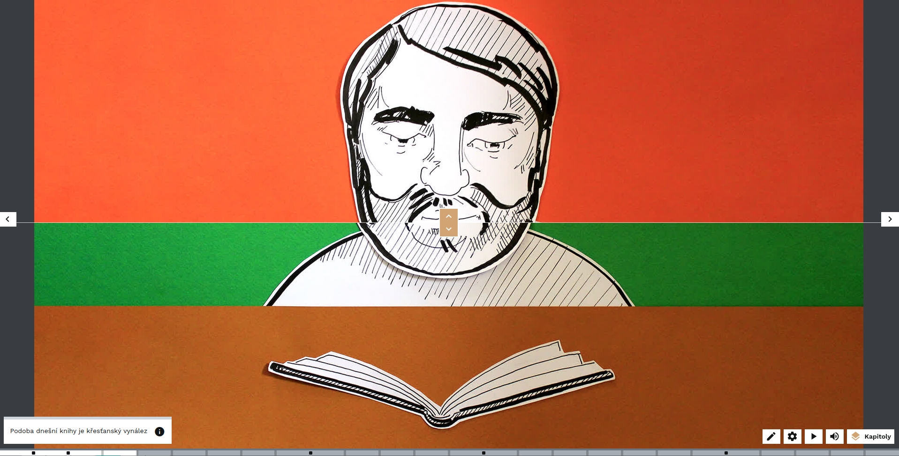

### External-content screen

An external-content screen embeds content hosted elsewhere online, or created in another tool that supports this sharing method, into an exhibition using an embed code. Embedded content retains its original features. You can share a map, interactive charts, videos and more.

Choose the service's embed-code sharing option, copy the code and paste it in the "External data" tab. Select "Scale to full screen" to display content fullscreen. Set the screen duration, after which the next screen appears automatically. Visitors can use arrows to move backwards or forwards when needed.

!!! info "Tip"
    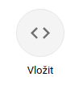  
    You will often find this in sharing options, marked &lt; &gt; or &lt; / &gt;. If several embed-code types are available, try the ones that work best. Responsive code may not work, whereas Fixed code might.

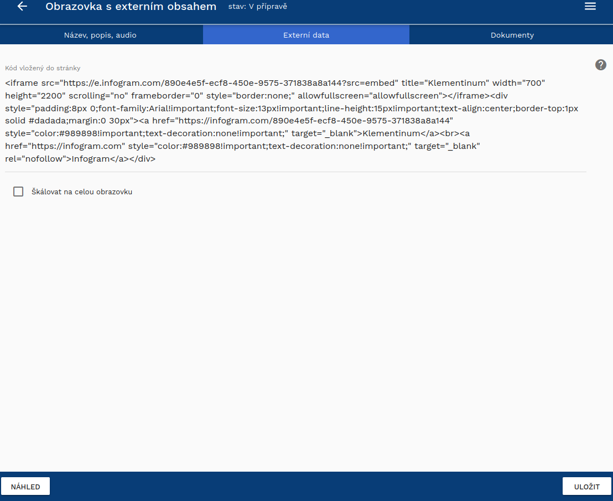

!!! info "Tip: Map"
    An embedded map, for example from Google Maps or mapy.cz, retains zoom controls. You can also set its size in the embed code; in this example it was manually enlarged to fullscreen, 1920 by 1080 px.
    Visitors then see the map like this:
    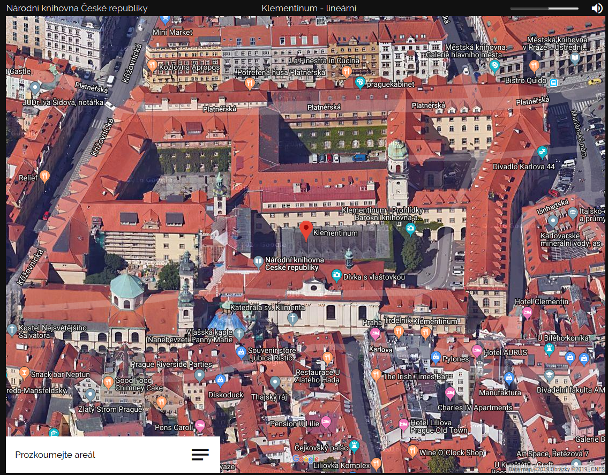

!!! info "Tip: Video"
    Visitors can play embedded video, for example from YouTube. You can set its size in the embed code; in this example it was manually enlarged to 1060 by 815 px.
    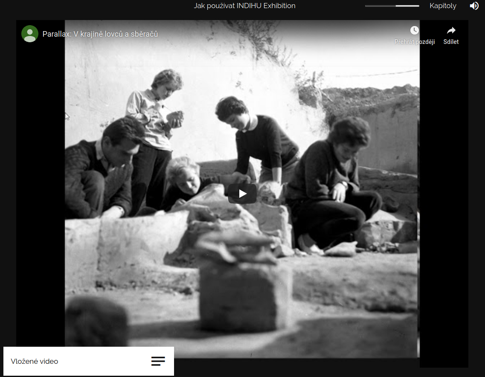
    Embedded video is useful when a video has been exported in a format unsupported by the editor and cannot be exported again. On the other hand, it can feel alien and may make some visitors feel the virtual exhibition's integrity has been disrupted.

!!! info "Tip: Interactive charts"
    Charts are effective tools for visualising information and can present large amounts of information engagingly.
    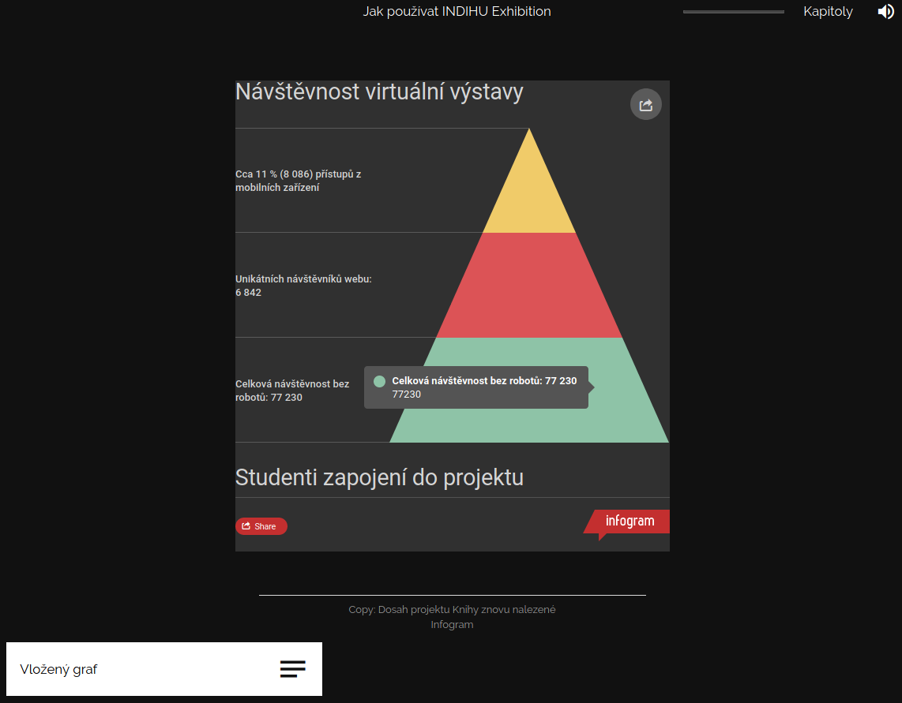
    This chart was created with [Infogram](https://infogram.com/). Specific figures and information appear when visitors hover over part of it. You can also create information maps in this tool.

!!! info "Tip: 3D object"
    If you have digitised 3D objects, embed them in an exhibition too. Visitors can rotate an object with the mouse and view it from all sides. Sometimes 3D models also contain textual information.
    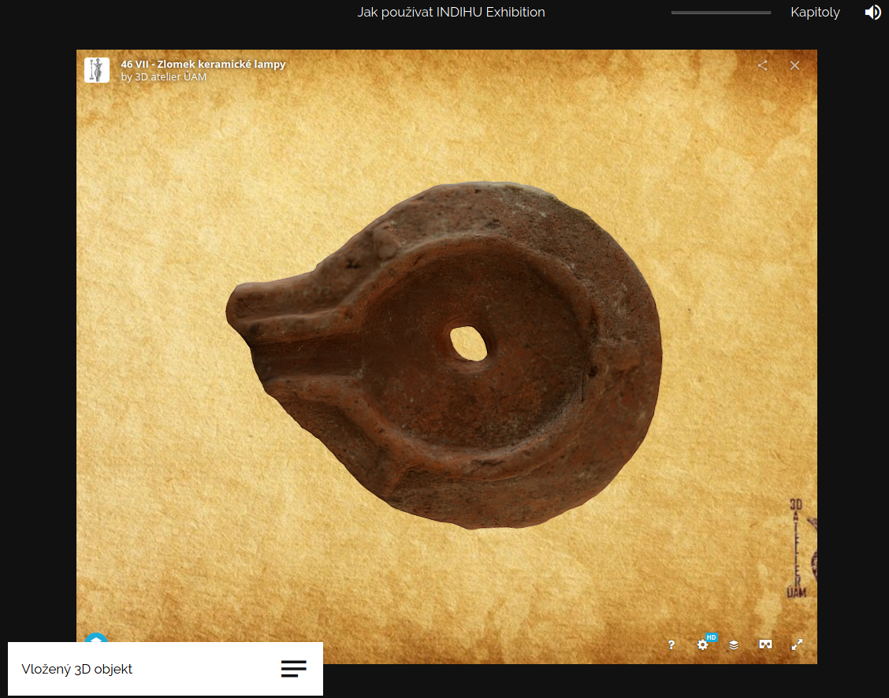

### Signpost

A signpost is an interactive screen that lets visitors choose what they want to explore next. Visitors choose a topic, or continue through the exhibition by clicking the **Next screen** square button in the bottom-left corner. Selecting a topic skips part of the exhibition.

Like a quiz, a signpost offers three basic choice formats:

- Image and text combined
- Text only
- Image only

Complete **Title, text, audio** as on other screen types. The key content is in the **Links** tab: enter topics visitors can continue to and select the screen they reach after choosing each one. Three options are offered initially, but you can add more or remove one. Add files as with other screens.

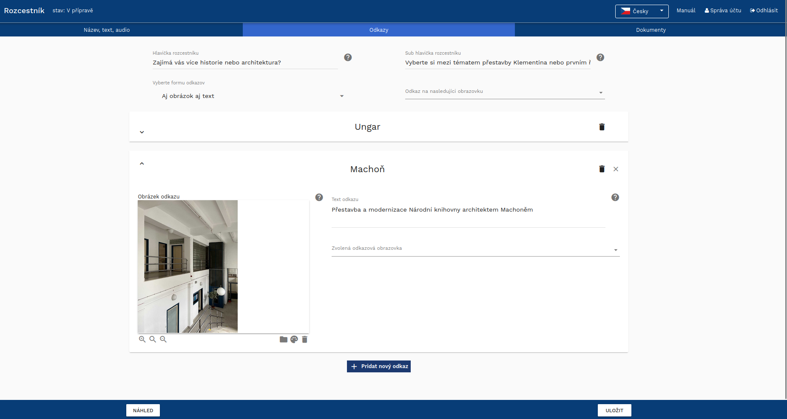

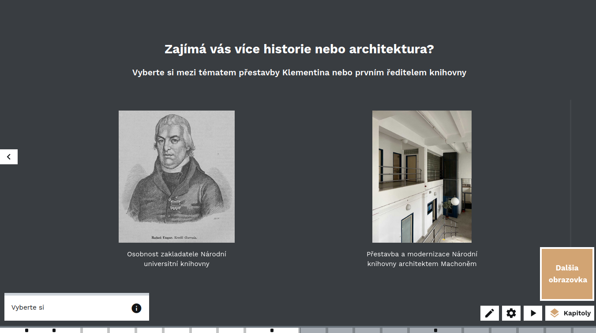

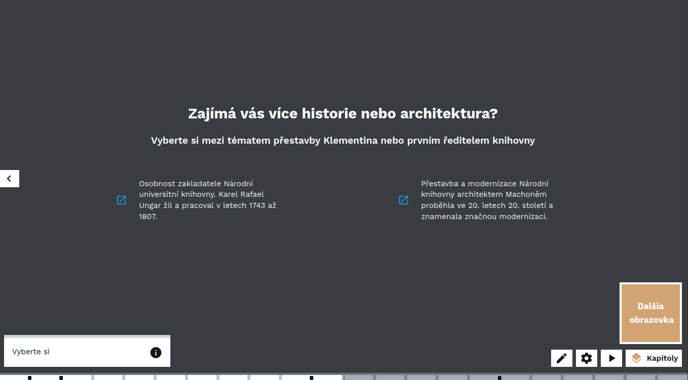

## Exhibition conclusion

The "Exhibition conclusion" screen is generated automatically. It uses the image from the landing page, but without animation, although you can upload a different image. The final screen asks visitors to rate the exhibition.

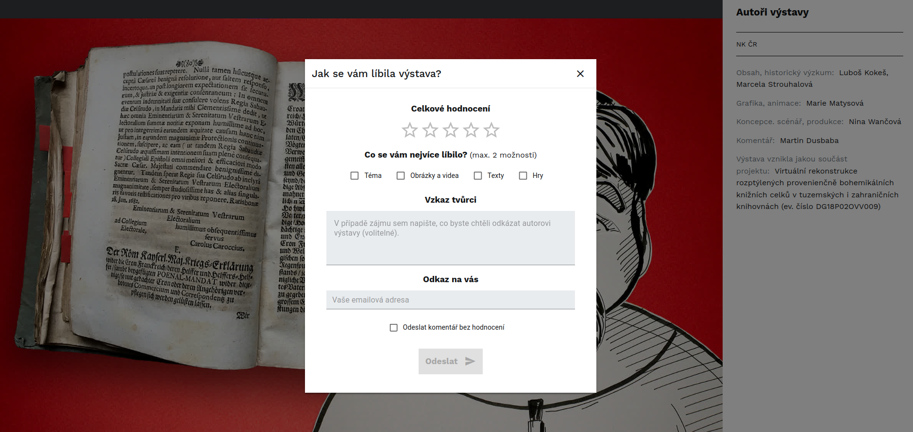

After rating, further functions appear. Visitors can replay the exhibition using the "Start again" icon (1). Clicking the "Exhibition files" download icon (2) opens a panel listing files visitors can download; it appears only if the exhibition contains documents. They can also use "Share" (3) to share the exhibition on Facebook, WhatsApp or X, or obtain its URL. The Email icon creates an automated email invitation.

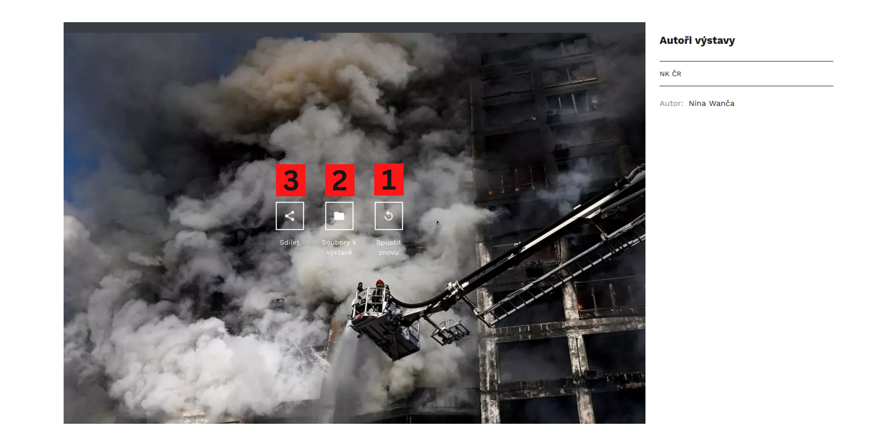

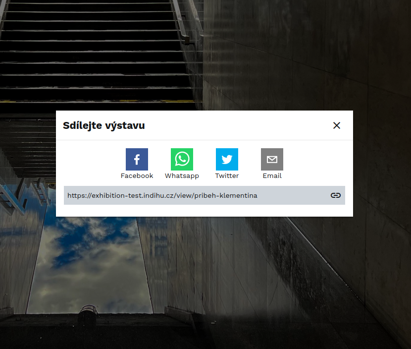

!!! info "Tip"
    If you attach files to an exhibition, give them understandable names so visitors know what they are downloading.
