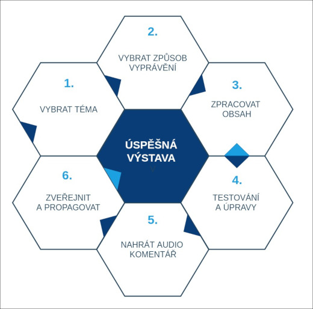
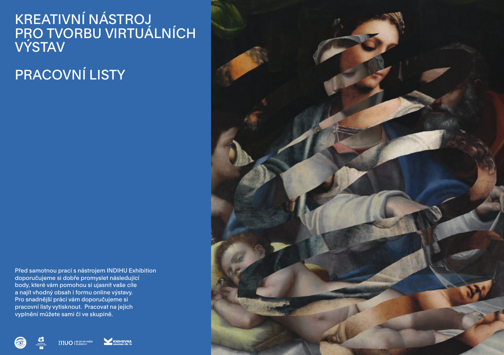

# How to create a successful virtual exhibition?

A virtual exhibition is an online presentation of a selected topic. When creating an exhibition, you fill individual screens with content - images, text, music and narrated commentary, or prepare games for visitors. Preparing an exhibition has two main parts: **preparing the exhibition topic and content** and **working in the INDIHU Exhibition tool itself.** Preparation can be divided into six basic activities:

1. Choose a topic
2. Choose a storytelling approach (content conceptualisation)
3. Prepare the content
4. Test and revise
5. Record audio commentary
6. Publish and promote

<!--  -->

!!! info "Tip"
    Do not underestimate thorough preparation of the exhibition topic, particularly steps 1 and 2. Give conceptualisation the attention it needs and find a storytelling approach that engages visitors. Using the tool is much easier when you have a clear idea of what you want to tell.

!!! warning "Warning"
    Remember that visitors are used to short online content. They regularly watch YouTube Shorts, short Instagram Reels and short TikTok videos. Your exhibition should take no more than 15 minutes.

## Creating my first exhibition

Creating your first exhibition is the hardest part, and we greatly appreciate that you have decided to use our tool. To make the process easier, we have prepared **worksheets** to help you create a virtual-exhibition script. Simply print them out. The worksheets help you target specific types of online visitors and, through questions, refine your content and multimedia choices.

[Download the worksheets as a PDF](../img/INDIHU_pracovni_listy_2026.pdf){:download}

!!! info "Tip"
    We recommend printing the worksheets and completing them by hand. They will help you answer the key questions: **what the exhibition is about, who it is for, and what interactions it offers visitors.** You can return to them repeatedly. We recommend that **each member of the creative team completes them independently** before agreeing on a shared concept.

**Exhibition topic**

First, choose a topic and find the right way to tell it. The virtual environment works differently from physical exhibitions, and online visitors have somewhat different expectations that we should accommodate if the exhibition is to succeed.

!!! info "Tip"
    Prefer focused topics and, where possible, avoid complex, highly structured issues. There is little room for complicated storytelling in the fast-moving online world.

**Exhibition content**

You can now begin preparing the exhibition content itself. **Less is more**: select what matters most so the final exhibition takes no more than 15 minutes. Write all necessary texts and find as much visual material as possible. Clarity is the most important consideration when preparing an exhibition, so structure the content logically and be specific and concise.

In the second stage, consider how descriptive text could be replaced by a more engaging type of content. Video clips are often the most suitable option. Use your creativity too and devise a game for the visitor (an advanced feature), which the tool lets you incorporate into the exhibition.

!!! info "Tip"
    Not all information is equally important. Identify which content is essential and which is supplementary material that can be attached for download.

**Exhibition format (how the topic is told)**

When creating a virtual exhibition in INDIHU Exhibition, you fill **screens** with content. Screens can be grouped into **chapters**, or an exhibition can consist of **individual screens** in sequence. You can also combine both approaches.

!!! info "Tip"
    Consider how you will develop and divide the exhibition content and how substantial its individual parts will be. This will help you decide whether to use standalone screens or structure the topic into chapters.

## Recommended features for beginners

Individual screens and their features are described in detail in the [Screens](obrazovky.md) section. If you are just learning to create virtual exhibitions, we especially recommend focusing on:

- Image screens
- Timing and infopoints
- Preparing image assets and quality post-production
- Text
- Clear chapter and screen titles
- Audio tracks (music)
- Interactive screens
- Testing

### Image screens

When preparing an exhibition, focus particularly on visual material and its quality. In today's visual world, images and videos attract the most attention. These screens include:

- [Image screen](https://libcas.github.io/indihu-manual/en/screens/#image-screen)
- [Zoom animation](https://libcas.github.io/indihu-manual/en/screens/#zoom-animation)
- [Slideshow](https://libcas.github.io/indihu-manual/en/screens/#slideshow)
- [Photo gallery](https://libcas.github.io/indihu-manual/en/screens/#photo-gallery)

!!! info "Tip"
    Pay special attention to introductory images: the exhibition cover image and chapter introductions.

If you prepare visual material yourself, we recommend using a **good-quality camera**. Also ensure that photographs have a good composition, appropriate lighting and a quality background. If possible, have the necessary images taken by a professional photographer. Only share images for which you hold the **copyright**.

!!! warning "Warning"
    **Copyright** is very complex online: once you publish something, anyone can download the images. We recommend using only images for which your institution holds the rights or which you took yourself. For illustrative images, use databases and images licensed under CC (Creative Commons), such as [Wikimedia Commons](https://commons.wikimedia.org/wiki/Main_Page) or [The Flickr Commons Program](https://www.flickr.com/commons). Audio and sounds are also available under CC licences. **Always credit the source** of images or other media. You can do this in a text field or an infopoint.

### Timing and infopoints

**Timing** is important for image screens. Set the time in the editor so visitors can view the visual material comfortably. Experiment with the exhibition's pace and take your audience into account: older people need more time, while children can cope with more frequent changes of content. Use **infopoints** to highlight the informational value of images. Besides short text, they can contain another image or video.

!!! info "Tip"
    Although we advise you to focus on the visual aspect of a virtual exhibition, less is more here too. This prevents unintentional visual overload for the visitor.

### Preparing image assets and post-production

Prepare images at a minimum Full HD resolution (1920x1080), 72 dpi, in .png or .jpg format. Landscape images generally work better. Images presented in an exhibition may have different formats, colours or styles. Post-production lets you unify them or add engaging details. The exhibition will then work as a whole even if the source materials differ. See [Inspiration](inspirace.md) for examples of good practice.

### Text

Good text can bring visitors new information and spark interest in the subject, but it must be **brief.** We recommend texts of no more than 500 characters. Visitor-satisfaction research on virtual exhibitions clearly shows that **visitors do not read long texts**.

Follow these recommendations when preparing text:

- Avoid specialist terminology where possible.
- Ask friends who are not experts whether they understand the text and identify difficult words.
- Write shorter sentences; they are easier to understand.
- Put the most interesting information at the beginning and do not rely on visitors reading to the end.
- Use formatting (bold important messages) or bullet points.
- Attach more detailed information in a separate file to the exhibition and/or each screen to avoid overloading the main content.
- Use a [text screen](obrazovky.md#text-screen) to highlight short text, for example quotations or key information.

If you want to prepare downloadable documents containing more detailed information, use these formats: .pdf, .txt, .docx. We especially recommend .pdf because its formatting will not change.

### Clear chapter and screen titles

Name chapters and screens simply and attractively so visitors know what to expect. Long, complicated titles are confusing and may not fit the relevant controls. Add any details in the accompanying text box.

!!! info "Tip"
    Take inspiration from newspaper headlines, which are intended to entice people to read, because as an exhibition creator you need to achieve the same goal.

### Audio tracks (music)

Sound and music give an exhibition atmosphere and add variety. Visitors can adjust the volume or turn sounds off. Producing audio commentary can be demanding at first, so we recommend using music, for example as a chapter soundtrack. You can use a wide range of recordings licensed under CC (Creative Commons).

!!! info "Tip"
    For beginners, we recommend adding music to each chapter separately. The track will then loop, so you do not need to worry about timing.

You can record **audio commentary** from your final texts. This makes the exhibition easier to follow because viewers do not need to read. A mobile phone is the simplest option today, but if possible, entrust this work to professionals: the difference will be noticeable. Set the timing of each relevant screen according to the length of its commentary.

!!! info "Tip"
    Public institutions such as libraries may offer podcast studios that you can use to record audio commentary.

!!! info "Tip"
    We recommend preparing audio commentary separately for each screen, as this makes timing easier to set.

### Interactive screens

Interactive screens let visitors engage in small interactions. They are not difficult to create and provide welcome variety in an exhibition. Their design is again based mainly on images.

**Use these types of interactive screen when preparing your exhibition:**

- [Photo gallery](obrazovky.md#photo-gallery): A set of images is displayed and visitors choose which one to enlarge and examine. They can view all of them or only selected ones. Each image also allows close examination with the magnifier function.
- [Before and after](obrazovky.md#before-and-after): This screen presents two complementary or contrasting images that visitors can compare themselves.
- [External-content screen](obrazovky.md#external-content-screen): Have interesting content published in another application? This screen lets you integrate it easily into your exhibition while retaining the interactivity it offers elsewhere. Examples include map applications and video.

### Testing

Ask someone outside the exhibition's creative team for feedback. This could be a colleague who is not working on the exhibition, or ideally somebody outside your field. Ask what they do not understand and revise the exhibition according to their observations.

!!! info "Tip"
    Above all, check whether visitors really spend as much time in the exhibition as you planned, and adjust its length accordingly.

## Recommended features and approaches for advanced creators

If you have already created your first exhibition, or several, try advanced features and work more deeply with different target groups. You can create exhibitions specifically for particular audiences or offer several versions (a more complex one for adults and a simpler, more playful one for children).

### Video clips

Alongside existing video clips, you can prepare unique video tracks for an exhibition, significantly enriching its content. Videos should not be too long (we recommend one minute, three minutes maximum). When making them, focus again on careful script preparation. You can use different genres:

- Documentary film
- Interview with a witness or expert
- Animation
- Fiction film

Prepare video in Full HD (1920x1080), 25 frames per second, rendered in H.264. For this content type, use the [external-content screen](obrazovky.md#external-content-screen).

### Parallax

[Parallax](obrazovky.md#parallax) is a special type of moving image. This engaging effect is achieved by uploading an image in several layers, each moving independently. Preparing parallax is more demanding both creatively and in production.

### Non-linear navigation through a virtual exhibition

Do you see a virtual exhibition as a space visitors can explore according to their own choices? Do you want to focus their interest according to their mood, curiosity or knowledge? In that case, use non-linear navigation through a virtual exhibition with:

- a [signpost screen](obrazovky.md#signpost)
- or [infopoints](obrazovky.md#infopoints)

This is one of the most advanced features and makes considerable demands on you as creator when planning the exhibition structure. However, it allows visitors to skip selected content.

### Games

Interactivity and the opportunity to participate directly in consuming virtual content are now normal online expectations. INDIHU Exhibition lets you include several types of game; detailed explanations are available in the separate [Games](hry.md) section.

Some have clear solutions and are better suited to testing knowledge and attention. Knowledge games can introduce a topic and establish visitors' initial knowledge, which the rest of the exhibition develops, or be used at the end as a simple way of summarising all the information presented. These games include:

- Find it in the image
- Guess the size
- Move to the right place
- Quiz

Other games are creative and have no single solution. These are better for developing imagination, encouraging creativity and letting visitors express themselves independently. They include:

- Draw/colour in
- Scratch card / Chisel away

### Carry out visitor research and use participatory exhibition-preparation methods

Find out what interests your visitors most and tailor the exhibition to them. You can run a **poll** about proposed topics on your website or social media. Another option is more in-depth research with a **specific target group**. You can also work with local schools or other non-formal education institutions while preparing the exhibition. This broadens both the exhibition's reach and your range of activities.

!!! info "Tip"
    For example, a local amateur photography club or film group can help create more demanding media content.

### Focus on promoting the exhibition

Promotion can significantly affect an exhibition's reach and success. Here are several tips:

- Create a video teaser for the exhibition.
- Prepare a social-media campaign and raise awareness well in advance. State clearly what visitors gain from seeing the exhibition.
- Time the exhibition to coincide with a significant date or link it to another offline event. You could even organise an opening event.
- Contact local media and prepare a press release, or offer journalists an interview with the authors.
- Use your contacts with schools or other educational institutions. Offer them your virtual exhibition directly and promote it through established channels.
- Prepare accompanying educational material for exhibition visitors or schools in the form of a worksheet.

!!! info "Tip"
    If you notice an **error** in text or images after publishing the exhibition, do not worry: you can correct it. **An exhibition can be edited** even in Published mode, or you can change its status to In preparation if the change will take longer. Changes are saved immediately and visitors always see the latest version.
