# Herní obrazovky

V současné době je hraní digitálních her velmi populární a využít je můžete i ve výstavách. Hry **nejsou jen pro dětské návštěvníky**, ale zaujmou i dospělé a **vtáhnou návštěvníka do děje**. Některé ze šesti her v INDIHU Exhibition mají jasné řešení a jsou zaměřené více na fakta, jiné jsou více kreativní a otevřené. 

!!! warning "Upozornění"
    Z [výzkumu](https://www.lib.cas.cz/casopis_informace/analyza-vystav-indihu-exhibition/), ve kterém jsme zkoumali do té doby všechny vytvořené výstavy, kterých bylo 189, vyplynulo, že 80% výstav neobsahuje hry. Je to škoda, interakci a herní prvky na internetu návštěvníci a uživatelé čekají. 

**Mezi výhody her patří:**

- Můžete "zkontrolovat", zda si návštěvník zapamatoval klíčové informace
- Hrou upozorníte na nejdůležitější informace
- Obsah bude dynamičtější a může oživit zájem návštěvníka
- Vtáhnete návštěvníka do děje
- Přimějete návštěvníka, aby se nad tématem zamyslel
- Z pasivního návštěvníka se stane aktivní návštěvník
- Poskytnete návštěvníkům možnost kreativně se vyjádřit
- Jednoduše nabídnete zábavu

!!! warning "Upozornění"
	U každé hry pečlivě formulujte v řádku "Otázka" nebo "Úkol hry" zadání úkolu nebo otázku, na kterou návštěvníci mají odpovědět. Toto zadání by mělo být jednoduché, krátké a hlavně srozumitelné. Zkuste úkol otestovat na někom z vašeho okolí, abyste si ověřili, že je pokyn jasný.

## Obsah stejný pro všechny hry

Jak je ukázáno na obrázcích z editace u hry Najdi na obrázku, v editaci u každé hry pojmenujte téma obrazovky v řádku "Název" (1). Tento název se zobrazuje v časové ose a v kapitolách a slouží k navigaci ve výstavě. V políčku "Úkol hry" pak stručně napište, co je úkolem návštěvníků (2). U každé hry také nastavujete čas, po který se zobrazí výsledek u správných řešení. Návštěvník hru dokončí tak, že klikne na fajfku (5), kterou potvrdí, že je s hraním hotový. V případě, že si chce zahrát hru znovu, klikne na ikonu zatočené šipky (6), obsah se mu vynuluje a může začít znovu.

## Najdi na obrázku

Návštěvník má za úkol najít určité místo na obrázku. V záložce obrázky nahrajte obrázek do "Zadání," to je obrázek, který se návštěvníkovi zobrazí, a na kterém hledá příslušný motiv. V případě, že má návštěvník najít nějaké určité místo nahrajte i obrázek "Výsledek", který se zobrazí po tom, co si návštěvník tipne. Čas zobrazení výsledku nastavujete v záložce "Název, úkol" ve vteřinách (3). Tento výsledný obrázek vytvořte v jiném programu a označte místo např. kroužkem, křížkem či jinak (viz druhý obrázek). Pokud hra nemá správné řešení, zaškrtněte pole "Hra nemá správné řešení". Návštěvník hledá pomocí špendlíku, který pomyslně zapíchne do obrázku (4). Po tom, co návštěvník vybere příslušné místo, klikne na ikonu fajfka (5), čímž svoji volnu potvrdí. 

**Příklady úkolů:**

- Najděte místo na mapě, kde se odehrálo... 
- Zkuste odhadnout, které z dětí na fotografii se stal v dospělosti slavným spisovatelem
- Najděte na obraze symbol zobrazující nevinnost
- Vyberte si vitráž v okně, která se vám líbí nejvíce

!!! info "Tip"
	Tato hra přiměje návštěvníka k pečlivému prozkoumání obsahu, čímž se prohloubí jeho vnímání a soustředění. 

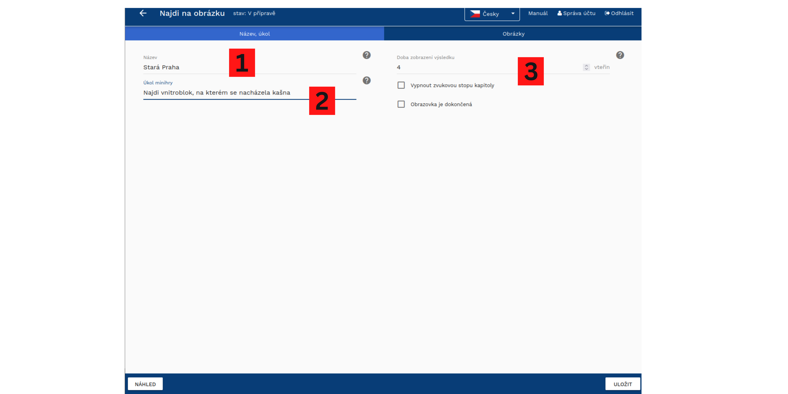 

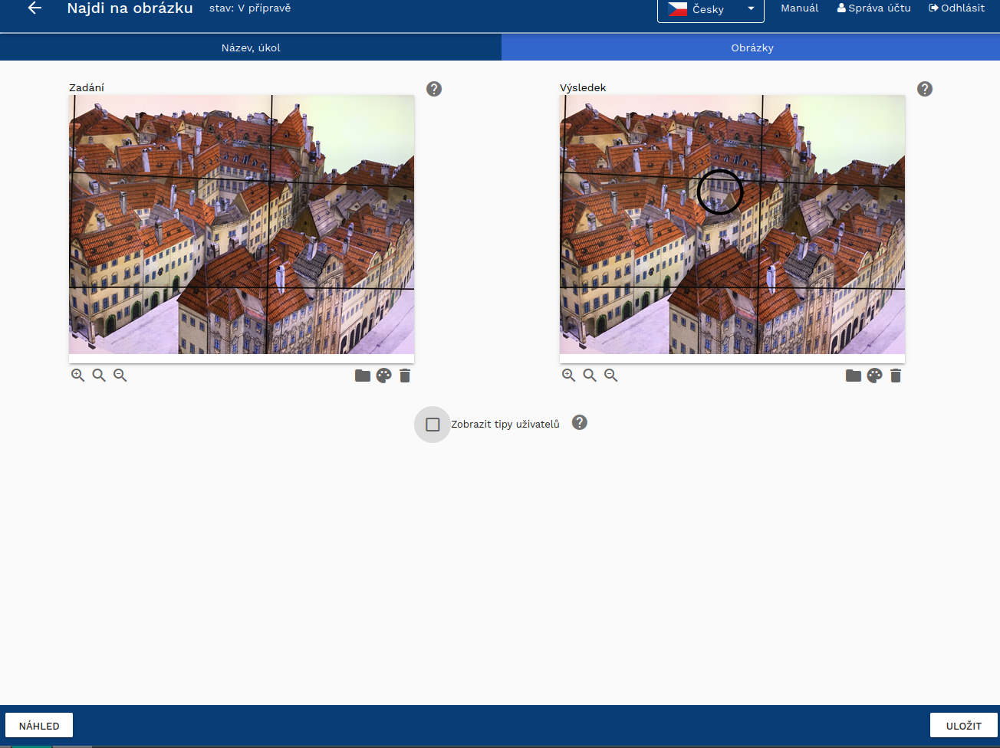 

 

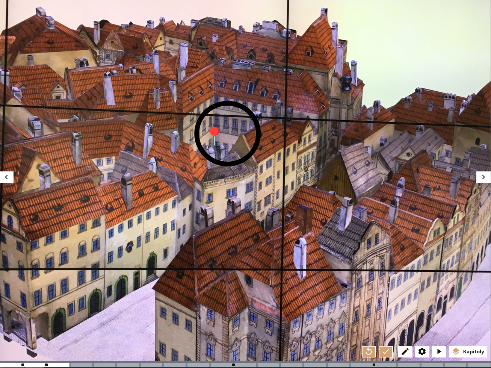 

!!! info "Tip"
	V případě, že hra nemá správné řešení a jde o to, aby návštěvníci formulovali vlastní názor, můžete se v obrázku "Výsledek" podělit o vlastní názor. Prohloubíte tak vztah mezi návštěvníky, tvůrci a výstavou.  

## Dokresli

Návštěvník má za úkol dokreslit pouze částečně zobrazený objekt. K dispozici má tužku, u které může měnit barvu (1), vybírat si tloušťku (2) nebo si zapnout gumu, díky které v případě potřeby část obrázku smaže (3). Díky různým tloušťkám tužky může návštěvník obrázek vybarvovat a udělat v něm i plochy. V případě, že chcete ukázat, jak vypadá celý obrázek, nahrajte obrázek do Výsledku. Pokud hra nemá správné řešení, zaškrtněte pole "Hra nemá správné řešení". 

**Příklady úkolů:** 

- Dokreslení symetrického předmětu (váza, ornament, svícen)
- Vybarvení černobílého obrázku
- Vybarvení obrázku jen za použití studených / teplých / určitých barev
- Ukažte návštěvníkům jen část grafu a nechte je zkusit odhadnout, jak vývoj pokračoval po nějaké události 

!!! info "Tip"
	Tato hra nutí návštěvníka, aby se nad tématem opravdu zamyslel, porovnal dosavadní informace z výstavy s tím, co si o tématu doposud myslel. Pokud se hra zaměří na dokreslení tvarů, výzdoby apod., tato hra může sloužit ke kreativnímu vyjádření návštěvníka.  

 

## Stírací los

V této hře návštěvník odkrývá obrázek zobrazený pod prvním obrázkem. Do editace nahrajete vrchní a spodní obrázek a zvolíte různé nástroje, kterými budou návštěvníci obrázek odkrývat - guma, metlička, kartáč, kladívku a další. Návštěvník první obrázek "vygumuje" myší a zobrazí se mu nový obrázek s novou informací. Stírací los můžete použít jako interaktivní obdobu [Foto před a po](obrazovky.md#foto-pred-a-po). Díky různým nástrojům, které můžete zvolit v editaci, můžete ovlivňovat kontext hry. 

**Příklady úkolů:** 

- Pomocí kladívka vykutají návštěvníci paleontologický nález ukrytý ve skále
- Díky metličce mohou uklidit místnost od prachu
- Hadříkem mohou návštěvníci umýt špinavé okno a zobrazit, co je za ním
- Pomocí dláta vysochají sochu z kusu dřeva

!!! info "Tip"
	Stírání je velice jednoduché a intuitivní. Nelze však předpokládat, že návštěvník pečlivě setře celý obrázek, proto raději umístěte objekt a pointu ke středu obrázku a ne na jeho okraje. 

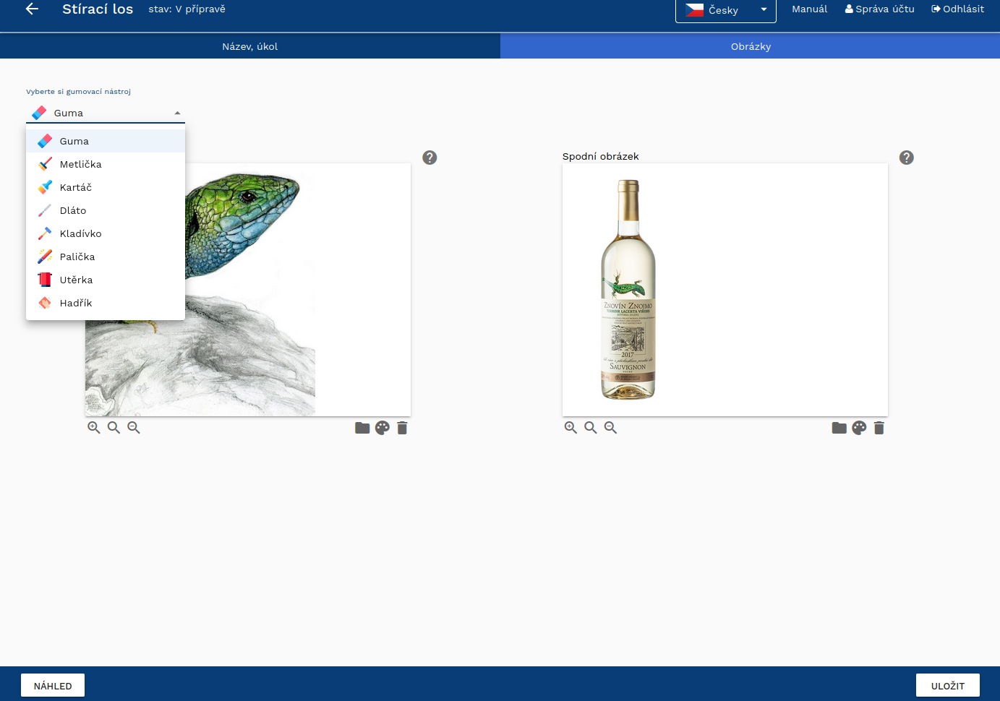 

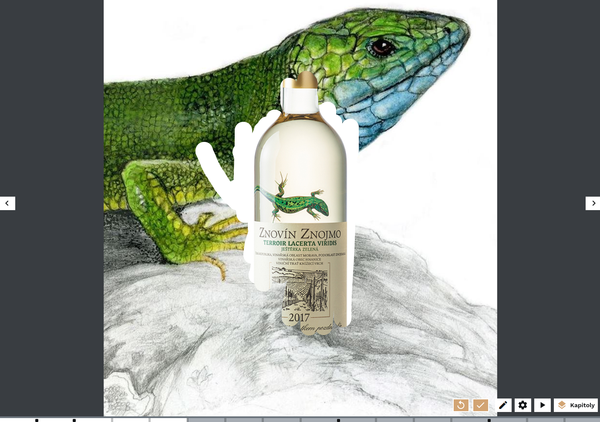 

## Hádej velikost

Hra je zaměřená na to, aby si návštěvníci uvědomili, jak jsou některé věci malé či velké. Návštěvníci mají za úkol pomocí šipky zvětšit či zmenšit obrázek a porovnat jeho velikost s referenčním objektem. Za referenční objekt vyberte dobře známý předmět, jehož velikost je fixní a všeobecně známá - např. krabička od sirek, propiska, lidská postava, auto apod. Hra je zaměřená na otestování senzorické zkušenosti. 

**Příklady úkolů:** 

- Překvapte návštěvníky tím, že jim ukážete, jak moc jsou některé věci malé - např. postavičky věstonických Venuší jsou ve skutečnosti mnohem menší, než si lidé myslí. Návštěvníci je pak překvapen zručností lidí v historii, kteří takový předmět vyrobili)
- Ukažte, jak např. budovy působí velkolepě, když se na ně člověk dívá z podhledu
- Ukažte, jak se změnily horizonty přidáním nových dominant, jako např. Eiffelova věž v Paříži

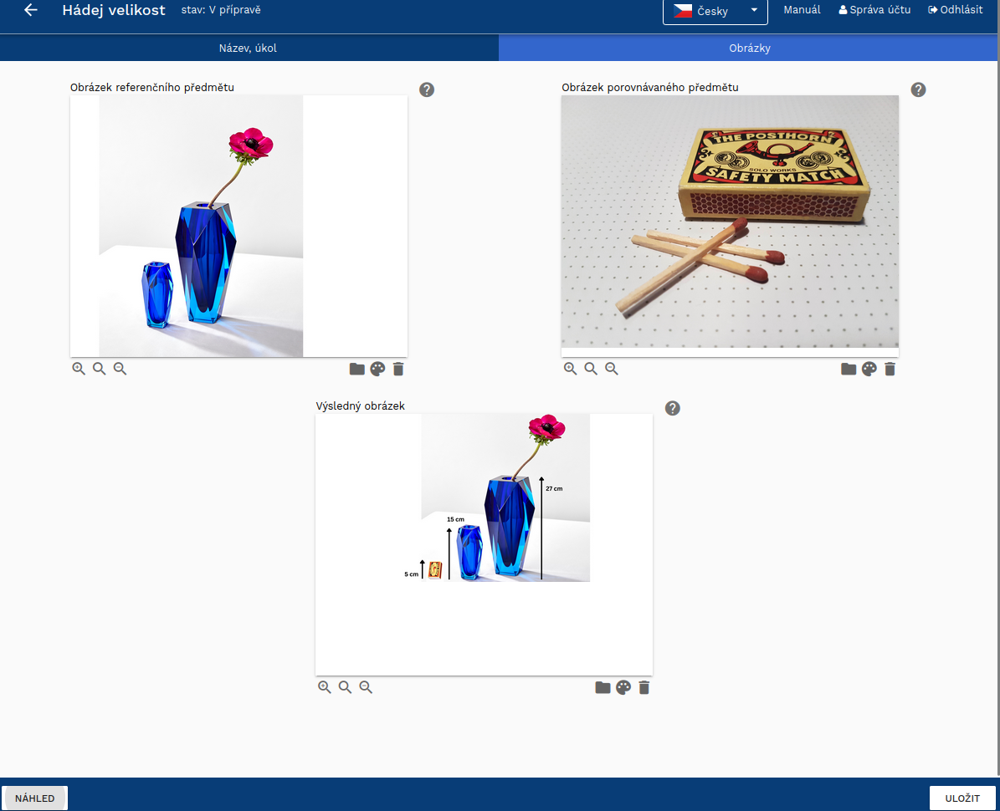 

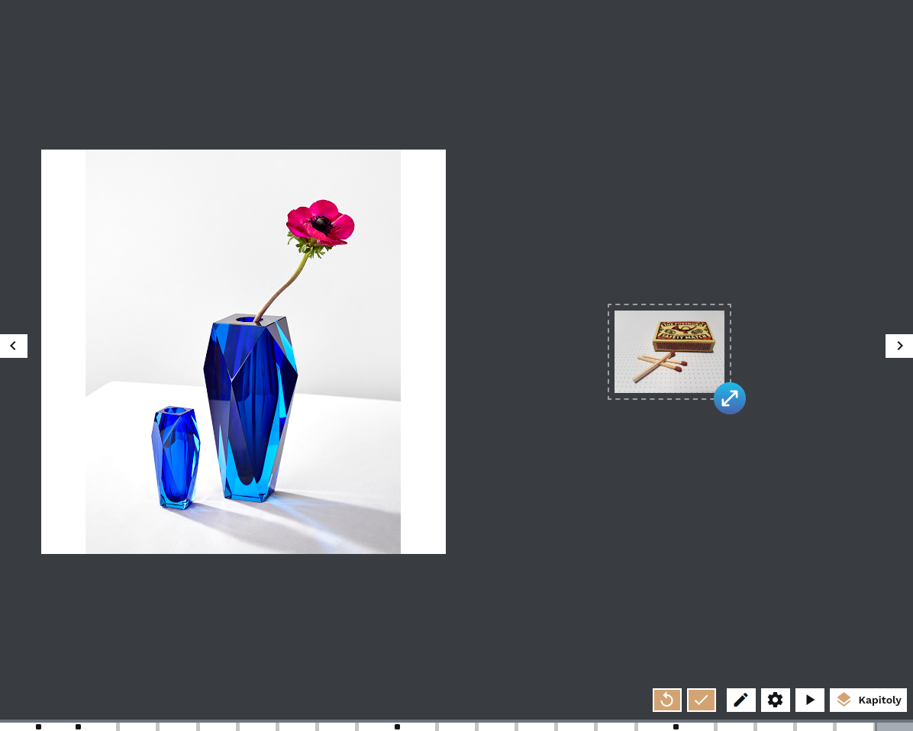 

 

## Posuň na správné místo

Hra "Posuň na správné místo" stojí na metodě drag and drop, kdy návštěvník posunuje objektem v obrázku a hledá, kam patří. Hra může a nemusí mít správné řešení - na obrázku je např. úkol, kdy mají návštěvníci vybrat okno, z kterého se princezna ráda dívá a je to jen na nich, aby vybrali. Pokud tedy vytváříte  hru, která nemá správné řešení, zaškrtněte pole "Hra nemá správné řešení". 

**Příklady úkolů:** 

- Umístěte významnou budovu či jinou dominantu na horizont
- Ozdobte místo vlajkou
- Umístěte do obraz ornament nebo určitý motiv, který ho vylepší
- Vyberte místo, z kterého byste si chtěli ulici prohlížet 

!!! info "Tip"
	Hra funguje vizuálně lépe, když je obrázek, s kterým návštěvníci posunují, bez pozadí. Vyexportujte tedy obrázek s transparentním pozadím ve formátu .png. 

!!! info "Tip"
	Přizpůsobte obrázek, kterým návštěvníci pohybují, velikosti obrazovky a obrázku. V případě, že je obrázek moc velký, zastíní obrázek, na který ho mají návštěvníci umístit. Použijte funkci "Resize" (Uprav velikost) se zachováním poměru stran. 

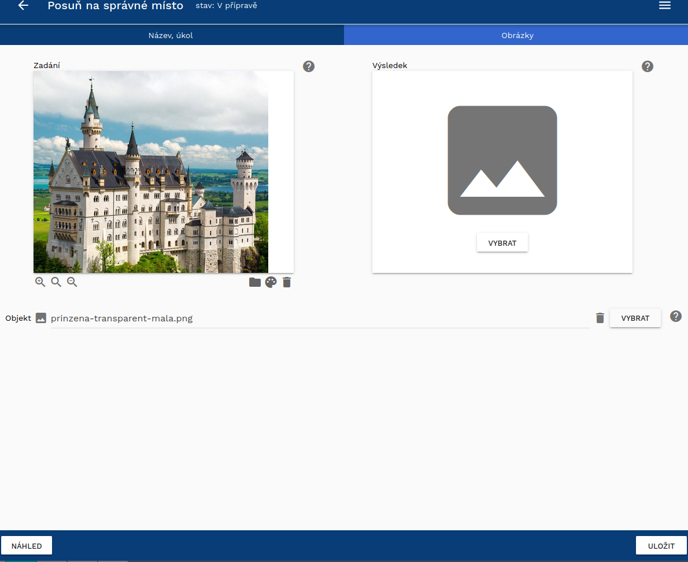 

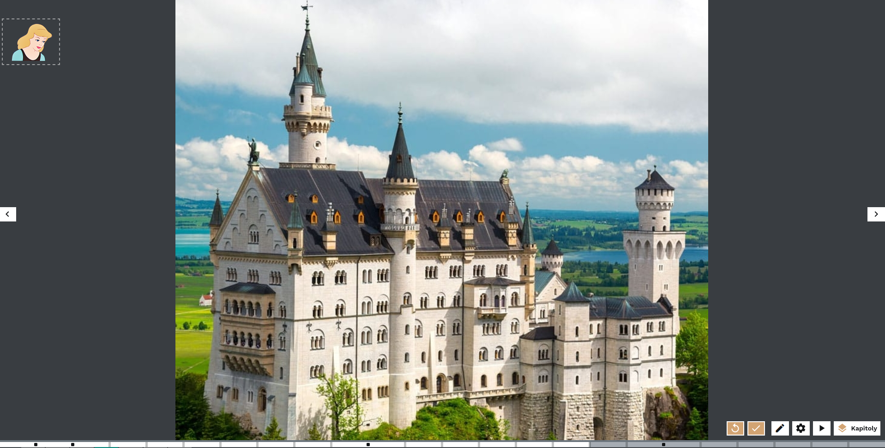 

## Kvíz

Kvíz je jednoduchá hra, kdy návštěvník vybírá jednu správnou odpověď nebo odpovědi z nabídky. Při designu kvízu můžete nastavit, zda je jedna nebo více správných odpovědí, které pak označíte za správné. Vždy musíte mít minimálně dvě možnosti, ačkoli jich můžete přidat více. Když si kvíz zakládáte, objeví se tři možnosti, čtvrtou a další pak přidáte tlačítkem "přidat novou odpověď." Jak ukazuje poslední obrázek, kde jsou čtyři možnosti, jednotlivé odpovědi se automaticky seřadí tak, aby dobře vyplňovaly stránku.  

Doporučujeme si jednotlivé možnosti pojmenovat, usnadní vám to orientaci v odpovědích, když budete přesouvat a měnit pomocí šipek pořadí možností. U kvízu se rozhodněte, zda budou odpovědi jen text, jen obrázek nebo obrázek s textem. Díky obrázkům bude kvíz zajímavější a vizuálnější. I textové možnosti lze pak zpracovat vizuálně jako obrázek (můžete si představit třeba příspěvek na Instagramu nebo jinou infografiku).

!!! warning "Upozornění"
    Z [výzkumu](https://www.lib.cas.cz/casopis_informace/analyza-vystav-indihu-exhibition/), ve kterém jsme zkoumali vytvořené výstavy, vyplynulo, že pokud výstavy obsahují hry, jde většinou o kvíz. Je nejjednodušší na vymýšlení, ale zkuste vymyslet i další hry. 

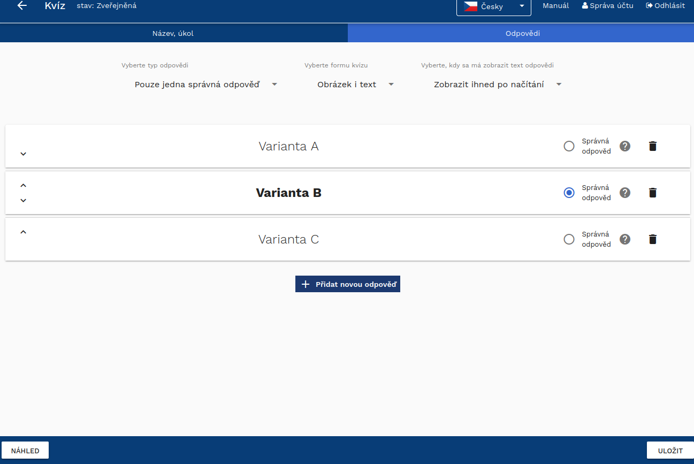 

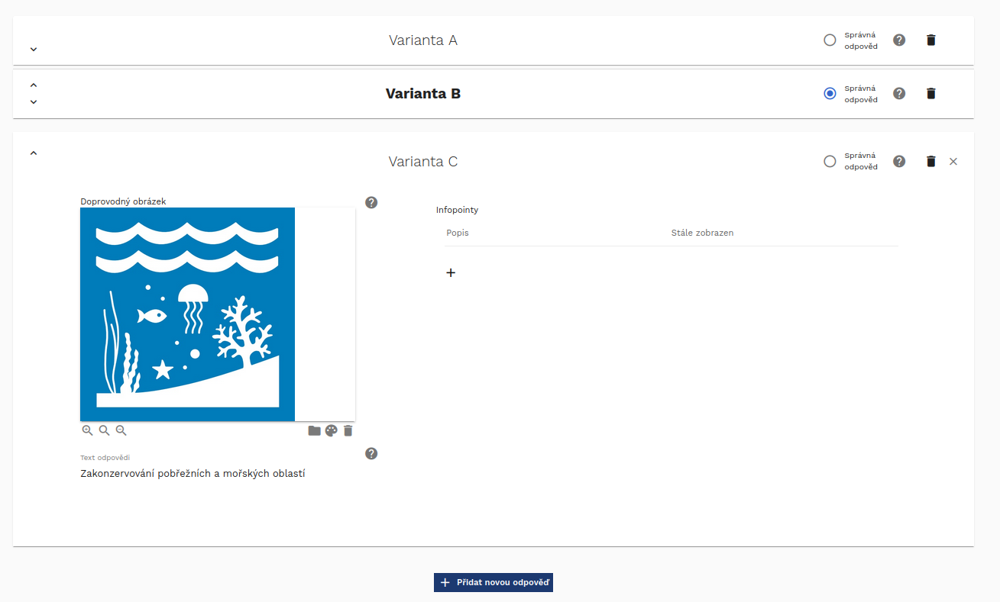 

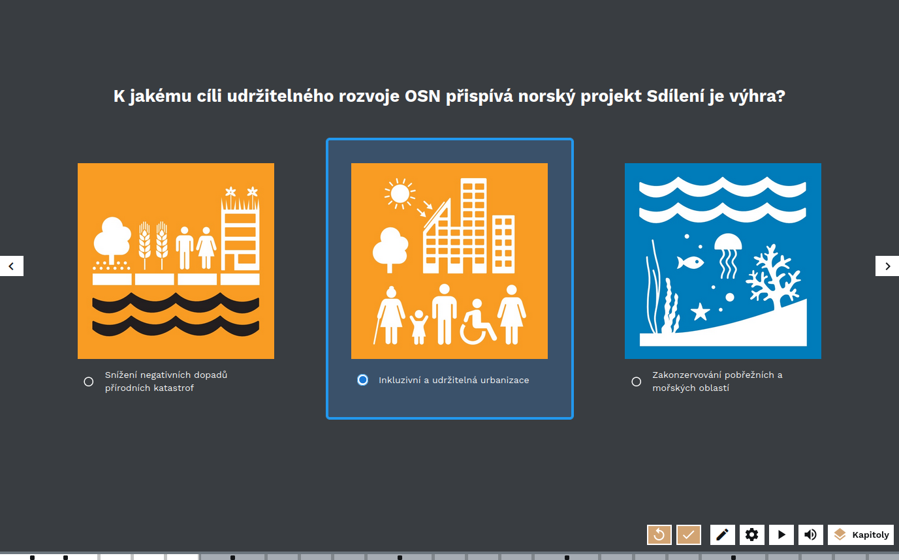 

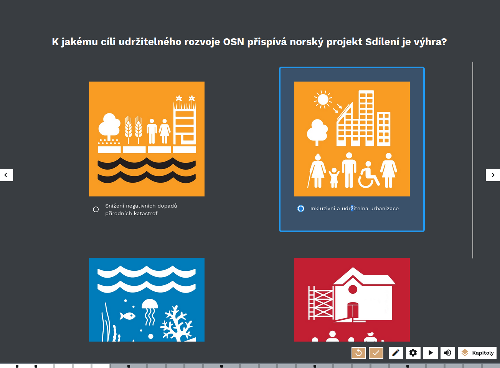 

!!! info "Tip"
	Kvíz je ideálním prostředkem, jak zkontrolovat, zda si návštěvníci pamatují důležitou informaci, která v předešlé části výstavy zazněla. Výběr z možností může být naopak možnost, jak prověřit názory na téma, které později ve výstavě teprve rozvineme.    
