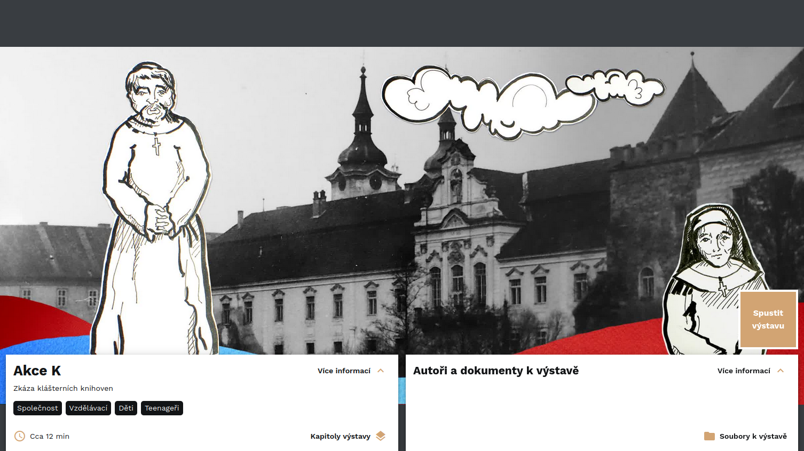

<!-- TODO promovideo -->

# O nástroji INDIHU Exhibition

Editor virtuálních výstav INDIHU Exhibition je vhodný pro tvorbu **multimediálních bohatých prezentací s interaktivními prvky**. Online přítomnost se stává nezbytností, protože veřejnost očekává, že **budete online nabízet zajímavý obsah**. Je ideální pro neotřelé představení svojí práce s cílem vzbudit v návštěvnících zájem. Už není tak ideální pro přenos velkého množství informací. Delší materiály lze však přiložit a návštěvníci si soubory mohou v případě zájmu stáhnout. 

Editor byl koncipován tak, aby byla výsledná virtuální výstava vizuální, svěží, nápaditá a zábavná. Hlavní roli ve virtuálních výstavách hraje obsah, ovládací prvky jsou subtilní. INDIHU Exhibition má širokou škálu použití pro instituce zprostředkovávající kulturní dědictví, umožní vytvářet výstavy na **libovolná témata** a lze použít i pro neotřelou online prezentaci výstupů vědeckého bádání. 

Může sloužit jako **vzdělávací nástroj** a pomůcka ve výuce v různých typech škol. Ve výuce můžete využít hotové výstavy, nebo nechat žáky a studenty v něm mohou zpracovávat školní práce. 

!!! question "Proč používat INDIHU Exhibition?"
    * Umožní tvořit virtuální výstavy, aniž byste museli rozumět webdesignu
    * Poskytuje širokou škálu obsahu od obrázků, přes video, texty 
    * Nabízí zařazení interaktivních her
    * Dovoluje soustředit se na obsah a ne na technickou stránku
    * Ušetří peníze za programátory
    * Splňuje současné standardy uživatelských rozhraní - jednoduché ovládání a střízlivé rozhraní s akcentem na vizuálně atraktivní obsah. 

INDIHU Exhibition je open source (free) software s otevřeným [zdrojovým kódem](<https://github.com/LIBCAS/INDIHU>). [Registrovaní tvůrci](https://libcas.github.io/indihu-manual/zaklady/#zrizeni-uctu) vytváří výstavu ve svém webovém prohlížeči na adrese [exhibition.indihu.cz]<https://exhibition.indihu.cz/>. Kdokoli si může software "rozběhnout" na vlastní infrastruktuře a upravit si ho tak, jak potřebuje. O technickou stránku věci, infrastrukturu, provoz a data se stará Knihovna Akademie věd ČR. 

## Co to umí 

- Obrázky (animace, různé přechody, před a po, fotogalerie)
- Infopointy (stručné informační boxy v obrázcích)
- Video
- Text 
- Audio (hudba, audio komentáře)
- Vkládání externího obsahu (např. mapy, videa, grafy, 3D objekty) 
- [Hry](hry.md) (Kvíz, Najdi na obrázku, Stírací los, Hádej velikost apod.)
- Přikládání souborů s dalšími materiály (např. seznam literatury, pracovní listy pro školy)
- Větvení výstavy, kdy si návštěvník vybere, jak chce pokračovat TODO LINK
- Na tvorbě výstavy můžete spolupracovat s více tvůrci
- Hostování výstavy
- Snadné sdílení návštěvníkům i spoluautorům a spoluautorkám
<!-- - Responzivní design (základní prvky výstavy jsou vhodné i pro mobilní zařízení) -->

## Jak začít?

Tvorba virtuálních výstav má dvě části - příprava obsahu a samotná práce v editoru. Nepodceňte přípravu obsahu. V osvojení nástroje doporučujeme postupovat takto: 

1. Nejprve je třeba [vybrat téma](uspesna-vystava.md) a obsah připravit tak, aby byl vhodný pro zpracování formou virtuální výstavy. [Inspirujte](inspirace.md) se jinými tvůrci. 
2. [Základní fungování](zaklady.md): Vysvětlení používaných pojmů a ilustrovaný popis jednotlivých kroků při založení první výstavy
3. [Obrazovky](obrazovky.md): Podrobný ilustrovaný popis jednotlivých typů obrazovek
4. [Hry](hry.md): Podrobný ilustrovaný popis jednotlivých interaktivních her

## Jak výstavu vidí návštěvník

Na úvodní stránce najde návštěvník klíčové informace o virtuální výstavě - její přibližnou délku, jednotlivé kapitoly, informace o tvůrčím týmu a v případě, že je autor vytvořil, tak i doplňující dokumenty k výstavě.

## Infoprohlídka

Jakmile návštěvník zahájí výstavu tlačítkem "Spustit výstavu," automaticky se otevře **infoprohlídka,** která návštěvníka postupně provede ovládacími prvky výstavy včetně užitečných klávesových zkratek, jako je posun ve výstavě šipkami nebo pauza a opětovné spuštění výstavy mezerníkem. Návštěvník ji může přeskočit kliknutím na tlačítko "Přeskočit prohlídku".

### Pohyb ve výstavě a průchod výstavou

Výstava je tvůrcem **načasovaná** a poběží návštěvníkovi v prohlížeči sama od sebe, obrazovku po obrazovce, kapitolu po kapitole. Návštěvníci však mají řadu možností, jak se ve výstavě pohybovat podle toho, jak potřebují: 

- (1) Pozastavení výstavy a opětovné spuštění: mezerník
- (2) Přechod na další obrazovku nebo naopak zpět: šipka doleva/doprava na klávesnici nebo na obrazovce 
- (3) Přechod na další kapitolu/obrazovku: Po kliknutí na ikonu s nápisem "Kapitoly" vyjede okno s výpisem kapitol po rozkliknutí šipky i obrazovek, a návštěvníci si mohou vybrat
- (4) Přechod na další kapitolu/obrazovku: pomocí osy s vyznačenými začátky kapitol (černý čtvereček), obrazovky (puntík, nad kterým vyjede název obrazovky)

### Typy obrazovek

Virtuální výstavy INDIHU Exhibition mají mnoho [druhů obrazovek](obrazovky.md), které se dají obecně zařadit tří typů: **obsahové, herní a interaktivní.**  [Obsahové obrazovky](obrazovky.md/#obsahove-obrazovky) jsou do velké míry statické a není v nich zapotřebí taková míra aktivity návštěvníků. U interaktivních obrazovek jsou připravené drobnější interakce při prohlížení obsahu, [hry](hry.md) aktivizují návštěvníky plně. Hry a interaktivní obrazovky slouží k aktivizaci návštěvníka, v žádném případě však není jejich vyplnění povinné. Pokud o interakci návštěvníci nestojí, mohou hry přeskočit.
