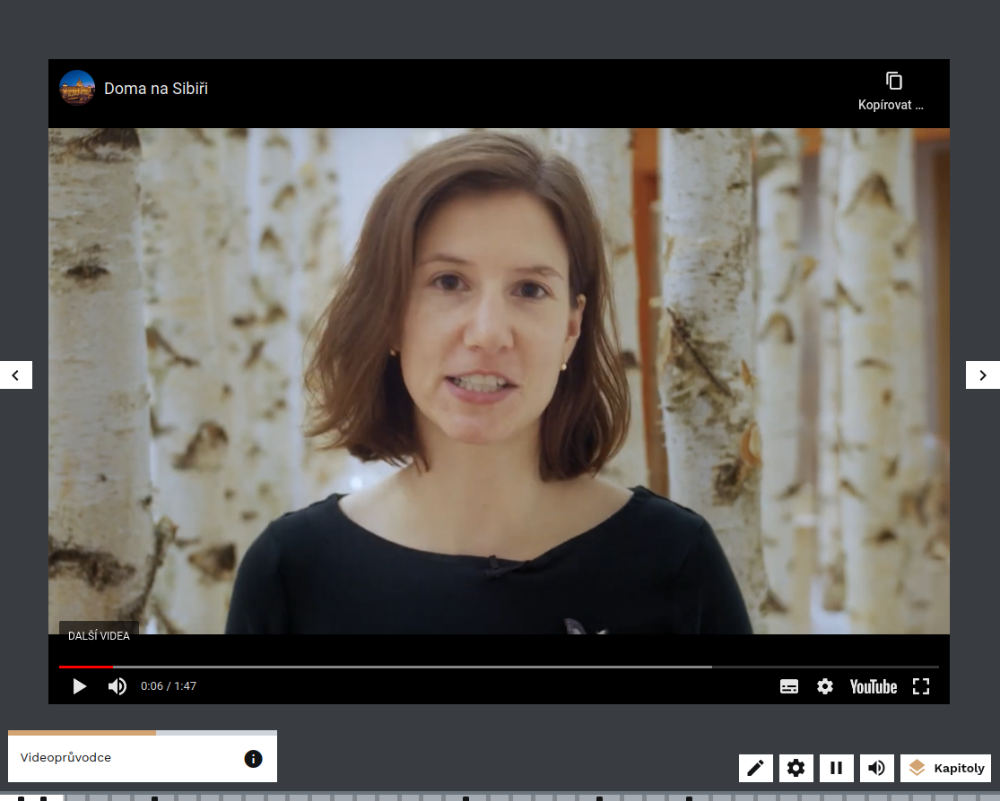
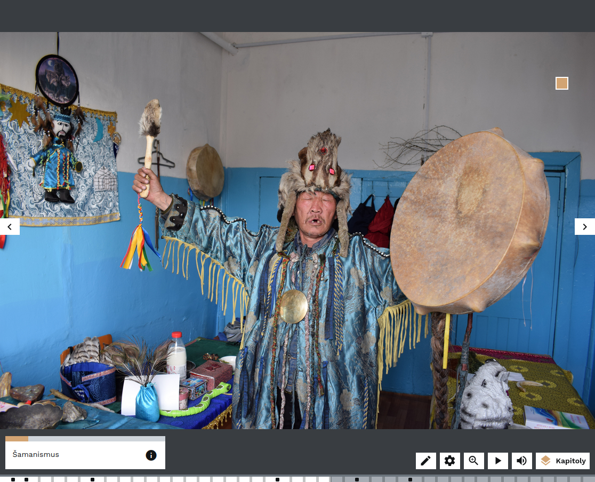
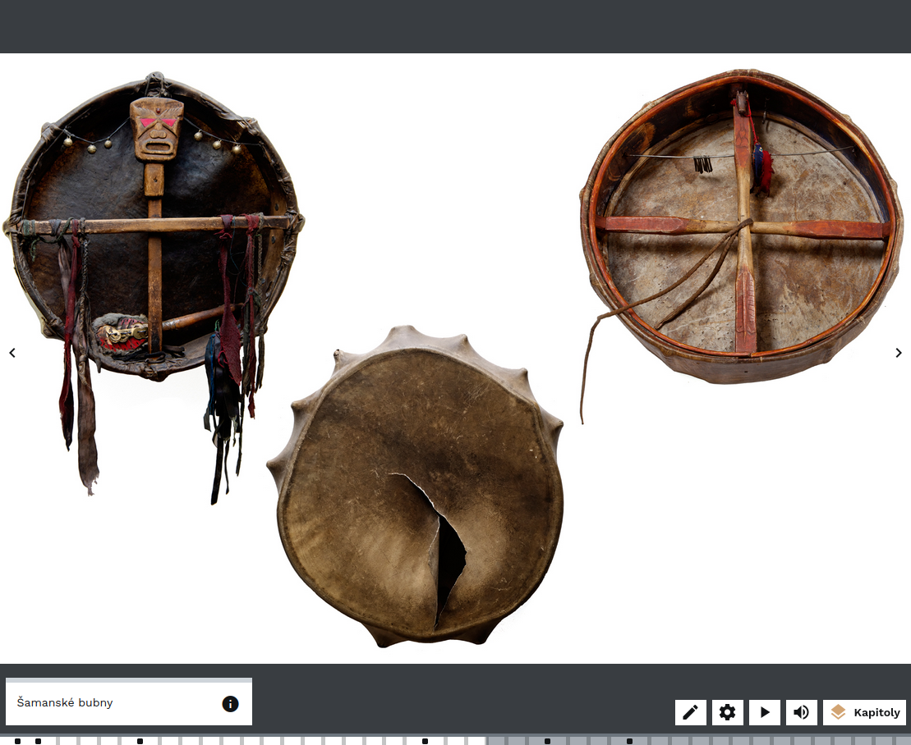
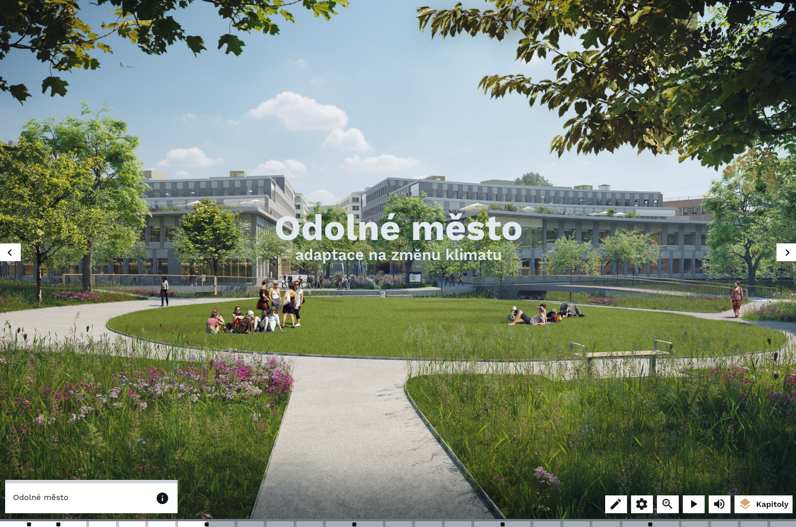
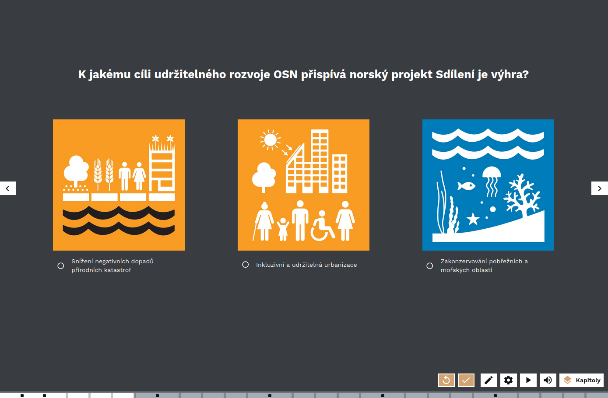
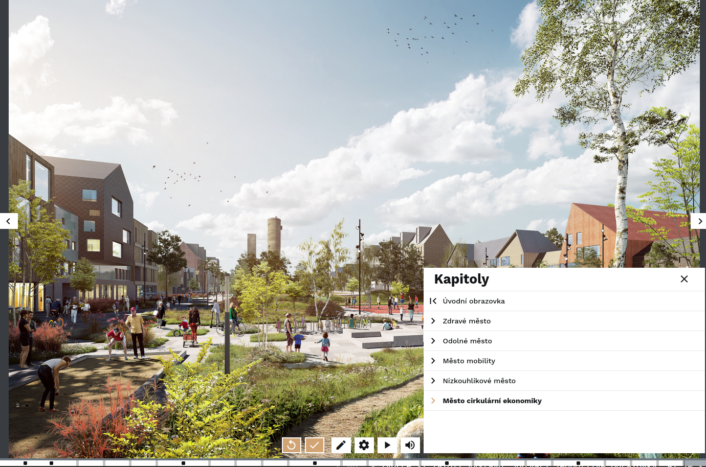
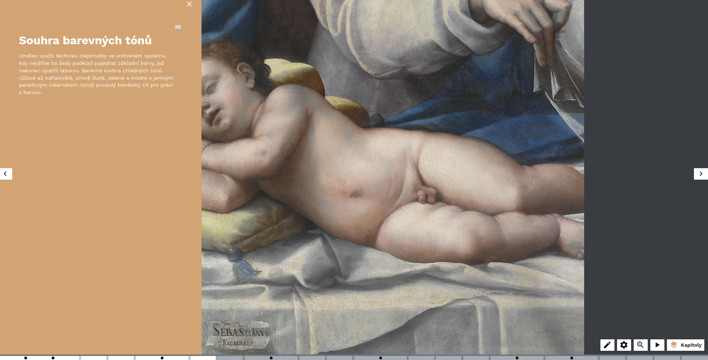
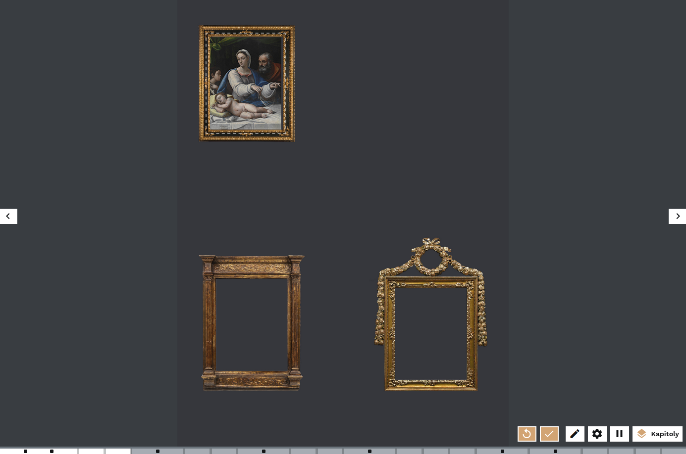
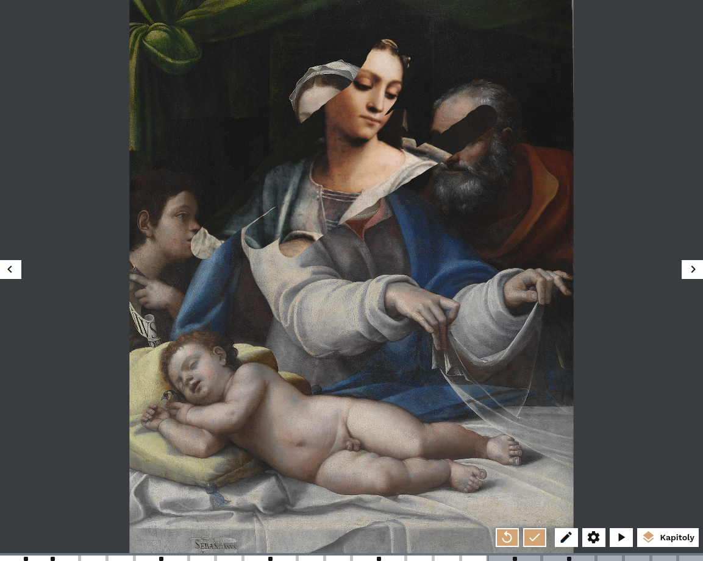

# Inspirace

Virtuální výstavy jsou **moderním způsobem**, jak propojit klasické prostředí muzeí či galerií se současným online světem. Díky dostupným nástrojům je možné zpřístupnit i vzdáleným návštěvníkům netušený obsah zdí našich institucí, seznámit je s aktuálními výsledky výzkumů či představit jim současné i minulé výstavy, které pracovníci paměťových institucí připravují. 

Virtuální výstava může být **doprovodným programem k výstavě fyzické**, obstojí však i jako zcela **samostatný multimediální počin**. Moderní technologie jsou běžnou součástí života mladších generací, nejsou však překážkou ani pro ty starší, které postupně odhalují jejich výhody a pronikají do jejich tajů. 

Tvůrci výstavy si musí na začátku stanovit, zda budou tvořit virtuální výstavu jako **samostatný počin, či s propojením na fyzickou část výstavy**. Druhá varianta tvůrce omezuje již daným ztvárněním tématu a stanovenou koncepcí fyzické výstavy, kdežto virtuální výstava bez této návaznosti poskytuje tvůrcům prostor pro zcela nové pojetí. 

Dalším krokem je pak stanovení **cílového návštěvníka** tak, abychom výstavu mohli tvořit s ohledem na jeho znalosti a vzdělávací potřeby, a rovněž definování konkrétních informací, které mu chceme předat, protože obsah je pořád to nejdůležitější. Nabízí se možnost vytvořit modifikované varianty výstavy pro různé cílové skupiny, včetně pracovních listů, které jsou vhodnou pomůckou pro vzdělávání. 

!!! info "Co říkají výzkumy?"
    Chceme-li, aby návštěvník u virtuální výstavy zůstal a prohlédl si ji celou, musíme ho zaujmout do 30 sekund. Zvažte tedy, co bude tvořit začátek vaší výstavy. Ideální je **návštěvníka aktivizovat**, a to po celou výstavu, vyváženou kombinací obsahu, obrázků, videa a interaktivních prvků (např. [hry](hry.md)). Platí přitom, že hlavním trendem je **odklon od textů směrem k vizuálnímu obsahu**, texty tedy zapojujte uvážlivě a zvažte jejich délku. To ale platí například i o videích, která by také neměla být moc dlouhá (cca 1 minutu). 

U virtuální výstavy je v neposlední řady důležitá **propagace**. Kromě tradičních médií je důležité propagovat výstavu v online prostoru - využít webové stránky a především sociální sítě nejen své instituce, ale například i těch spřátelených. 

## Očekávání návštěvníků 

Co od virtuální výstavy očekává její návštěvník? Je to především **výrazný zážitek**, pocit vtáhnutí do děje. Tento prožitek má totiž na návštěvníka největší efekt a díky vlastním pocitům z výstavy si může odnést i zajímavé informace o tématu. K aktivizaci v INDIHU Exhibition slouží kupříkladu: 

- interaktivní obrazovky
- hry
- střídání různorodého obsahu
- možnost výběru tématu

Návštěvníci očekávají **příběh!** Formulací tématu do příběhu, využití postavy **vypravěče**, kterým může být třeba reálná nebo vymšlená postava, můžeme dosáhnout osobního zážitku. 

V neposlední řadě je důležité, aby ovládání virtuální výstavy bylo **jednoduché a intuitivní** a aby návštěvník, věděl, jak může výstavou procházet. Ideální kombinací je předem navržená cesta výstavou s možností individuálního odklonu od ní. 

## Výstavy pro inspiraci

### Na Sibiř z domova

Výstavu "Na Sibiř z domova" vytvořili v Národním muzeu v době, kdy byla kvůli pandemii covidu-19 zavřená muzea. Zvolenou koncepcí bylo **převedení fyzické výstavy do virtuální podoby**, nicméně tak, aby vyhovovalo potřebám online návštěvníků. Výstava vyniká zejména svým překvapivým tématem a **zajímavým obsahem**, kdy se návštěvníci setkávají s kulturou, op které toho příliš neví a sledují **každodenní život a zvyky** obyvatel Sibiře. Výstava má **dobrý začátek**, kdy se setkáváme pomocí videa s jednou z autorek výstavy, takže výstava **působí osobně**. Mezi další kvalitní prvky výstavy **patří pestrý obrazový materiál** a zejména skvělé fotografie pocházející z výzkumu v terénu a pořízené profesionálním fotografem. Fotografie se typově střídají, takže návštěvník udrží pozornost a nezačne se nudit. **Fotografie sbírkových předmětů** jsou kvalitně nafocené a doplněné infopointy, takže vyniknou. Výstava obsahuje hudbu i kvalitní audio komentář. **Délka je 14 minut**, což je ideální - výstavy by neměly být delší než 15 minut, protože online návštěvníci hledají spíše kratší obsah. 

[Odkaz na výstavu: Na Sibiř z domova](https://exhibition.indihu.cz/view/na-sibir-z-domova/)

### Severská udržitelná města

Virtuální výstava "Severská udržitelná města" je příkladem výstavy, která se zabývá **aktuálním tématem.** Za její tvorbou stojí organizace Nordic Innovation, což je společnost usilující o udržitelný rozvoj a fungující napříč evropskými severními zeměmi. Ukazuje se, že **výstavy mohou dělat nejrůznější typy institucí**, nejen muzea. Její délka je 14 minut, takže je **přiměřeně krátká**. **Dynamiku** jí dodává střídání ženského a mužského hlasu v audiokomentáři, čímž se návštěvníci aktivizují a méně ztrácejí pozornost. **Výstava střídá** obecná ekologická doporučení, současné trendy a prezentaci řady konkrétních případů z různých měst, což návštěvníky udržuje pozornost. Ve výstavě jsou **použity hry**, které vtahují návštěvníky do děje a jsou příjemným oživením. Fotografie jsou kvalitní, jsou na nich lidé, což působí osobně, a korespondují s tím, co komentátoři říkají. Výstava vyniká **srozumitelným použitým jazykem** - pojmenování kapitol je jednoduché, krátké a srozumitelné. V případě, že výstava pojednává o něčem složitějším, jsou termíny vysvětleny. 

[Odkaz na výstavu: Severská udržitelná města](https://exhibition.indihu.cz/view/severska-udrzitelna-mesta/)

### Projekt Piombo_Madona bez roušky

Virtuální výstava "Projekt Piombo_Madona bez roušky" je příkladem výstavy, která návštěvníky seznamuje **s jedním dílem do větší hloubky** a vede ho detail za detailem po jednom konkrétním obrazu. Díky výstavě se návštěvníci naučí, co je možné **na obrazech vnímat** a čeho si všímat. Tuto dovednost pak mohou aplikovat na další díla, se kterými se setkají jak online, tak ve fyzických výstavách. Ústředním motivem je samotný obraz, až v závěru se dozvídáme víc o malíři. Výstava končí prezentací dalších děl v Muzeu umění Olomouc, které za výstavou stojí. Výstava tak má **širší kontext** a funguje také jako pozvánka k návštěvě. Dobře se tak propojuje konkrétní obsah s institucí a jejími sbírkami. Výstava neobsahuje zvuk ani audiokomentář a návštěvníci jsou vtahování do děje pomocí **řady her**. texty ve výstavě jsou nicméně trochu složitější, než by mohly pro laickou veřejnost být. 

[Odkaz na výstavu: Projekt Piombo_Madona bez roušky](https://exhibition.indihu.cz/view/ProjektPiombo2021-05-05T115848277Z/1/0)

