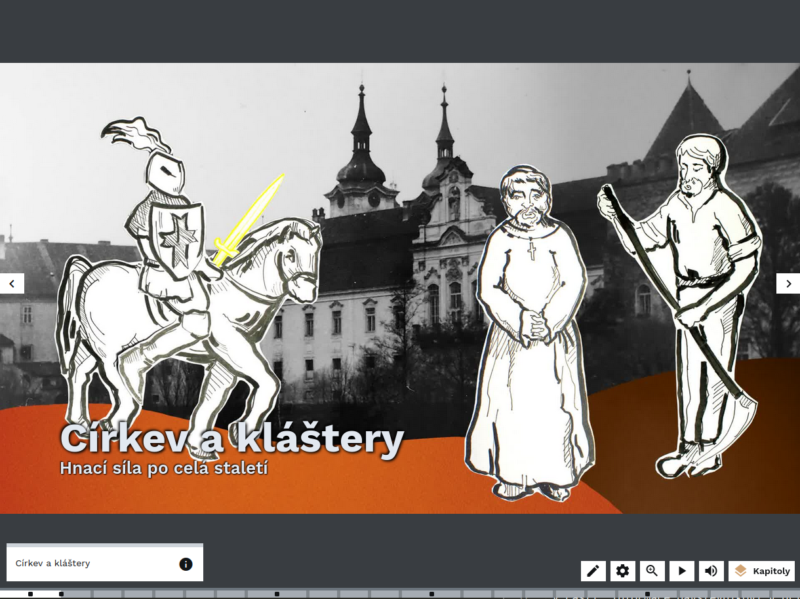
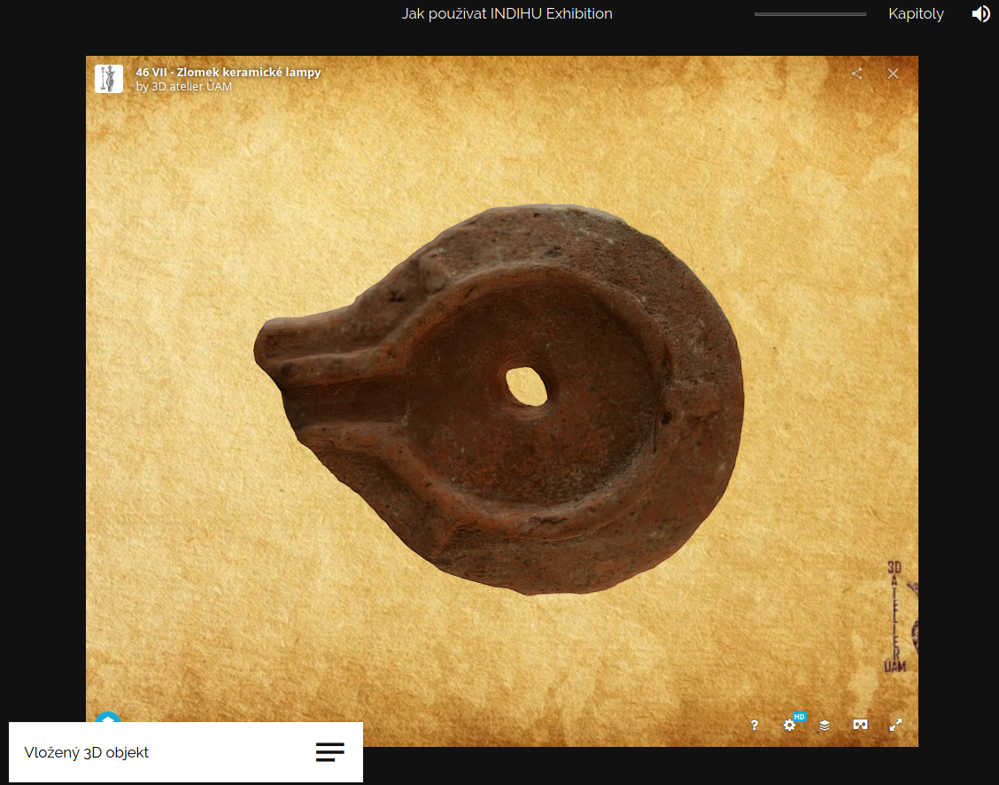

# Obrazovky

Základním stavebním kamenem virtuální výstavy, kterou tvoříte, jsou obrazovky. Postupně si projdeme jednotlivé typy obrazovek, jejich funkcionality a možnosti použití. Pokud hledáte informace ke konkrétnímu typu obrazovky, použijte navigaci vpravo. Obrazovky plníte obsahem a sdružujete do kapitol, tím vznikne výstava. Výstava může být složená pouze z jednotlivých obrazovek bez organizace do kapitol. Nabízíme 3 druhy obrazovek: 

- [Obsahové obrazovky](obrazovky.md#obsahove-obrazovky) 
- [Interaktivní obrazovky](obrazovky.md#interaktivni-obrazovky)
- [Herní obrazovky](hry.md)

## Úvod výstavy

Úvodní stránka výstavy obsahuje poměrně hodně informací, jsou však schované a návštěvník si je rozklikne. Základem je (animovaný) obrázek, název výstavy, informace o tom, kdo výstavu vytvořil, seznam kapitol, informace o čase potřebném k projití výstavy a zejména ikona pro spuštění výstavy. Čas pro projití výstavy se počítá automaticky podle nastavení délky všech obrazovek ve výstavě. Jedná se o čas bez her. Po založení výstavy se obrazovka vytvoří automaticky. Tvůrce se k editaci dostane ze záložky "Struktura výstavy" kliknutím na čtvereček nebo přes menu v podobě tří teček. 

!!! warning "Upozornění"
    Není třeba vyplnit všechny položky hned na začátku tvorby výstavy. Některé informace vyplynou až během procesu vytváření samotné výstavy. 

 

Obrazovka "Úvod výstavy" má tři záložky, které je třeba postupně naplnit obsahem. Kromě záložky "Název, popis, audio," kde přidáváte informace jako u ostatních obrazovek a navíc dáváte informaci o instituci, která výstavu vytvořila, obsahuje záložku "Tiráž" a "Dokumenty/soubory k výstavě". V úvodu výstavy vyplňujete:

* Název: Název výstavy, který se zobrazí při prohlížení výstavy. Pokuste se názvem zaujmout. 
* Podnázev: Vysvětlující doplněk k názvu. Není třeba vyplňovat. 
* Perex: Text uvádějící výstavu. Měl by být chytlavý a vzbudit v návštěvníkovi zájem, ale zároveň stručný a jednoduchý. Zobrazí se po kliknutí na "Více informací" před spuštěním výstavy. Editor vám ukazuje počet znaků a automaticky vypočítává přibližnou délku, kdyby text byl namluvený jako audio.
* Obrázek na pozadí: Titulní obrázek celé výstavy. 
* Animace obrázku: Volba typů animace (Shora dolů, Zdola nahoru a další). Obrázek může být statický a bez animace. 
* Audio verze výstavy: Vznikne složením všech audio komentářů použitých ve výstavě. Návštěvníkům umožníte si ji stáhnout a poslechnout či sdílet jako podcast.  
* Organizace: Hlavní instituce, která stojí za tvorbou výstavy. Ostatní zapojené instituce je možné přidat do tiráže. 
* Odkaz na web organizace 

!!! info "Tip"
    Audio verzi výstavy lze uveřejnit jako podcast, což umožní lidem čerpat zajímavé informace i formou poslechu. 

!!! info "Tip"
    Vyzkoušejte na někom, kdo výstavu nezná a nepodílí se na její tvorbě. Má u všech obrazovek dost času na prohlížení? Jak dlouho stráví hraním?

**Tiráž**

Na této záložce tvůrce přidává osoby podílející se na přípravě výstavy. Tiráž je navržena tak, aby tvůrci mohli pomocí ikony "+" **volně přidávat spolupracovníky a spolupracovnice** a přiřazovat jim popis spolupráce dle potřeby. Jednotliví autoři se zobrazují v řádcích. Pomocí ikonky tužka lze text upravit a pomocí koše smazat. Po kliknutí na ikonu "+" se zobrazí vyskakovací okno, kde do prvního řádku "Role" napíšete, co konkrétní osoba dělala. Do druhého řádku "Osoby nebo text" napíšete jméno nebo jinou krátkou informaci. Přidání další osoby do tiráže potvrdíte tlačítkem Uložit. Pro zrušení akce použijte tlačítko Storno. Pomocí šipek nahoru/dolů lze upravovat pořadí osob v tiráži.  

## Úvod do kapitoly

Každá nová kapitola je uvozena titulní stránkou, obrazovkou "Úvod do kapitoly". Obsahuje název a titulní obrázek. Obrázek přidáváte v záložce "Obrázek na pozadí," kde můžete vybrat typ animace. Zkuste více druhů animace a vyberte, která vám bude nejvíce vyhovovat.Obrázek doporučujeme orientovat na šířku. Vyberte ho z dokumentů a pokud ho nemáte nahraný do editoru, nahrajte jej pomocí správce souborů. Na hlavní záložce "Název, audio" vyplníte základní údaje ke kapitole název a případně podnázev a nastavíte pozici textu (uprostřed, nahoře, vlevo), tmavý nebo světlý motiv či zvýraznění. Různá nastavení vám pomohou, aby byl text dobře čitelný. Text také můžete animovat, což znamená, že písmena se budou objevovat postupně. 

 

 

Zvuková stopa pro celou kapitolu je přehrávána ve smyčce po čas průchodu všemi stránkami kapitoly. Zvuková stopa pro úvodní stránku kapitoly je přehrána pouze jednou a definuje svou délkou i délku animace obrázku a celkově délku setrvání na této stránce. Pokud vám automaticky vypočtená délka nevyhovuje, můžete délku v sekundách manuálně změnit.  

!!! failure "Pozor"
    Tvorba mluveného komentáře je produkčně poměrně náročná. Proto doporučujeme audio komentář nahrávat až jako poslední, když jste s celou výstavou spokojeni a prošla testováním. 

## Obsah společný pro všechny obrazovky 

### Název, text, audio

Každá obrazovka začíná záložkou s názvem **Název, text, audio** kde vyplňujete název obrazovky. V názvu shrňte, o čem obrazovka pojednává a usnadněte tak návštěvníkovi orientaci v tématu. Název se zobrazí v editoru ve výpisu obrazovek a vidí ji i návštěvník v levém dolním rohu, kde si může otevřít textové pole s dalšími informacemi k tématu. Název má být atraktivní a stručný. 

Vyplňte **Text k tématu**, pokud chcete sdělit nějaké informace o tom, na co se návštěvník dívá nebo chcete dodat širší kontext. Formátování textu (1) usnadní jeho čtivost. V editoru sledujte informaci o délce textu - počet znaků převedený na délku mluveného slova - to vám pomůže mít představu o potřebném času na čtení. Text se zobrazí v textovém poli po kliknutí na název obrazovky. Sledujte informace o délce textu. Po finalizaci textu můžete obsah nahrát jako audio, které si návštěvník poslechne. Audio a i text však nemusí mít stejný obsah. 

V pravé části stránky editace nahráváte **audio** soubory, nastavujete časování obrazovky buď manuálně (2) nebo podle mluveného slova (3). Pokud máte ve příslušné kapitole podkresovou hudbu, můžete ji u konkrétní obrazovky vypnout (4), aby se nestřetávala s audio obsahem příslušné obrazovky

 

 

!!! info "Tip"
    K orientaci vám při vytváření výstavy slouží jak názvy obrazovek, tak ikonky vedle názvu, které odkazují na typ obrazovky - např. ikona obrázku, ikona poháru označující hry nebo ikona videa. Díky tomu neztrácíte přehled jak o obsahu, tak o typech obrazovek. Máte informaci o tom, jaké typy obrazovek jdou po sobě a zda se vám obrazovky příliš neopakují. 

### Dokumenty

K výstavě i ke každí obrazovce je možné přidat dokumenty ideálně ve formátu .docx nebo .pdf, které si návštěvník může stáhnout. **Soubory ke stažení** umožňují přidat rozšiřující informace k výstavě (článek, seznam doporučené literatury, pracovní listy apod.). Dokumenty vybírejte z knihovny dokumentů v editoru nebo je nahrajte z počítače. Druhou variantou je vložit odkaz na web pomocí URL. Web se návštěvníkovi otevře automaticky v novém okně. 

!!! info "Tip"
    Dokumenty je možné přidat k výstavě nebo ke každé obrazovce zvlášť. Nemusíte tedy všechny dokumenty přikládat rovnou na úvodní stránku. Pokud některé dokumenty dáte dovnitř výstavy, snížíte riziko, že bude návštěvník přehlcen množstvím informací na úvodní stránce výstavy. 

!!! warning "Upozornění"
    Podporované formáty pro soubory ve výstavě jsou: video (.mp4 - rozlišení FullHD (1920×1080), 25 snímků za vteřinu, v rendrovacím formátu H.264),audio (.mp3), obrázky (.jpeg, .png), textové dokumenty (.pdf, .txt, .docx). 

Dokumenty jsou návštěvníkovi k dispozici: 

- na úvodu výstavy
- v textovém poli u každé obrazovky
- na závěrečné obrazovce

 

### Infopointy

Infopointy jsou malé čtverečky, které můžete umístit kamkoli na obrazovku a dodat k detailu dodatečné informace ve formě textu, obrázku nebo videa. Díky infopointům můžete nasměrovat návštěvníkovu pozornost. Infopointy nabízí řadu funkcí: 

- Nadpis (když nevyplníte, nezobrazí se) (1)
- Typ - text, obrázek, video (2)
- Popis k textovému infopointu (3)
- Stále zobrazen (4) (pokud nezakliknete tuto možnost, návštěvník si obsah musí otevřít kliknutím, což podporuje interakci)
- Můžete do něj dát externí odkaz jinam na web nebo se skrz něj dostat na jinou obrazovku (5)
- Čtverec, kolečko, nebo umožňuje nahrát si vlastní obrázek (6)
- Změna barvy (7)
- Úprava velikosti (8) 

 

!!! info "Tip"
    Na jeden obrázek doporučujeme vložit **max. 3 infopointy**. Z testování a výzkumu víme, že více je matoucí a zahlcující a nevede k většímu návštěvnickému zážitku. 

 

!!! info "Tip"
    Pro snadnější sledování postupu prací na výstavě lze všechny obrazovky po dokončení označit jako dokončené. Ve výpisu všech obrazovek výstavy se tyto obrazovky vyznačí zelenou barvou. 

!!! warning "Upozornění"
    Myslete na to, že při prohlížení výstav mohou mít návštěvníci malé obrazovky, a proto se obsah jednotlivých infopointů může překrývat. Doporučujeme psát infopointy stručné a nedávat je jako "Trvale zobrazené." Můžete také vytvořit výstavu pro telefony zvlášť.  

## Obsahové obrazovky 

### Obrazovka s obrázkem

Obrazovka s obrázkem je jednou ze základních obrazovek. Hlavním obsahem je tedy obrázek. Obrazovka s obrázkem je relativně snadná na přípravu a je efektní. Pokud potřebujete obrázky upravit, do jednoduchého editoru obrázků se dostanete u každého obrázku přes ikonku palety nebo přes správce souborů. Doporučujeme použití tzv. [infopointů](obrazovky.md#infopointy), které obohatí obrázek o informační hodnotu. Infopointy do obrázku přidáte v záložce "Obrázek" a mají podobu modrého otazníku, který umístíte kamkoli v obrázku chcete. Nový infopoint se vždy zobrazí v levém horním rohu. 

Infopointy jsou určeny ke zvýraznění určitého detailu nebo motivu na obrázku tím, že na konkrétní místo vložíte ikonu a krátký text, obrázek nebo video. Na jeden obrázek je možné vložit více infopointů. Infopoint se v editaci vždy objeví v levém horním rohu a je to modrá ikona s otazníkem. Odtud ho přetáhněte myší na jakékoli místo v obrázku.  

!!! info "Tip"
    V případě, že máte ve výstavě více obrazovek s obrázkem za sebou, zvažte, zda raději nepoužijete typ obrazovky [Fotogalerie](obrazovky.md#fotogalerie) nebo [slideshow](obrazovky.md#slideshow). 

Vyberte obrázek z dokumentů. V případě, že obrázek nemáte nahraný do editoru, nahrajte jej pomocí správce souborů. Pokud chcete, vyberte typ animace. Zkuste více druhů animace a vyberte, která vám bude nejvíce vyhovovat. Pomocí tlačítka + přidejte infopointy a nabídka nastavení se vám zobrazí ve vyskakovacím okně. Na jeden obrázek je možné vložit více infopointů, nedoporučujeme však více než tři.

### Obrazovka s videem

Hlavním obsahem této obrazovky je video, které nahrajete do souborů z počítače. Nahrávání videa funguje stejně jako nahrávání ostatních typů obsahu. Ve výstavě se video zobrazí na celou stránku, proto jsou lepší videa orientovaná na šířku. Video připravujte v rozlišení FullHD (1920×1080), 25 snímků za vteřinu, v rendrovacím formátu H.264.  

Zaškrtnete-li pole Vypnout zvukovou stopu kapitoly, nebude na této obrazovce zvuk pokreslující celou kapitolu, ale pustí se zvuk ve videu. 

!!! info "Tip"
    Ve výstavě můžete použít i video, které jste umístili na internet, např. na YouTube nebo na Vimeo. V tomto případě využijte [Obrazovku s externím obsahem](obrazovky.md#obrazovka-s-externim-obsahem). Externí služby nabízejí možnost sdílení přes tzv. embed kód, který si zkopírujete do své stránky. 

### Obrazovka s textem

Obrazovka s textem umožňuje sepsat text na libovolné téma. Text, který se zobrazí jako hlavní obsah obrazovky, je bílý na tmavě šedém pozadí, je umístěn do středu stránky se zarovnáním vlevo. Velikost textu si můžete zvolit - malá střední velká. Můžete využít různé druhy formátování. V případě této obrazovky zvažte vyplnění textu v záložce "Název, text, audio". 

 

Tipy použití pro obrazovku s textem: 

- Citát (slavné) osobnosti 
- Stručné shrnutí části výstavy 
- Upozornění na to, co by si měli návštěvníci zapamatovat
- Vznesení (řečnické) otázky
- Nalákání na další část výstavy

 

### Parallax

Parallax je dynamický efekt, který oživí virtuální výstavu. Spočívá v tom, že je obrázek rozdělen na nejméně 2 vrstvy - popředí a pozadí. Tyto vrstvy jsou animovány rozdílnou rychlostí, čímž vzniká iluze 3D, ačkoli se jedná stále o obrázek. Přípravu jednotlivých vrstev vytvořte v příšlušném grafickém programu, na který jste zvyklí (např. Kripta, Adobe Photoshop). 

!!! info "Tip"
    Tato obrazovka je poměrně náročná jak grafickou na přípravu, tak na vymýšlení jejího obsahového zakotvení ve výstavě. Proto se zatím ve výstavách příliš neobjevuje. Doporučujeme si najít inspiraci pro použití např. na YouTube.

Pomocí vkládání obrázků po vrstvách vytvoříte parallax. Obrázky si nahrajte do systému z počítače pomocí správce souborů. V případě parallaxu je třeba obrázky jednotlivých vrstev upravit a ořezat, viz následující obrázek z editace. Nejdůležitějším obrázkem je podkladový obrázek, na jehož výběr dbejte. 

Vyzkoušejte, jaká animace bude vypadat nejlépe. Máte na výběr z několika typů - Shora dolů, Zdola nahoru, Zleva doprava, Zprava doleva. 

Ukázku, jak může vypadat parallax, uvidíte v následujícím videu. 

<iframe width="560" height="615" src="https://www.youtube.com/embed/XoykDUe2ItI" frameborder="0" allow="accelerometer; autoplay; encrypted-media; gyroscope; picture-in-picture" allowfullscreen></iframe>

### Animace přiblížení

Obrazovka "Animace přiblížení"" je velmi efektní způsob, jak na jednom obrázku návštěvníkům zdůraznit určité detaily. Obrázek se přiblíží na místo, které chcete ukázat, poté se oddálí a může se přiblížit na další. Tento detail také máte možnost okomentovat - máte na výběr několik možných umístění, kde se komentář zobrazí. Na detaily můžete upozorňovat i pomocí infopointů, které ale návštěvníci nemusí vždy rozkliknout, kdežto u obrazovky "Animace přiblížení" o detailní pohled nepřijdou, protože se obrázek přibližuje a oddaluje tak, jak jste to nastavili.  Mezi jednotlivými detaily se animace vždy vrátí na celek obrázku. Pokud potřebujete obrázky upravit, do jednoduchého editoru obrázků se dostanete u každého obrázku přes ikonku palety nebo přes správce souborů.   

!!! info "Tip"
    Obrazovka "Animace přiblížení" vyžaduje poměrně dost času, aby byla animace příjemná a plynulá a návštěvníci měli dost času si obrázek prohlédnout. 

!!! info "Tip"
    Načasování plynutí výstavy věnujte velkou pozornost. Zvolte u každé obrazovky takový čas, aby měl návštěvník prostor si prohlédnout obsah, ale zároveň aby se nezačal nudit. Doporučujeme vyzkoušet načasování jednotlivých obrazovek s testovacími návštěvníky. 

<!-- TODO video -->

**Sekvence**

Vyberte příslušný obrázek nebo jej přidejte do souborů z počítače. Místa, která se v animaci přiblíží označte infopointem, který metodou drag and drop přetáhnete myší na vybrané místo. Infopoint se objeví vždy v levém horním rohu. Seřazením bodů za sebe vytvoříte sekvenci. Ke každému bodu můžete dát popisek a určit délku a míru přiblížení, po jakou bude detail přiblížen. Nezapomeňte určit, kde se popisek zobrazí. Na výběr máte ze dvou možností; vpravo dole nebo vlevo nahoře. Tento typ obrazovky potřebuje dost času a bývá tedy delší.  

### Slideshow

Slideshow je typ obrazovky, která je v hodná k prezentování více obrázků, které spolu souvisí. V případě, že vkládáte za sebe více "Obrazovek s obrázkem", zvažte využití Slideshow, protože výsledný dojem bude plynulejší. Umožní vám to také okomentovat více fotografií v jednom textu nebo jedním audio komentářem, což vám ulehčí i editaci a práci s audiosoubory. 

Při vkládání obrázků postupujte stejně jako u "Obrazovky s obrázkem" nebo u práce se soubory. Vyberte příslušný obrázek z adresáře nebo jej nahrajte do správce souborů. Další obrázek do Slideshow přidáte kliknutím na čtverec s ikonou "+"" (1). Pokud potřebujete obrázky upravit, do jednoduchého editoru obrázků se dostanete u každého obrázku přes ikonku palety nebo přes správce souborů.

**Funkcionality Slideshow:**

- **Infopointy (2):**Ke každé fotografii můžete přidávat infopointy. 
- **Přechod obrázků (3):**Zvolte také způsob animace, tedy přechodu mezi jednotlivými obrázky. Na výběr máte z více typů  (např. Bez animace, Bez animace s rozmlženým pozadím nebo Pozvolné objevení. Rozmlžené pozadí vyplní celou obrazovku na fullscreen. 
- **Časování (4):** Slideshow nabízí dvě varianty. Buď nastavíte časování pro celou obrazovku a editor sám vypočítá čas jednotlivých obrázků rovnoměrně. Nebo můžete nastavit časování manuálně a zvolíte si čas pro každý obrázek zvlášť. 

!!! info "Tip"
    Zvažte také využití obrázku s rozmlženým pozadím. Pozadí potom bude černé a obrázek hezky vynikne.
     

!!! info "Tip"
    Načasování plynutí výstavy věnujte velkou pozornost. Zvolte u každé obrazovky takový čas, aby měl návštěvník prostor si prohlédnout obsah, ale zároveň aby se nezačal nudit. Doporučujeme vyzkoušet načasování jednotlivých obrazovek s testovacími návštěvníky, protože vy jako tvůrci obsah znáte a nepotřebujete tolik času na prohlížení a čtení. 

## Interaktivní obrazovky 

### Fotogalerie

Fotogalerie je typ obrazovky, která je v hodná k prezentování více obrázků, které spolu souvisí. V případě, že vkládáte za sebe více "Obrazovek s obrázkem", zvažte využití fotogalerie, protože výsledný dojem bude plynulejší. Umožní vám to také okomentovat více fotografií v jednom textu nebo jedním audio komentářem, což vám ulehčí jak editaci, tak práci s audiosoubory. Pokud potřebujete obrázky upravit, do jednoduchého editoru obrázků se dostanete u každého obrázku přes ikonku palety nebo přes správce souborů.

U fotogalerie se ukáže přehled všech obrázků a v detailu se zobrazí pouze ty, které si návštěvníci interaktivně zvolí. Detail si pak mohou ještě zvětšit. Pro výběr mohou obrázek zavřít pomocí ikony křížku nebo přejít na další obrázek pomocí šipek. Podle počtu obrázků a velikosti obrazovky, na které si návštěvníci výstavu prohlížejí, se náhledy obrázků ve fotogalerii upraví automaticky tak, aby byly dobře velké a rozprostřené na obrazovce. V případě, že se nevejdou na jednu obrazovku, objeví se možnost posunu dolů (scrollování). 

Při vkládání obrázků postupujte stejně jako u "Obrazovky s obrázkem" nebo u práce se soubory. Vyberte příslušný obrázek z adresáře nebo jej nahrajte do správce souborů. Správce souborů umožňuje nahrát více obrázků najednou. Další obrázek do fotogalerie přidáte kliknutím na čtverec s ikonou +. Pořadí fotek můžete upravovat pomocí šipek nebo je můžete smazat kliknutím na koš. 

<!-- TODO video, jak si prohlíží fotogalerii návštěvník -->

### Foto před a po

Obrazovka "Před a po" je jedním z prvků výstavy, který vybízí návštěvníka k aktivitě, protože ten si obrázek prohlíží a přejíždí táhlem z jedné vrstvy na druhou. Je složena ze dvou obrázků, které jsou vidět jen z půlky. Editace obrazovky spočívá ve výběru dvou obrázků ze souborů k výstavě. Pokud nemáte soubor v editoru, nahrajte jej ze svého počítače. Nástroj obsahuje i jednoduchý [editor obrázků](zaklady.md#jednoduchy-editor-obrazku), který je dostupný v adresáři souborů přes menu u každého obrázku. Máte možnost nastavit: 

- Způsob přechodu mezi obrázky (táhlo, přechod, prolnutí)
- Umístění táhla
- Infopointy
- Délku trvání obrazovky

Obrazovka Před a po je ideálním prostředkem, jak **zdůraznit změnu a rozdíly**, kterých by si návštěvník nemusel všimnout. Nabízí se třeba při prezentaci stejného místa v různých dobách. Zároveň je možné obrazovku využít i k vytvoření vtipů a hříček, kdy do jednoho obrázku vložím něco, co na původním není a tento rozdíl se objeví až přetažením táhla. Pokud potřebujete obrázky upravit, do jednoduchého editoru obrázků se dostanete u každého obrázku přes ikonku palety nebo přes správce souborů.

!!! info "Tip"
    Vyzkoušejte různé druhy přechodů. Pozvolný přechod působí zcela odlišným dojmem než když použijete táhlo, kterým hýbe sám uživatel. Právě pozvolný přechod u obrazovky Před a po může být využit místo složitějších animací. 

### Obrazovka s externím obsahem

Obrazovka s externím obsahem je nástroj, jak do výstavy pomocí embed kódu vložit obsah, který je umístěný jinde na internetu nebo jste jej vytvořili pomocí jiného nástroje, který tento typ sdílení umožňuje. Zároveň si takový obsah zachovává své původní funkcionality. Takto je možné sdílet např. mapu, interaktivní grafy, videa apod. 

U příslušné služby, kterou chcete využít, zvolíte možnost sdílení embed kódem, ten si zkopírujete a vložíte do záložky "Externí data". Zaškrtnutím pole "Škálovat na celou obrazovku" se obsah zobrazí na celou obrazovku. Doplňte délku trvání obrazovky, kdy se automaticky zobrazí další obrazovka. V případě potřeby se návštěvníci mohou pohybovat tam či zpět pomocí šipek. 

!!! info "Tip"
      
    Často jej najdete v možnostech sdílení. Bývá označen &lt; &gt; nebo &lt; / &gt; 
    V případě, že je na výběr více typů embed kódů, vyzkoušejte ty, které fungují nejlépe. Responsive kód nemusí fungovat, ale Fixed naopak ano. 

!!! info "Tip: Mapa"
    Vložená mapa např. ze služby Google maps nebo mapy.cz si zachovává možnost přiblížení a oddálení. V embed kódu je také možné nastavit velikost mapy - v tomto případě byla ručně velikost zvětšena na fullscreen, tedy na 1920 na 1080 px.
    Návštěvník pak vidí mapu takto: 
    

!!! info "Tip: Video"
    Vložené video např. ze služby YouTube si může návštěvník spustit. V embed kódu je také možné nastavit velikost videa - v tomto případě byla ručně velikost zvětšena 1060 na 815 px. Návštěvník pak vidí obrazovku následovně: 
    
    Využití embedovaného videa je vhodné, pokud máte video vyexportované ve formátu, který není editorem podporován a nemůžete jej znovu vyexportovat. Na druhou stranu vložené video může působit jako cizorodý element a na některé návštěvníky to může působit tak, že byla narušena integrita virtuální výstavy. 

!!! info "Tip: Interaktivní grafy"
    Grafy jsou účinnými nástroji vizualizace informací a dokáží návštěvníkovi předat velké množství informací zajímavou formou. Využití grafů může vypadat třeba takto: 
    
    Tento graf byl vytvořen pomocí služby [Infogram](https://infogram.com/). Konkrétní čísla a informace se zobrazí, když na část grafu návštěvník najede myší. Kromě grafů můžete vytvářet v tomto nástroji i mapy s informacemi. 

!!! info "Tip: 3D objekt"
    Máte-li k dispozici digitalizované objekty ve 3D, je možné pomocí embed kódu vložit do výstavy i je. Návštěvník si může pomocí myši s objektem otáčet a dívat se na něj ze všech stran. Někdy 3D modely obsahují i textové informace.   
    

### Rozcestník

Rozcestník je typ interaktivní obrazovky, díky které návštěvníkům umožníte, aby si vybrali, čemu se chtějí ve výstavě dále věnovat. Návštěvník si vybírá téma, nebo si vybere možnost pokračovat dál ve výstavě kliknutím na čtvercové tlačítko **Další obrazovka** vlevo dole. Pokud si vybere konkrétní téma, které nabízíte, přeskočí tím část výstavy. 

Rozcestník funguje podobně jako kvíz. Máte tři základní možnosti, jak dáte návštěvníkům vybrat: 

  - Kombinací obrázku a textu
  - Jen textem
  - Pouze obrázkem

Postupně vyplníte záložku **Název, text, audio** jako u ostatních typů obrazovek. Klíčový obsah je v druhé záložce **Odkazy**, kam dáte jednotlivá témata, kam mohou návštěvníci pokračovat, a vyberete obrazovku, na kterou se návštěvník dostane, pokud si ji zvolí. Vždy se vám k vyplnění nabídnou 3 možnosti, nicméně můžete přidat další nebo jednu odebrat. Jako k ostatním obrazovkám můžete přidávat soubory. 

    
## Závěr výstavy  

Obrazovka "Závěr výstavy" se generuje automaticky a využívá obrázek, který jste měli na úvodní stránce, tentokrát však bez animace. Máte však možnost nahrát jakýkoli jiný obrázek. Na závěrečné obrazovce se objeví výzva k hodnocení výstavy. 

Po hodnocení výste se objeví další funkce. Obrazovka nabízí možnost přehrát si výstavu znovu pomocí ikony "Spustit znovu" (1). Ikona pro stažení dokumentů "Soubory k výstavě" (2) po kliknutí zobrazí panel se seznamem souborů, které si návštěvník může stáhnout do počítače. Tato funkce se zobrazí jen tehdy, když výstava dokumenty obsahuje. Dále najdeme funkci "Sdílet" (3) výstavu ostatním na Facebook, WhatsApp, síť X a získat URL odkaz na výstavu. Návštěvníci také mají možnost kliknout na ikonu Email, což vytvoří automatizovaný mail s pozvánkou. 

!!! info "Tip"
    Přikládáte-li k výstavě soubory, dbejte na jejich srozumitelné pojmenování, aby návštěvník věděl, co si stahuje. 
