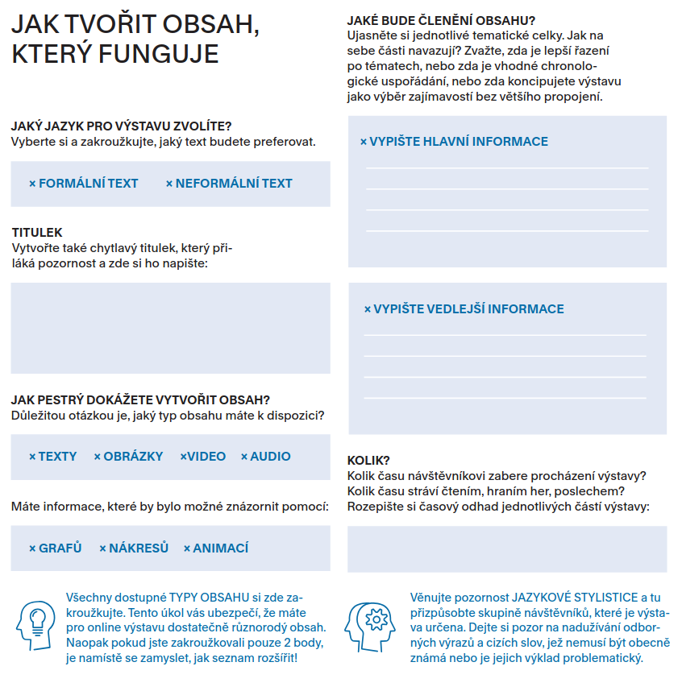

# Online návštěvníci 

Nároky online návštěvníků na kvalitu virtuálních výstav jsou vysoké. Tato část vám pomůže rozhodnout, na jakou cílovou skupinu se zaměřit a jaký obsah jí připravit. Cílit na neodbornou veřejnost je vhodné, ale je potřeba cílovou skupinu ještě lépe definovat. 

Pro práci s online návštěvníky vám také pomohou [Pracovní listy](https://libcas.github.io/indihu-manual/img/INDIHU_listy3.pdf). 

  

**Virtuální výstava musí být:**

- Tematicky relevantní (rozsah a délka)
- Informačně relevantní (fakta, jazyk)
-Přístupná (funkční, UX, UI, design optimalizovaný pro PC/mobilní zařízení)
-Obsahově koherentní (přičemž obsah lze rozdělit na statický a interaktivní)

Návštěvníci chtějí **zážitky, které s nimi osobně rezonují**, spíše než generické, univerzální prezentace, proto je důležité nutné znát své publikum.

!!! info "Tip"
    Nabídněte **personalizovaný zážitek** - využijte obrazovku Rozcestník a nechte online návštěvníka vybrat, čemu se bude věnovat. Nemusíte nabízet jen rozdílná témata, ale také média. Pro lepší zacílení realizujte **návštěvnické šetření** a zjistěte si předem, co návštěvníky zajímá. Ujistěte se, že vaše výstava má jasné sdělení a myslete na to, že "méně je více."

## Kontext online návštěvy 

Podstatný je také **kontext online návštěvy,** tedy situace, ve které se návštěvník nachází. Velmi často bude k virtuální výstavě přistupovat vzdáleně (nebude v budově muzea). Pravděpodobně z chytrého telefonu, protože statistiky přístupů ukazují, že se uživatelé odklánějí od stolních počítačů a online stránky navštěvují z mobilních telefonů. V tom případě je pravděpodobné, že během prohlížení výstavy je budou rušit notifikace. Častým důvodem návštěvy je překonání nudy nebo zkrácení si doby čekání (doprava, lékař, při nakupování). Pravděpodobně se bude jednat o individuální návštěva, což je velký rozdíl oproti společenské návštěvě muzea, která se v 80% případů děje s někým dalším. 

!!! info "Tip"
    Dostat virtuální výstavu k individuálním návštěvníkům je poměrně těžké. Proto zvažte, zda se nezaměřit na školní skupiny a nevyužít virtuální výstavu v rámci uceleného vzdělávacího balíčku jako přípravu na fyzickou návštěvu nebo jako reflexi po návštěvě. Připravíte-li metodické materiály pro učitele, kde vysvětlíte, jak s výstavou pracovat, bude to fungovat. 

## Dospělí, neodborníci

Internet je jedním z hlavních zdrojů informací pro dospělé z řad široké veřejnosti, což je pro vás velkou výhodou. Vyberte témata, kterými se dospělí  zabývají např. jako koníček (např. výstava pro rybáře nebo amatérské malíře). Preferujte takové téma výstavy, které poskytuje praktickou hodnotu a  srozumitelně vysvětlete, proč investovat čas do výstavy a co jim její návštěva přinese "Díky této výstavě se dozvíte zajímavé informace z dějin závodního rybářství první poloviny 20. století)."

- **Délka**: 7–15 minut (jako jedna epizoda webového seriálu)
- **Forma**: vyhýbá se odbornému jazyku, ale nezjednodušuje obsah, jasně sděluje, že výstava je založena na vědeckých poznatcích
- **Tón:** přátelský, návštěvník je partnerem v objevování, vysvětluje význam faktů, souvislostí, prezentuje kontext a vztahy k aktuálním jevům
- **Vizuální obsah**: Obrázky, videa, animace jsou nejoblíbenějším typem obsahu napříč všemi generacemi. Používejte vizuální podporu, jako jsou grafy, kresby, diagramy, obrázky
- **Interaktivita ve spojitosti s informacemi**: „Věděli jste, že…“ „Zajímavosti“
- Umožněte poslech výstavy jako audio **podcast** např. do auta nebo na procházku

## Děti 

Děti na internetu hledají zejména zábavu, hry a vzdělávání se nebrání, ale chtějí fakta zábavně a interaktivně. Inspirací vám může být tzv. eduteinment. Zvažte, zda nepřipravit virtuální výstavu jakou součást komplexního vzdělávacího balíčku pro školy, protože pro individuální děti může být těžké výstavu najít a mít motivaci ji procházet. 

!!! info "Tip a sdílení zkušeností"
	My jsme kupříkladu využili virtuální výstavu jako začátek vzdělávací lekce, kdy jsme prohlíželi virtuální výstavu společně na velké obrazovce ve třídě. Žáci se střídali v ovládání výstavy a čtení jednotlivých textů, takže si to vyzkoušel každý. My jako lektoři jsme tak získali možnost upřesnit nebo okomentovat obsah a reagovat na komentáře dětí. 

- **Kontext**: Nezapomeňte do výstavy přidat vysvětlení a kontextové informace, které vysvětlí dobu a hlavní myšlenky. Nezastírejte, že věci jsou složité, ale používejte srozumitelný a jasný jazyk. 
- **Délka**: Krátká výstava 5–10 minut
- **Tempo**: Rychlé, ale přesto umožněte dostatek času na přečtení jednotlivých informací a rozkliknutí infopointů. Ideálně načasování výstavy vyzkoušejte s nějakým dítětem z vašeho okolí. Mediální forma by se měly střídat.
- **Vypravěč**: Využijte personifikace a vytvoře průvodce výstavou. Může to být lidský kamarád/ka, zvíře. Využijte dialog, přímou řeč
- **Interaktivita**: prozkoumejte možnosti her a přidání aktivit (kvízy, kresby), „Najděte na obrázku...“, „Zkuste si představit...“, „Víte, že...?“
- **Animovaný obsah**: Kreslené filmy, komiks
- **Bohatá prezentace**: Vizuální a barevné prezentace, grafika s obrázky, návody, obrázky, ikony, barevné prvky, bubliny
- **Texty**: Krátké věty, běžná slova, žádné odborné termíny bez nutnosti dalšího vysvětlování
- **Tón**: Přátelský, podněcující zvědavost, s otázkami, podněcující k zamyšlení

## Dospívající a mladí dospělí 

Dospívající a mladí dospělí jsou cílovou skupinou, která hledá zejména autenticitu, objevuje nová témata a informace skrze osobní lidské příběhy. Jejich životní fáze je nutí otevírat se různým pohledům na témata a zjišťovat, jak svět funguje a jak je složitý. V rámci digitálního zdraví začínají být citliví na smysluplné využívání technologií jak v osobním, tak pracovním životě, takže je možné virtuální výstavy komunikovat jako protiváhu "ledabylému srollování" na sociálních sítích. 

- **Délka**: 5–10 minut (ocení také obsah online navíc, zákulisní informace, podcasty, rozhovory s pracovníky muzeí) 
- **Témata:** Ekologie, mentální zdraví, sociální normy, stereotypy a "nálepky", technologie a digitální zdraví, vztahy, inspirativní životní příběhy
- **Skutečné příběhy**: Skutečné příběhy historických postav, s kterými se mohou emocionálně propojit a které ukazují složitost světa 
- **Výzvy**: Nebojte se ukazovat složitý obsah, vyzývat online návštěvníky k zaujetí vlastního postoje a prezentovat různé pohledy na stejnou věc (multiperspektivita), ale myslete u toho na genderovou vyváženost a respektující jazyk 
- **Genderová vyváženost**: Prezentujte ve výstavě rovnoměrně ženy i muže nebo argumentujte, proč nebylo možné vyprávět příběhy žen 
- **Forma**: Vysoká kvalita obrázků, postprodukční práce s vizuálním obsahem, grafika, memy a interaktivní média (hry, kvízy)
- **Partnerský přístup**: Tato cílová skupina je citlivá na to, když se k ní přistupuje z pozice autority. Ujasněte si pozici, z které výstavu tvoříte a vyzývejte toto publikum k vytváření a formulování vlastního názoru. K tomu slouží např. ankety. 
- **Vyváženost obsahu**: Vyvažte zábavu, vzdělání a potěšení a zařaďte do výstavy i pasáže pro odlehčení. Střídejte obsah a formáty (obrázky, videa, animace) a pracujte se zvukem a hudbou 
- **Sdílení**: Vyzývejte ke sdílení a propojte výstavu s obsahem na sociálních sítích 

## Odborníci a profesionálové 

Jelikož i vy sami jste profesionálové, zřejmě nebude těžké připravit atraktivní obsah pro tuto cílovou skupinu, protože můžete využít vlastní zájmy a preference. Tato cílová skupina ocení zejména nejaktuálnější vědecké poznatky a informace z nejnovějších výzkumů. 

- **Délka**: 10–15 minut (zvažte také seriál virtuálních výstav, kdy na sebe jednotlivé díly budou navazovat)
- **Tón, jazyk a forma**: Profesionální, vědecký, faktický. I v naučné literatuře se v současnosti doporučuje používat aktivní slovesa a ne pasivum. Nechte se k tématu vyjádřit (v audiu nebo videu" skutečné profesionály / vědce. Můžete využívat vědecké koncepty, cizí slova, čísla, data a fakta. Pozor však na to, aby výstava nebyla zatěžující - stále by měla mít srozumitelné a jasné vyznění. 
- **Zdroje**: Pracujte s odbornými zdroji, na které odkážete. Přidejte k výstavě seznam doporučené literatury k tématu. Zdroje citujte. Omezíte tím subjektivní názory. Nepoužívejte metafory. 
- **Vizuální pomůcky**: Pomocí grafů, diagramů, nákresů nálezových situací či dokumentárních filmů obohatíte výstavu o detailní informace a prohloubíte možnost poznání. 
- **Grafika**: Grafika by měla být seriózní, ale moderní. Upravte dobové fotografie a využijte postprodukci, výstava bude působit profesionálně. 

## Závěrečná doporučení, která fungují na všechny 

1. Zvolte přístup, kdy se v první řadě zaměříte na kvalitní vizuální stránku výstavy ("tzv. visual-first přístup")
2. Video obsah je populární u všech, ale forma nebo typ videa se mění s věkem (odborníci ocení dokumentární filmy, děti animované, dospívající osobní zpovědi a videa ze zákulisí muzea zaujmou dospělé i dospívající)
3. Personalizovaný obsah zvýší zapojení všech skupiny (ankety pro sdílení názoru, výběr pokračování pomocí obrazovky Rozcestník) 
4. Interaktivní prvky jsou vhodné pro děti a dospívající
5. Jasné a důvěryhodné a vědecky podložené informace jsou důležité pro všechny
6. Vyvážený obsah zábavy a poučení (Zde je vhodné vyzkoušet různé varianty a otestovat správnou míru)
