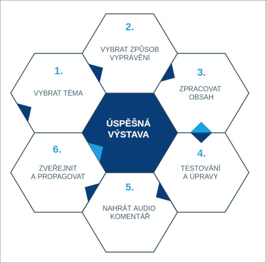

# Jak vytvořit úspěšnou virtuální výstavu?

Virtuální výstava je online prezentace vybraného tématu. Při tvorbě výstavy plníte jednotlivé obrazovky obsahem - obrázky, texty, přidáváte hudbu, namluvený komentář nebo pro návštěvníky připravíte hry. Příprava výstavy se skládá ze dvou hlavních částí. Z **přípravy tématu a obsahu výstavy** a ze **samotné práci v nástroji INDIHU Exhibition.** Přípravu výstavy lze rozdělit do 6 základních činností: 

1. Vybrat téma
2. Vybrat způsob vyprávění (konceptualizace obsahu)
3. Zpracovat obsah
4. Testování a úpravy
5. Nahrání audio komentáře
6. Zveřejnění a propagace 

<!--  -->

!!! info "Tip"
    Nepodceňujte poctivou přípravu tématu výstavy, tedy bodu 1 a 2. Věnujte konceptualizaci potřebnou péči a najděte ten typ vyprávění, který zaujme. Používání nástroje je mnohem snazší, když máte dobře rozmyšlené, co budete vyprávět.

## Vytvářím svou první výstavu

Udělat svou první výstavu je nejtěžší a moc si vážíme toho, že jste se rozhodli použít náš nástroj. Abychom vám tento proces zjednodušili, připravili jsme pro vás sadu pracovních listů, které vám pomohou vytvořit scénář virtuální výstavy.

[Pracovní listy - provedou vás přípravou výstavy](img/INDIHU_listy3.pdf){:download}

!!! info "Tip"
    Pracovní listy doporučujeme vytisknout a vyplnit s tužkou v ruce. Pracovní listy vám pomohou odpovědět na klíčové otázky - **o čem výstava bude, komu je určena, jaký ty interakce nabídne návštěvníků.** K pracovním listům se můžete opakovaně vracet. Doporučujeme je nechat **samostatně vyplnit každému členu či člence tvůrčího týmu** a poté najít společnou koncepci. 

**Téma výstavy**

Nejprve je třeba vybrat téma a najít ten správný přístup k jeho vyprávění. Virtuální prostředí funguje jinak, než jak jsme zvyklí u fyzických výstav, a online návštěvníci mají trochu jiná očekávání, kterým bychom se měli přizpůsobit, aby naše výstava byla úspěšná.

!!! info "Tip"
    Preferujte kompaktní témata a pokud možno se vyvarujte složitě strukturovaným problémům. Na komplikované vyprávění v těkavém online světě není prostor. 

**Obsah výstavy**

Nyní můžete začít zpracovávat vlastní obsah výstavy. Napište všechny potřebné texty a vyhledejte si co největší množství vizuálního materiálu. Nejdůležitějším hlediskem přípravy výstavy je srozumitelnost obsahu, proto se zaměřte na jeho logické členění, buďte konkrétní a věcní.

V druhé fázi práce se zamyslete nad tím, jak byste mohli popisný text nahradit zajímavějším typem obsahu. Nejpříhodnější bývají videoklipy. Využijte také svoji kreativitu a vymyslete pro návštěvníka hru (pokročilejší funkce), jejichž uplatnění ve výstavě vám nástroj nabízí. 

!!! info "Tip"
    Ne všechny informace jsou stejně důležité! Uvědomte si, která část obsahu je hlavní a co jsou pouze dodatečné materiály, které můžete připojit ke stažení.

**Forma výstavy (způsob vyprávění tématu)**

Při tvorbě vlastní virtuální výstavy v nástroji INDIHU Exhibition plníte **obrazovky** obsahem. Obrazovky je dále možné sdružovat do **kapitol** nebo je možné výstavu sestavit z **jednotlivých obrazovek** jdoucích po sobě. Oba principy můžete rovněž kombinovat.

!!! info "Tip"
    Rozmyslete si, jak budete obsah výstavy rozvíjet a členit, jak budou jednotlivé části obsáhlé? Podle toho si lépe rozhodnete, zda budete používat jednotlivé izolované obrazovky, nebo budete téma strukturovat do kapitol.

## Doporučené funkce pro začátečníky 

Jednotlivé obrazovky a jejich funkce jsou podrobně popsány v záložce [Obrazovky](obrazovky.md). Začínáte-li si teprve tvorbu virtuálních výstav osvojovat, doporučujeme zaměřit se zejména na:

- Obrazovky s obrázky
- Načasování a infopointy
- Přípravu obrazových dat a kvalitní postprodukci
- Texty
- Jasné názvy kapitol a obrazovek
- Zvukové stopy (hudba)
- Interaktivní obrazovky
- Testování

### Obrazovky s obrázky

Při přípravě výstavy se zaměřte zejména na obrazový materiál a jeho kvalitu. V současné vizuální době přitáhnou pozornost zejména obrázky nebo videa. Jedná se obrazovky: 

- [Obrazovka s obrázkem](https://libcas.github.io/indihu-manual/obrazovky/#obrazovka-s-obrazkem)
- [Animace přiblížení](https://libcas.github.io/indihu-manual/obrazovky/#animace-priblizeni)
- [Slideshow](https://libcas.github.io/indihu-manual/obrazovky/#slideshow)
- [Fotogalerie](https://libcas.github.io/indihu-manual/obrazovky/#slideshow)

!!! info "Tip"
    Speciální pozornost věnujte úvodním obrázkům - obrázek celé výstavy a úvodům do kapitol. 

Pokud si obrazový materiál připravujete sami, doporučujeme použít **kvalitní fotoaparát**. Rovněž se ujistěte, že fotografie mají dobrou kompozici, jsou správně nasvícené a mají kvalitní pozadí. Samozřejmě pokud máte tu možnost, nechte nafotit vše potřebné profesionálním fotografem. Sdílejte pouze ty obrázky, ke kterým máte **autorská práva**.

### Načasování a infopointy 

U obrazovek s obrázky je důležité **načasování**. Nastavte čas v editoru tak, aby si návštěvník mohl obrazový materiál v klidu prohlédnout. Pohrajte si s tempem výstavy a zohledněte, pro koho výstavu tvoříte - starší lidé potřebují více času, děti naopak snesou častější střídání obsahu. Pro zvýraznění informační hodnoty obrázků využijte **infopointy**. Ty mohou kromě krátkého textu obsahovat i další obrázek nebo video.

!!! info "Tip"
    Přestože vám radíme, abyste se při přípravě virtuální výstavy zaměřili na její vizualitu, tak i tady platí heslo, že méně je více. Předejdete tak nechtěnému vizuálnímu přesycení návštěvníka.

### Příprava obrazových dat a postprodukce 

Obrázky připravujte v rozlišení minimálně full HD (1920×1080) s rozlišením 72 dpi a ve formátu .png nebo .jpg. Obrázky s orientací na šířku fungují obecně lépe. Obrázky, které prezentujete ve výstavě, mohou mít jiný formát, rozličnou barevnost nebo styl. Díky postprodukci je můžete sjednotit, nebo přidat zajímavé detaily pro ozvláštnění. Výstava pak bude fungovat jako celek, i když zdrojové materiály budou rozdílné. Příklady dobré praxe naleznete v části [Inspirace](inspirace.md).

### Texty 

Kvalitní texty mohou přinést návštěvníkům nové informace a probudit jejich zájem o prezentované téma. Musí být ale **stručné!** Doporučujeme nevkládat texty delší než 500 znaků! Průzkum návštěvnické spokojenosti virtuálních výstav jasně ukázal, že **delší texty návštěvníci nečtou**. 

Při přípravě textů se držte těchto doporučení:

- Pokud možno, vyhněte se odborným výrazům.
- Ověřte si u přátel, kteří nemají expertízu, zda textům rozumí a identifikujte slova, která jsou obtížná
- Pište kratší věty, jsou srozumitelnější.
- Nejzajímavější informace dejte na začátek textu a nespoléhejte se na to, že návštěvník dočte až do konce.
- Používejte formátování (vytučněte důležitá sdělení) nebo odrážky
- Podrobnější informace můžete připojit v samostatném souboru k výstavě a/nebo ke každé obrazovce, předejdete tak neúnosnému přehlcení hlavního obsahu.
- Pro zvýraznění krátkého textu využijte [obrazovku s textem](obrazovky.md#obrazovka-s-textem), která se hodí např. pro citáty nebo zopakování klíčových informací.

V případě, že chcete pro návštěvníky připravit dokumenty ke stažení s podrobnějšími informacemi, můžete je připravit v následujících formátech: .pdf, .txt, .docx. Doporučujeme především využití formátu .pdf, u kterého nedojde ke změně formátování.

### Jasné názvy kapitol a obrazovek

Pojmenujte jednotlivé kapitoly i obrazovky jednoduše a atraktivně, aby návštěvník věděl, na co se může těšit. Dlouhé a složité názvy ho spíše zmatou a navíc se nevejdou do příslušných ovládacích prvků a "přetékají". Případné podrobnosti můžete vepsat do doprovodného textového boxu. 

!!! info "Tip"
    Inspirujte se například novinovými titulky, které mají za úkol návštěvníka ke čtení textu navnadit, protože vy jako tvůrce výstavy potřebujete dosáhnout stejného cíle. 

### Zvukové stopy (hudba)

Zvuk a hudba dodá výstavě atmosféru a funguje jako ozvláštnění. Návštěvníci mají možnost si nastavit hlasitost nebo si zvuky vypnout. Produkce audiokomentáře pro vás na začátek může být náročná, proto doporučujeme využít hudbu, např. jako podkresy kapitol. Využít můžete nejrůznější zvukové záznamy pod lincencemi CC (creativ commons). 

!!! info "Tip"
    Pro začátečníky doporučujeme přidat hudbu ke každé kapitole zvlášť. Zvuková stopa se tak bude přehrávat ve smyčce a vy si nemusíte lámat hlavu s načasováním.

Z finálních textů můžete namluvit **audio komentář**. Usnadníte tak divákovi vnímání obsahu výstavy, protože nebude muset číst. V dnešní době je nejjednodušší za tímto účelem využít mobilní telefon, ale pokud budete mít možnost, svěřte tento úkol profesionálům, na výsledku to bude opravdu znát. Podle délky komentářů nastavte načasování u jednotlivých obrazovek, ke kterým komentář náleží.

!!! info "Tip"
    I veřejné instituce jako např. knihovny nabízejí podcastová studia, která můžete využít pro nahrání audiokomentáře. 

!!! info "Tip"
    Doporučujeme si připravit audio komentář pro každou obrazovku samostatně, bude se vám lépe nastavovat jejich časování. 

### Interaktivní obrazovky 

Interaktivní obrazovky jsou druhy obrazovek, které poskytují návštěvníkům možnost drobné interakce, ale nejsou náročné na vytvoření a jsou vítaným ozvláštněním výstavy. Jejich podoba opět stojí zejména na obrázcích.

**Při přípravě výstavy využijte tyto typy interaktivních obrazovek:** 
 - [Fotogalerie](obrazovky.md#fotogalerie): Tato obrazovka návštěvníkovi umožňuje si vybrat obrázky, které si prohlídne a pohled z blízka pomocí lupy.
 - [Před a po](obrazovky.md#foto-pred-a-po): Tato obrazovka umožňuje prezentovat dva obrázky, které se doplňují, nebo naopak kontrastují, a návštěvník je může sám porovnávat. 
 - [Obrazovka s externím obsahem](obrazovky.md#obrazovka-s-externim-obsahem): Máte zajímavý obsah uveřejněný v jiné aplikaci? Díky této obrazovce ho můžete jednoduše integrovat do výstavy a to včetně zachovaní interaktivity, který obsah na jiné stránce nabízí. Příkladem mohou být např. mapové aplikace nebo video.

### Testování

Poproste někoho mimo tvůrčí tým výstavy o názor. Například kolegu, který s vámi na výstavě nepracuje, ale nejlépe někoho, kdo není z vašeho oboru. Ptejte se, čemu nerozumí a podle jeho postřehů výstavu upravte. 

!!! info "Tip"
    Především si uvědomte, jestli návštěvník stráví na výstavě opravdu tolik času, kolik jste naplánovali a podle toho upravte její délku.

## Doporučené funkce a postupy pro pokročilé tvůrce

Máte-li za sebou již svou první výstavu nebo dokonce několik, doporučujeme vám vyzkoušet pokročilejší funkce a zejména do větší hloubky pracovat s různými cílovými skupinami. Můžete tak udělat výstavy určené speciálně pro konkrétní cílové skupiny nebo udělat výstavy v několika verzích (složitější pro dospělé, hravější a jednodušší pro děti).

### Videoklipy

Vedle použití již existujících videoklipů si můžete pro výstavu připravit unikátní video stopy, čímž zásadně ozvláštníte obsah. Videa by neměla být příliš dlouhá (doporučujeme 1 min, max. 3 min). A při jejich tvorbě se opět zaměřte na poctivou přípravu scénáře. Můžete využít různé žánry:

- Dokumentární film
- Rozhovor s pamětníkem či odborníkem
- Animace
- Hraný film

Video připravujte v rozlišení FullHD (1920×1080), 25 snímků za vteřinu, v renderovacím formátu H.264. Pro tento typ obsahu opět použijete [Obrazovka s externím obsahem](obrazovky.md#obrazovka-s-externim-obsahem). 

### Parallax

[Parallax](obrazovky.md#parallax) je speciální typ pohyblivého obrázku. Tohoto zajímavého efektu se docílí tím, že se obrázek nahraje v několika vrstvách, z nichž se každá pohybuje zvlášť. Příprava parallaxu je náročnější, jak na představivost, tak na vlastní produkci. 

### Nelineární procházení virtuální výstavou

Přemýšlíte o virtuální výstavě jako o prostoru, který si může návštěvník projít podle své volby? Chcete jeho zájem koncentrovat podle jeho nálady, zvědavosti či úrovni vědomostí? V tomto případě můžete využít funkci nelineárního procházení virtuální výstavou pomocí: 

- obrazovky [Rozcestník](obrazovky.md#rozcestnik)
- nebo skrz [Infopointy](obrazovky.md#infopointy)

Je to jedna z nejvíce pokročilých funkcí a na vás jako na tvůrce klade velké nároky na promýšlení struktury výstavy. Návštěvníkovi ale tímto způsobem můžete nabídnout přeskočení vybraného obsahu. 

### Hry 

Interaktivita a možnost se přímo zapojit do procesu konzumace virtuálního obsahu je již běžnou součástí vnímání na internetu a návštěvníci jsou na takové chování ve virtuálním prostředí zvyklí. Nástroj INDIHU Exhibition nabízí zapojit do výstavy několik typů her, jejichž podrobnější vysvětlení naleznete v samostatné [záložce](hry.md). 

Některé z nich mají jasné řešení a jsou vhodnější pro ověření znalostí a pozornosti. Znalostními hrami můžeme téma otevřít a zjistit vstupní úroveň vědomostí, které zbytkem obsahu výstavy doplníme a rozvedeme, nebo je naopak zapojit na závěr jako jednoduchý způsob všechny prezentované informace shrnout. Mezi tyto hry patří: 

- Najdi na obrázku
- Hádej velikost
- Posuň na správné místo
- Kvíz

Dalšími typy her jsou hry kreativní, které nemají jednoznačné řešení. Tyto jsou vhodnější k rozvoji imaginace, podpoření tvořivosti a umožní návštěvníkům se samostatně vyjádřit. Mezi tyto hry patří:

-	Dokresli/Domaluj
-	Stírací los (Setři)/Odtesej

### Zrealizujte návštěvnický průzkum a využijte participativní metody přípravy výstavy

Ověřte si, co nejvíce zajímá vaše návštěvníky a ušijte jim výstavu na míru. Můžete o navržených tématech uspořádat **anketu** na webu nebo na sociálních sítích. Další možností je uspořádání hlubšího průzkumu přímo v **konkrétní cílové skupině**. Na přípravě výstavy můžete dále spolupracovat s místními školami nebo jinými institucemi z oblasti neformálního vzdělávání. Rozšíříte tím dosah výstavy i samotné portfolio vašich aktivit. 

!!! info "Tip"
    Například klub místních amatérských fotografů nebo filmový kroužek se může podílet na tvorbě náročnějšího mediálního obsahu.

### Zaměřte se na propagaci výstavy

Propagace výstavy může do velké míry ovlivnit její dosah a úspěšnost. Připojujeme pro vás několik tipů:

- Vytvořte video upoutávku na výstavu (tzv. teaser).
- Připravte kampaň na sociální sítě a upozorňujte na výstavu v dostatečném předstihu. Jasně formulujte, co návštěvníci díky zhlédnutí výstavy získají.
- Načasujte výstavu na nějaké významné datum, nebo ji spojte s další offline událostí. Můžete například zorganizovat i vernisáž.
- Oslovte místní média a připravte tiskovou zprávu, nebo novinářům nabídněte rozhovor s autory.
- Nabídněte virtuální výstavu pro volnočasové či školní vzdělávání, čímž připravíte komplexnější využití vaší práce.
- Připravte doprovodný edukační materiál pro návštěvníky výstavy či pro školy v podobě pracovního listu. 
