# Základní fungování

## Vysvětlení pojmů

| Pojem             | Vysvětlení                                                                                                                                                                                                                                                                                                                                                          |
|-------------------|---------------------------------------------------------------------------------------------------------------------------------------------------------------------------------------------------------------------------------------------------------------------------------------------------------------------------------------------------------------------|
| Virtuální výstava | Virtuální výstava je základním konceptem systému a výsledný produkt. Jedná se o ucelenou prezentaci určitého tématu, kterou vytvoříte pomocí obrazových, textových, audiovizuálních informací a interakce. Software INDIHU Exhibition je nazýván editorem výstav.                                                                                                   |
| Editor            | Editorem názýváme nástroj INDIHU Exhibition, v kterém tvůrce vytváří výstavu. Editor běží v internetovém prohlížeči.                                                                                                                                                                                                                                                |
| Tvůrce            | Tvůrce je člověk, který tvoří výstavu.                                                                                                                                                                                                                                                                                                                              |
| Návštěvník        | Pojmem "návštěvník" je označován uživatel, který navštíví web s virtuální výstavou.                                                                                                                                                                                                                                                                                 |
| Obrazovka         | Výstava je tvořena jednotlivými obrazovkami. Na obrazovkách může být různý obsah (obrázky, hry, videa atd.). V části [Obrazovky](obrazovky.md) se seznámíte se všemi možnostmi i ovládáním. Při tvorbě výstavy postupně plníte obrazovky obsahem.                                                                                                                   |
| Kapitola          | Obrazovky je možné sdružovat do kapitol. Tvoření kapitol je nástrojem pro logické členění obsahu. Výstava může obsahovat jednu či více kapitol. Kapitola vždy obsahuje úvodní stránku kapitoly s názvem a titulním obrázkem, který může být animovaný. Návštěvník může při prohlížení výstavy přeskakovat z jedné kapitoly do druhé skrze seznam "Kapitoly" v menu. |
| Hra               | Pro větší interaktivitu, kterou návštěvníci dnes hodně vyžadují, jsou k dispozici [hry](hry.md). Návštěvník je postaven před řešení úkolu a tím se zvýší jeho angažovanost v tématu.                                                                                                                                                                                |                                                                                                                                                                                                     
                                                        
## Zřízení účtu

1.  **Registrace tvůrce**: Pro využívání INDIHU Exhibition jako webové
    aplikace je třeba se zaregistrovat na adrese [exhibition.indihu.cz](https://exhibition.indihu.cz). Můžete si vytvořit registrační údaje a zvolit si login (e-mail) a heslo nebo použít při registraci login do Google, Facebooku či GitHubu. Po vyplnění registračního formuláře je třeba registraci potvrdit pomocí odkazu zaslaného na zadaný e-mail. Tím vznikne žádost o vytvoření účtu, která je schválena
    administrátorem nejpozději během 3 dnů. Po schválení žádosti vzniká uživatelský účet s rolí Editor. O postupech v procesu registrace je žadatel informován e-mailovými notifikacemi.
2.  **Přihlášení do editoru**: Tvůrce se přihlašuje uživatelským jménem
    (e-mail) a heslem, které si zvolil při registraci nebo třetí službou Google, Facebook, GitHub). Tvůrce má možnost v záložce “Správa účtu” umístěné na pravé straně záhlaví změnit svoje osobní údaje, heslo nebo zrušit účet.

<!-- TODO video -->

## Zvládneme přípravu výstavy sami?

Tvorba (virtuálních) výstav je týmová práce. Nemusíte ale umět programovat nebo být webdesignéři, a přesto vytvoříte online výstavu. Editor umožňuje, aby na výstavě spolupracovalo více tvůrců. Neumožňuje však spolupráci v reálném čase - provádět úpravy může vždy jen jeden tvůrce, pro úpravy se editor pro spolutvůrce odemkne po 1 minutě. Editor je vytvořen tak, aby jeho **používání bylo co nejjednodušší**. 

V části [Jak vytvořit úspěšnou výstavu](uspesna-vystava.md) jsou typy pro tvůrce, kteří dělají svou první výstavu a pro ty, kteří jsou již zkušenější a chtějí se rozvíjet a vyzkoušet nové funkce. 

!!! info "Tip"
    Pracujte v týmu. Ačkoli je zámek pro editaci nastaven jen na 1 minutu, domluvte se předem, kdy kdo na výstavě bude pracovat. Zabráníte tomu, abyste pracovali na stejné části výstavy.

Virtuální výstavy však obsahují různé typy obsahu, které vytváříte mimo editor pomocí jiných nástrojů a do editoru obsah jen vkládáte. Je tedy vhodné, abyste: 

- Uměli alespoň trochu pracovat s obrázky
- Nahrát audio nebo připravit podklady pro nahrání
- Vytvářet videa nebo napsat scénář a výrobu videa někomu zadat 

!!! info "Tip"
    Pokud si po zveřejnění výstavy všimnete nějaké **chyby** v textu nebo i v obrázcích, nebojte se, můžete ji opravit. **Výstavu lze upravovat** i v režimu Zveřejněná, případně můžete změnit stav na V přípravě, pokud se jedná o změnu, která vám bude trvat déle. Změny se rovnou ukládají a návštěvníkům se vždy zobrazí ta nejaktuálnější verze. 

### Jednoduchý editor obrázků

Současné webové prezentace stále více stojí na používání obrázků. Během přípravy výstav se proto neobejdete bez práce s obrázky. Můžete samozřejmě připravovat obrázky v nástrojích, na které jste běžně zvyklí. Nástroj INDIHU Exhibition však obsahuje i jednoduchý **editor obrázků**, který vám umožní základní úpravy jakými je např. ořez, otočení či změna poměru stran. 

!!! warning "Upozornění"
    **Autorská práva** jsou v prostředí internetu velmi složitá a když něco zveřejníte online, obrázky si může kdokoli stáhnout. Doporučujeme používat jen ty obrázky, ke kterým práva máte jako instituce nebo jste je sami vyfotili. Pokud potřebujete ilustrační obrázky, využijte databáze a obrázky s licencí CC (Creative commons). Můžeme doporučit např. [Wikimedia commons](https://commons.wikimedia.org/wiki/Main_Page), [The Flickr Commons Program](https://www.flickr.com/commons). Existují i audio a zvuky pod licencemi CC. **Vždy uvádějte zdroj** obrázků nebo jiných médií. K tomu můžete využít textové pole nebo infopoint. 

Najdete ho pod ikonou paletky u samotného obrázku nebo ze souborů. Pokud vám to zdroje dovolí, můžete **využít služeb profesionálů** (fotografa, grafika, filmaře nebo zvukaře). 

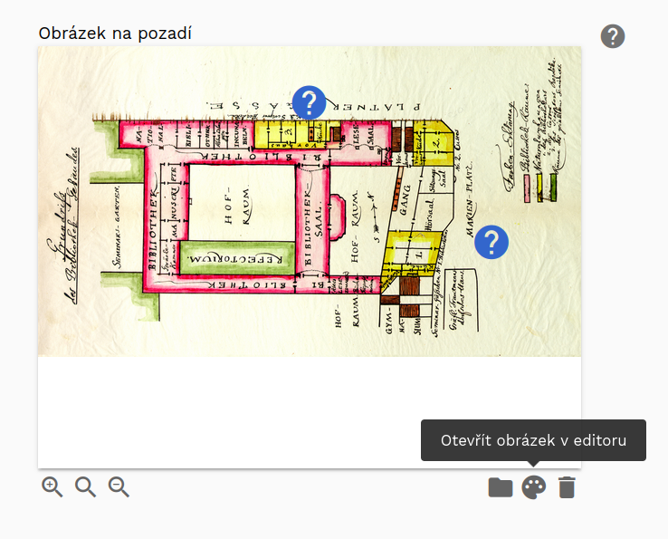

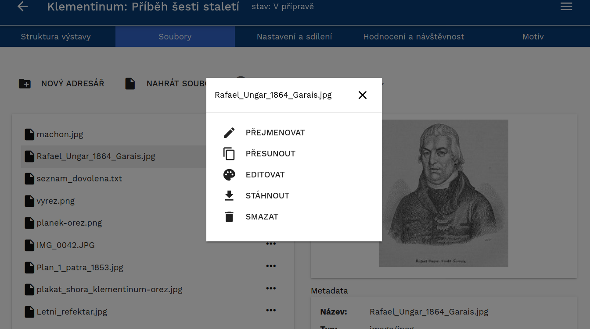

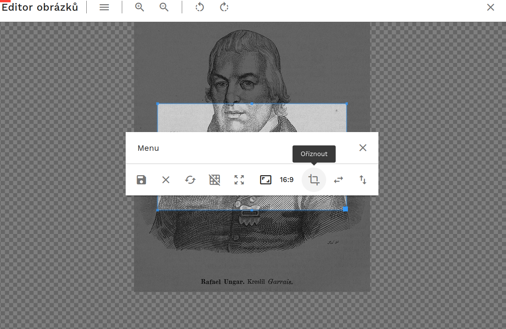

!!! info "Tip"
    Pro potvrzení uložení stačí zmáčknout klávesu Enter. Akce, která je zvýrazněná modrou barvou je vždy ta, která se po potvrzení provede.

## Po vstupu do editoru

Po přihlášení do editoru se zobrazí **seznam výstav**. Tyto výstavy buď byly vytvořeny tvůrcem, nebo od jiného tvůrce získal právo prohlížení nebo editace od dalšího uživatele. Výstavy jsou děleny podle práv, která k nim máte: 

- Jsem autor
- Sdíleno pro čtení
- Sdíleno pro zápis (jste v roli spolutvůrce)

Výstavy jsou zobrazeny graficky pomocí **dlaždic** nebo jako **seznam** (viz obrázky). Pro přepínání zobrazení slouží ikonka v pravém horním rohu (1). Výstavy je možné **filtrovat** nebo řadit pomocí přepínačů v horní části okna (Naposledy použité, Název apod.) (2). Tvůrce může také **vyhledávat** v seznamu výstav podle názvu (3).

U každé výstavy jsou uvedeny základní informace, jako jsou: název, vlastník, stav a datum poslední změny (4).

U každé výstavy jsou pomocí tlačítka se třemi tečkami (5) k dispozici základní operace jako je přejmenování, sdílení výstavy či její části, export, změna stavu, zkopírování či smazání .

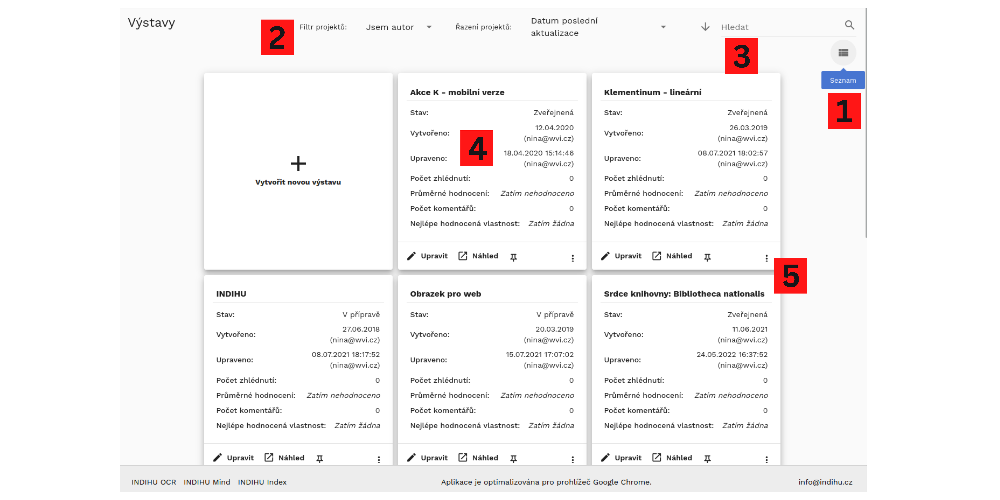

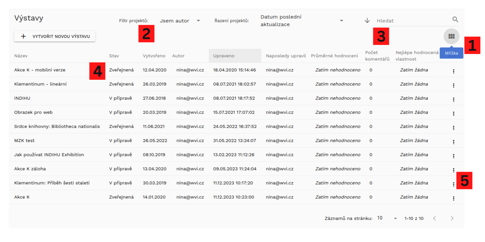

## Struktura výstavy a základní nastavení 

Po otevření detailu výstavy se tvůrci zobrazí první záložka "Struktura výstavy" (1). Lze se přepnout na záložky "Soubory" (2) pro správu souborů k výstavě, "Nastavení a sdílení" (3) pro obecná nastavení celé výstavy, do záložky "Hodnocení a návštěvnost," (4) kde jsou vidět statistiky návštěvnosti a poslední částí je záložka "Motiv" (5), která umožňuje nastavit si například barevnost a přidat k výstavě logo vaší instituce. 

Po založení nové výstavy automaticky výstava obsahuje první obrazovku "Úvod výstavy" (6), možnost přidání obrazovky pomocí ikonu + (7) a obrazovku "Závěr výstavy" (8).

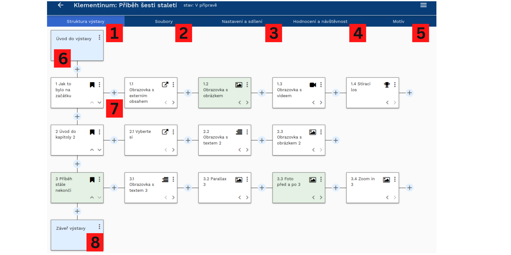

Všechny změny, které tvůrce na detailu výstavy udělá, jsou okamžitě ukládány, není zde žádné tlačítko Uložit.

Každá výstava obsahuje dvě povinné části, obrazovku Úvod výstavy a Závěr výstavy (viz výše [Detail výstavy](https://nnis.github.io/indihu-manual/zaklady/#detail-vystavy). Mezi nimi může být výstava strukturována
do kapitol nebo je možné ji sestavit ze samostatných obrazovek. Každá
kapitola obsahuje povinně úvodní stránku kapitoly a pak další stránky s obsahem.

Po přidání vybrané obrazovky přidáváte další obrazovky pomocí tlačítka +
(8). Postupným přidáváním dalších obrazovek a jejich přiřazování do
kapitol vznikne výstava.

<!-- Struktura výstavy je zobrazená v grafické podobě. Editor umožňuje:

  - Přidávat nové části výstavy
  - Přesouvat stránky a kapitoly pomocí funkce "drag and drop"
  - Každou stránku lze upravovat, zobrazit náhled nebo smazat pomocí menu (9).
 -->

### Hudba a zvuk ve výstavě 

Do virtální výstavy můžete přidat zvuk nebo audiokomentář na více místech: 

1. Zvukový podkres výstavy, který přidáte va Úvodní obrazovce a hraje i přes individuální obrazovky, které nejsou sdruženy do kapitol.
2. Hudební podkres kapitoly (je možné označit určité obrazovky, kdy se vypne). 
3. V každé obrazovce. Tato varianta je vhodná pro audiokomentář. 

**Hudební podkres**
Hudební podkres může online výstavu rovněž výrazně obohatit, pokud je použit citlivě a účelně. Pomáhá totiž vytvářet atmosféru (např. historickou, industriální, přírodní), podporuje emoce a udržuje pozornost návštěvníka, aniž by rušil mluvený komentář. Ideální je volit jemnou, nevtíravou hudbu bez výrazných vokálů a nastavit její hlasitost tak, aby byla vždy pod úrovní mluveného slova. Správně zvolený hudební podkres spolu s mluveným komentářem vytváří vrstevnatý audiovizuální zážitek, který návštěvníka více vtáhne do tématu výstavy.

**Kde získat hudbu a autorská práva**
Hudbu lze legálně získat z databází s volnými licencemi, jako jsou Free Music Archive, Pixabay nebo YouTube Audio Library. Ale stejně doporučujeme sledovat licenční podmínky jednotlivých skladeb, protože některé vyžadují uvedení autora (Creative Commons), případně nejsou určeny pro komerční využití. Pro komerční využití online výstavy většinou vytvořené nejsou, ale doporučujeme to uvádět například v tiráži nebo v textovém poli u obrazovky společně s autory/em hudby. Doporučeujeme být transparentní a o zdroji hudby informovat. 

**Převod textu do mluveného slova**
Pro převod textu do mluveného slova lze využít nástroje typu text-to-speech (TTS), které z psaného komentáře vytvoří zvukový soubor (formát MP3). Mezi nejjednodušší patří ElevenLabs, PlayHT nebo NaturalReader. Postup je velmi jednoduchý: vložíte text, zvolíte jazyk a hlas (např. ženský, vyprávěcí, jemný), upravíte tempo a po převodu stáhnete výsledný soubor. Abyste získali co nejlepší výsledek, je důležité zdrojový text upravit: používat kratší věty, přidat přirozené pauzy (např. rozdělením textu do odstavců), dát větám jednodušší rytmus a nepoužívat složitá souvětí. Zvukový komentář má pro online výstavu zásadní přínos, protože návštěvníkovi umožňuje obsah poslouchat namísto čtení, což zvyšuje srozumitelnost, přístupnost (např. pro osoby se zrakovým omezením) i celkový zážitek z prohlídky.

!!! info "Tip"
    Audio komentář si sami přečtěte nahlas nebo požádejte někoho dalšího, aby vám ho přečetl. Označte si části textu, kde došlo k chybě nebo zaváhání a zkuste text upravit. Tak zjistíte, že audiokomentář bude znít dobře. Až potom použijte nástroje text-to-speach k finálnímu nahrání. 

### Soubory k výstavě

Každá výstava disponuje svým vlastním souborovým depozitářem, do kterého si tvůrce může nahrávat soubory potřebné pro tvorbu výstavy. Tvůrce také může vytvářet adresářové struktury ("nový adresář") a přesouvat soubory mezi složkami. K dispozici je náhled obrázku a metadata souboru. Přes ikonu ... se dostanete k menu jednotlivého obrázku. Tyto soubory tvůrce dále využívá při vytváření a editaci jednotlivých stránek, proto se snažte udržet co nejvyšší přehlednost v souborech. Editor umožňuje i hromadné nahrávání. 

!!! info "Tip"
    Přehlednost v souborech lze dosáhnout více cestami. Jednou z nich je např. řazení souborů do adresářů podle kapitol. Jinou možností je uspořádání podle formátů - obrázky, texty či audio soubory zvlášť. Během přípravy výstavy můžete mít několik verzí stejného obrázku, proto doporučujeme si obrázky pojmenovávat. Nepoužité soubory mažte. Zkuste se předem zamyslet, jak budete se soubory pracovat, jak je budete pojmenovávat a dodržujte pravidla napříč tvůrčím týmem.

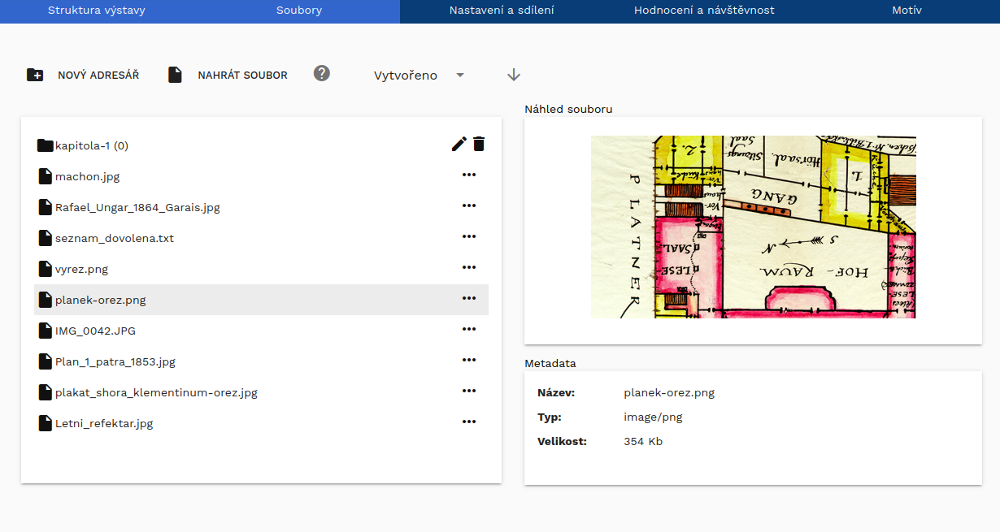

### Nastavení a sdílení 

Záložka obsahuje veškerá nastavení virtuální výstavy, která se týkají výstavy jako celku - stav výstavy, URL výstavy, Embed kód pro výstavu, tagy výstavy a sdílení s ostatními tvůrci. 

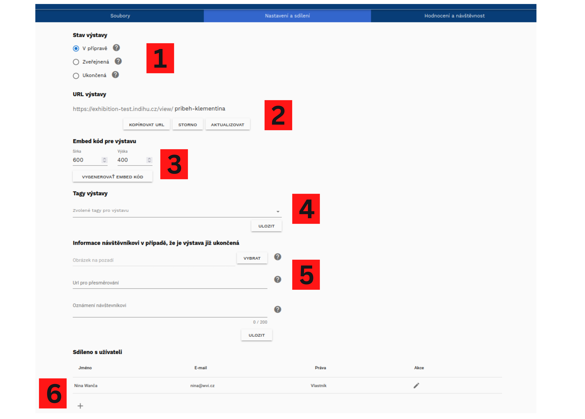

**Stav výstavy (1)**

- **V přípravě**: Výstava je v přípravě. Obsah výstavy je možné libovolně upravovat. Výstava je přístupná pouze přihlášeným tvůrcům, se kterými je výstava sdílena.
- **Zveřejněná**: Výstava je veřejně dostupná přes svoje URL. Výstavu není možné upravovat. 
-  **Ukončená**: Výstava byla ukončena a není ani veřejně dostupná ani určena k dalším úpravám.Výstavu lze znovu převést do stavu "V přípravě"" nebo "Zveřejněná".
  
**URL výstavy (2)**

Umožňuje nastavit libovolnou koncovku adresy tak, aby byla dobře použitelná a zapamatovatelná.

!!! info "Tip"
    URL výstavy umožňuje nastavit libovolnou koncovku adresy tak, aby byla dobře použitelná a zapamatovatelná. Upravte URL tak, aby na propagačních materiálech vypadala dobře.

**Embed kód pro výstavu (3)**

Funkce umožňuje vygenerovat embed html kód, který můžete vložit do vlastní webové stránky a umožnit tak návštěvníkům procházet výstavu na vašem webu. Funguje to podobně jako podobně, jako když na svůj web vložíte mapy nebo video z YouTube. 

**Tagy výstavy (4)**

Tagy výstavy se zobrazí na úvodní stránce vsýtavy a pomohou návštěvníkům rozhodnout, zda je výstava pro ně v hodná. Vybíráte z připravených tagů: 

- 1 hlavní téma výstavy (např. Dějiny a lidé, Příroda nebo Umění)
- 2 formální vlastnosti výstavy (např. Vzdělávací English friendly nebo Zábavná)
- pro koho je výstava určena (např. Děti, Odborníci nebo Studenti)

!!! info "Tip"
    Můžete vytvořit několik verzí výstavy na stejné téma pro různé cílové skupiny

**Informace návštěvníkovi v případě, že je výstava již ukončená (5)**

Je skvělé, že o vaši výstavu mají návštěvníci zájem, ale může se stát, že jí z jakéhokoli důvodu už nepovažujete za aktuální. Proto nastavte informace pro případ, že návštěvmník si vaši výstavu najde, ale ta již není dostupná. Vyberte obrázek, zadejte URL pro přesměrování (např. na váš web nebo na aktuální výstavu či jiný zajímavý online projekt) a napište návštěvníkům krátký vzkaz, kupříkladu poděkování za zájem a informaci o nových projektech. 

**Sdíleno s uživateli (6)**

Výstavu lze sdílet s dalšími tvůrci pomocí jejich e-mailu. Ostatním tvůrcům je možné dát práva **jen pro čtení** nebo **Pro čtení a zápis**. V případě, že přidáváte někoho, kdo není registrovaným uživatelem, zašlete se ze systému výzva k registraci. O sdílení výstavy jsou spolutvůrci informováni e-mailem. 

Výstavu je dále možné **sdílet odesláním URL adresy výstavy**, a to jak odkazu na titulní obrazovku, tak na libovolnou kapitolu či obrazovku. Avšak stále platí, že pokud výstava není ve stavu Zveřejněná, nikdo jiný než ostatní tvůrci ji neuvidí.

Při **spolupráci více autorů** se automaticky editace zamkne na 1 minutu. Informace o tom, který tvůrce právě výstavu upravuje, je viditelná jak v seznamu výstav, tak na detailu výstavy. Ostatní tvůrci mohou výstavu prohlížet, ale ne upravovat.

!!! info "Tip"
    Ačkoli je zámek pro editaci nastaven jen na 1 minutu, doporučujeme se předem domluvit, kdy kdo na výstavě bude pracovat. Zabráníte tomu, abyste pracovali na stejné části výstavy. 

## Hodnocení a návštěvnost

V záložce "Hodnocení a návštěvnost" jsou dostupné informace o tom, jak výstavu vnímají návštěvníci. Jednak je tam uveden celkový počet shlédnutí, který systém počítá sám, podobně jako je tomu u shlédnutí videí na YouTube. Toto hodnocení pro vás může být užitečnou zpětnou vazbou, co se povedlo a kde je naopak prostor pro zlepšení. Zjednodušené hodnocení se rovněž ukáže na výpisu všech vašich výstav a máte ho tak po ruce. 

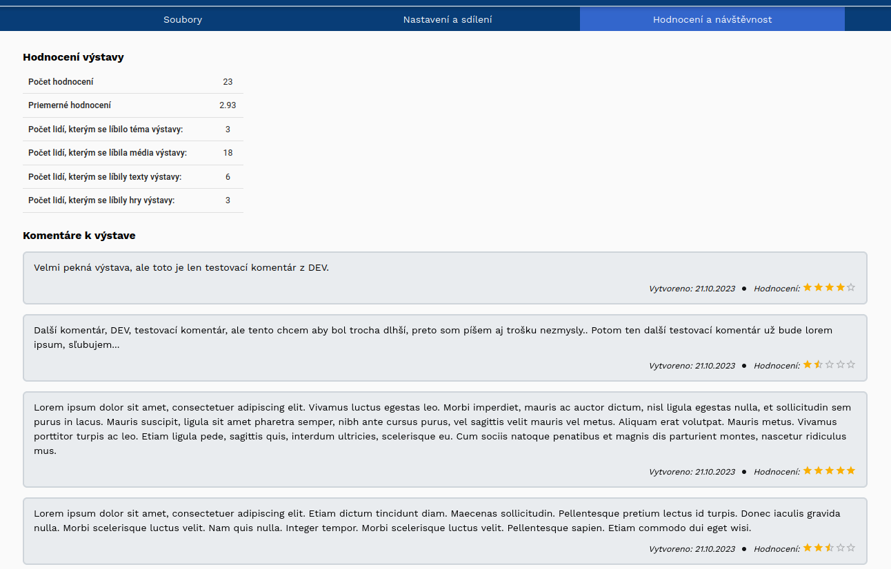 

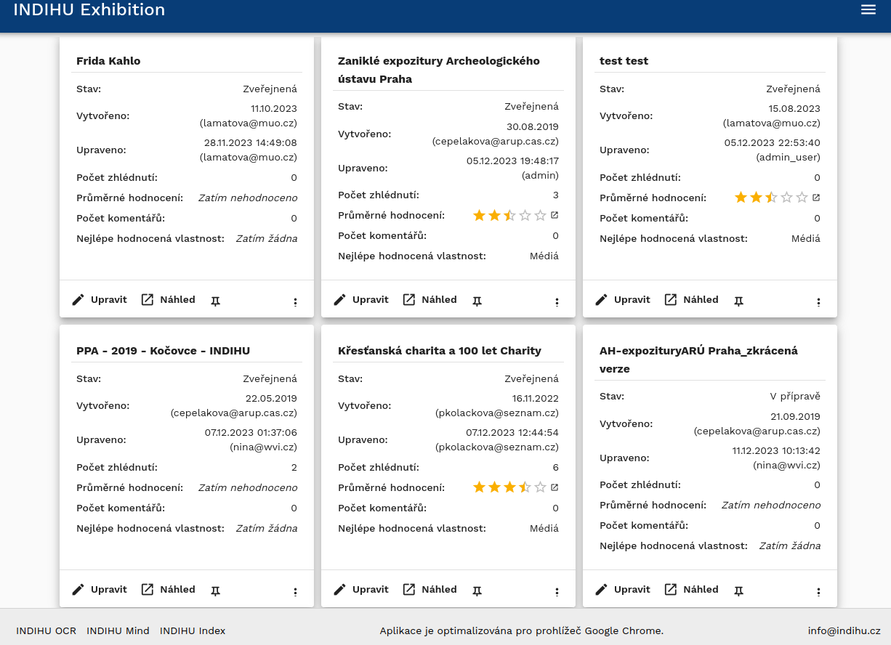 

Návštěvníci jsou vyzváni k hodnocení výstavy na závěrečné obrazovce. Celkové hodnocení výstavy je pomocí hvězdiček, poté mohou vybrat aspekty výstavy (např. téma nebo hry), které je obzvlášť zaujaly, a také mají možnost zanechat návštěvníkům vzkaz a adresu, na kterou tvůrci mohou odpověď. Vzkaz však není povinný. 

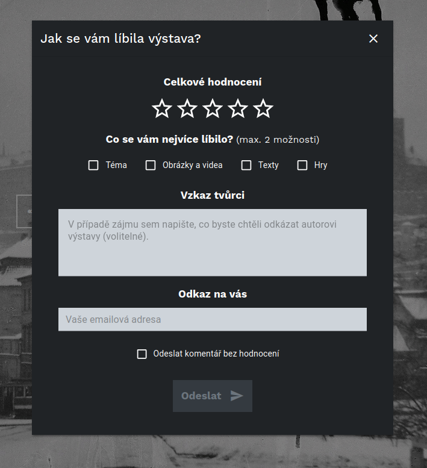 

## Motiv 

Poslední záložkou u výstavy v rámci všeobecných nestavení je úprava motivu, tedy barevného schématu výstavy. Editor nabízí dva základní motivy - **světlý** a **tmavý**. Editor však umožňuje si některé prvky nastavit **vlastními barvami**. To se hodí zejména v případě, kdy vaše instituce má jednotný grafického manuálu a korporátní identitu. Ve všeobecném nastavení máte možnost upravit barvu pozadí, barvu ikon (např. šipky), barvu tagů. Výstavu také v části "Nastavení loga a vodoznaku" můžete nahrát vlastní logo a vybrat umístění, kde se bude zobrazovat. Ve třetí části můžete změnit všeobecné nastavení infopointů, kdy všechny infopointy budou mít vámi zvolenou barvu. U infopointů si však můžete změnit barvu u každého individuálně dle potřeby a tak dát jen některé jinou barvou, což je více zvýrazní. 

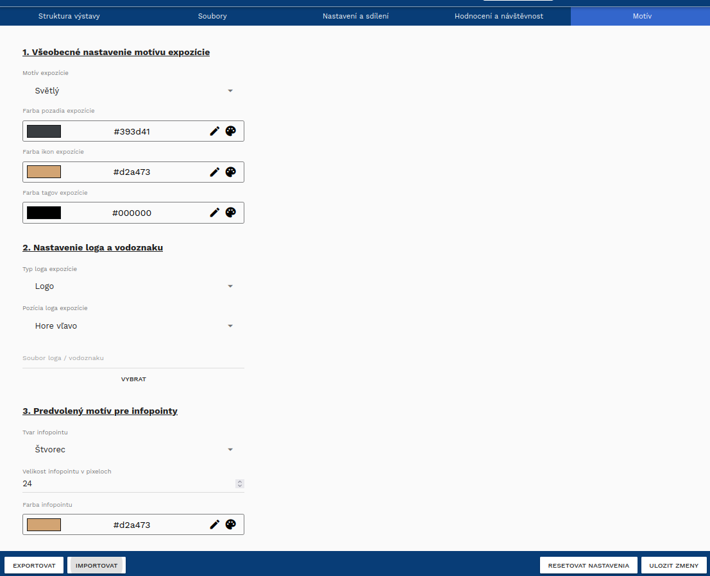 

!!! warning "Upozornění"
    Nezapomeňte změny motivu uložit vpravo dole.   

!!! warning "Upozornění"
    V záložce Motiv si můžete vybrat základní verzi infopointu - vybíráte barvu, tvar (čtverec, kruh) nebo nahráváte vlastní ikonu. Individuálně můžete u každého infopointu měnit jeho vzezření. Nastavení u infopointu je pak nadřazené nastavení infopointu u motivu. Můžete tak pracovat s různými druhy infopointů podle barevnosti nebo např. piktogramu. 
    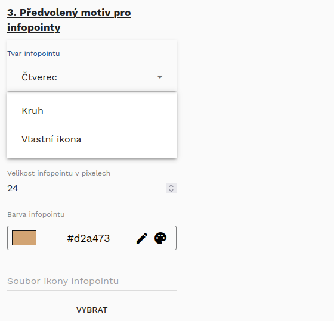 

